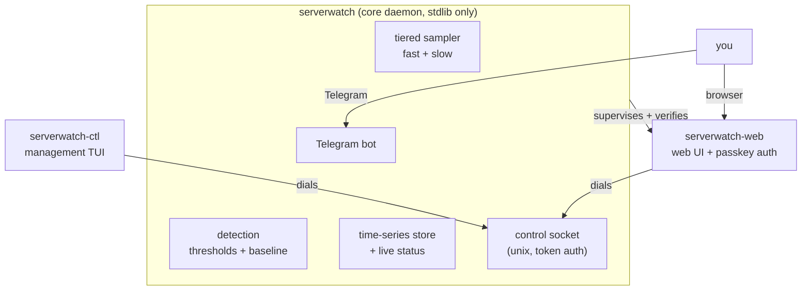

# serverwatch

**A home server monitor that fits in your head.** One small Go daemon watches a
Linux/systemd box, decides when something is wrong using rules you can actually
read, and tells you over Telegram. No agent, no cloud, no Prometheus, no
external metrics database. The core is standard library only.


```bash
sudo serverwatch install                      # one systemd service
sudo serverwatch telegram set-token <token>   # the only required setting
# then, from your phone:  /start <pin>  ->  /stats
```

---

## Why serverwatch

Most monitoring stacks are built for fleets: a scraper, a time-series database,
a dashboard service, an alertmanager, and a pile of YAML to wire them together.
That is a lot of moving parts to babysit for one machine on a shelf.
serverwatch is the opposite bet.

- **One binary, one service.** Drop it on the box, run `install`, set a token.
  It runs as a single systemd unit and stores what it needs locally.
- **No AI in the decision path.** It alerts two ways you can reason about:
  static thresholds you set, and a rolling per-metric baseline that flags "this
  is not normal for this box." Both are ordinary arithmetic. You can read the
  rule and predict when it fires.
- **The core is stdlib only.** No third-party modules in the default
  `serverwatch` daemon: no scraping exporter, no cloud account, nothing to keep
  patched but Go itself. Heavier features live in optional plugin binaries, not
  in the core.
- **Configured by command, not by hand.** Every setting goes through the CLI,
  which writes an atomic, validated, private config store. There is no file you
  are meant to hand-edit, so the config on disk always came from a command that
  checked it.
- **Answers in about a second.** Message the Telegram bot and it replies fast,
  with live stats, history, and controls.

## What it watches

| Area | What you get |
|------|--------------|
| **Live metrics** | CPU, memory, swap, load, temperature on a fast tier that drives detection and live status |
| **Slow tier** | Disk usage and SMART, docker containers, systemd services, network throughput |
| **Alerting** | Static thresholds plus a rolling baseline, with boot and recovery reports, a daily digest, and a weekly rollup |
| **Channels** | Telegram by default, plus email, webhook, Slack, Discord, ntfy, and Gotify |
| **Downtime** | Heartbeats, power-down reconstruction across reboots, and reachability checks |
| **History** | A compact binary time-series store with tiered retention, queryable from the CLI and the web UI |
| **Web UI** | An optional live dashboard, history charts, a config editor, and a curated public status page |

See [Monitoring](docs/handbook/05-monitoring.md),
[Alerting and channels](docs/handbook/06-alerting-and-channels.md), and
[Downtime and liveness](docs/handbook/07-downtime-and-liveness.md) for the
details.

## Architecture at a glance

serverwatch is a lean **core** daemon with optional **plugins** around it. The
core runs the sampler, keeps the live picture and the history, answers Telegram,
and exposes its whole internal API over a local control socket (newline-JSON on
a unix socket, token-authenticated). Plugins are separate processes that dial
that socket, so the core stays small and their dependencies never touch it.



Two front-door subcommands launch the plugins for you, so you never need to know
their binary names:

```bash
sudo serverwatch cli   # launches serverwatch-ctl, the management TUI
sudo serverwatch web   # launches serverwatch-web, the web UI
```

Because those run as root, the core never execs a plugin blindly. It first
proves the binary next to it is the exact one it installed: an absolute path
from the core's own directory (never `$PATH`), a root-owner and non-writable
check on the file and its directory, and a SHA-256 match against a root-only
manifest recorded at install. Any mismatch is refused, not run. The full trust
model is in [Architecture](docs/handbook/02-architecture.md).

## Quick start

```bash
# On the server, pick your arch: linux-amd64 / linux-arm64 / linux-arm (older Pis)
cd /tmp && arch=linux-amd64
for b in serverwatch serverwatch-ctl serverwatch-web; do
  curl -fsSL -o "$b" "https://github.com/Suraj-Tiwari/server-monitor/releases/latest/download/$b-$arch"
done
chmod +x serverwatch serverwatch-ctl serverwatch-web

sudo ./serverwatch install     # installs the daemon AND both plugins, enables the systemd service
sudo serverwatch cli           # guided first-run setup: bot token, enrollment PIN, web UI
```

`serverwatch install` copies all three binaries to `/usr/local/bin` and starts
the service; `serverwatch cli` opens the interactive
[serverwatch-ctl](docs/handbook/plugins/serverwatch-ctl.md#managing-with-serverwatch-ctl)
TUI, which walks you through the Telegram bot token, the `/start <pin>`
enrollment, and (optionally) the web UI. Prefer the command line? The one
required setting is the bot token, which prints the enrollment PIN right in the
terminal:

```bash
sudo serverwatch telegram set-token <token>   # token from @BotFather
```

From there, `/stats` or `/help` in Telegram, or `sudo serverwatch web` for the
browser dashboard. The two plugins are optional: drop them from the download
loop if you only want the Telegram daemon. Full steps are in [Installation and
first run](docs/handbook/03-installation.md).

## Documentation

Everything is in the handbook, one concern per chapter.

**[Read the handbook](docs/handbook/README.md)**

| | |
|---|---|
| [Introduction](docs/handbook/01-introduction.md) | What it is and the ethos |
| [Architecture](docs/handbook/02-architecture.md) | Daemon internals, the control socket, core + plugins, the safe-exec trust model |
| [Installation](docs/handbook/03-installation.md) | Getting it onto the server and enabled |
| [Configuration](docs/handbook/04-configuration.md) | The CLI-managed settings and per-target overrides |
| [Monitoring](docs/handbook/05-monitoring.md) | What is collected and how alerting decides |
| [Alerting and channels](docs/handbook/06-alerting-and-channels.md) | Telegram and the other channels |
| [Downtime and liveness](docs/handbook/07-downtime-and-liveness.md) | Heartbeats and power-down reconstruction |
| [Web UI](docs/handbook/08-web-ui.md) | The browser interface and its serving modes |
| [Storage and data model](docs/handbook/09-storage-and-data-model.md) | The time-series store and retention |
| [Operations](docs/handbook/10-operations.md) | Day-to-day running and troubleshooting |
| [Command reference](docs/handbook/11-command-reference.md) | Every CLI subcommand |
| [Roadmap and status](docs/handbook/12-roadmap-and-status.md) | Where it is and what is planned |

## Status

serverwatch is in **beta** on the `develop` branch, where the core-plus-plugin
architecture (the control socket, the supervised `serverwatch-web`, and the
`serverwatch-ctl` management binary) lives. The stable `main` branch carries the
previous single-daemon release. The handbook marks beta features where they
appear; see [Roadmap and status](docs/handbook/12-roadmap-and-status.md) for the
current line.

## License

MIT.
