<p align="center">
  <picture>
    <source media="(prefers-color-scheme: dark)" srcset="docs/assets/trinetra-wordmark-ash.png">
    <source media="(prefers-color-scheme: light)" srcset="docs/assets/trinetra-wordmark-ink.png">
    
  </picture>
</p>

<p align="center"><strong>Sees what you can't.</strong></p>

<p align="center">
One small Go daemon per server. Live dashboards, readable alert rules, Telegram in your pocket,<br>
and, when you have more than one box, a whole fleet with incidents, routing and escalation.<br>
No agent zoo, no cloud, no Prometheus, no external database.
</p>

<p align="center">
  
  
  
  
  
  
</p>

<p align="center">
  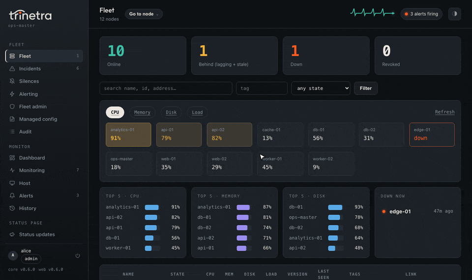
</p>

```bash
# 1. Download the latest release (arch: linux-amd64 / linux-arm64 / linux-arm)
mkdir -p ~/trinetra-download && cd ~/trinetra-download && arch=linux-amd64
base=https://github.com/InfoDiveLabs/trinetra/releases/latest/download
for b in trinetra trinetra-ctl trinetra-web; do curl -fsSL -o "$b" "$base/$b-$arch"; done
for f in manifest.json manifest.ci.sig manifest.maint.sig; do curl -fsSL -o "$f" "$base/$f"; done
chmod +x trinetra trinetra-ctl trinetra-web

# 2. Verify the signatures and install: one systemd service
sudo ./trinetra install --require-signed

# 3. Guided setup: web UI, your admin account, where alerts go
sudo trinetra cli
```

<p align="center">
  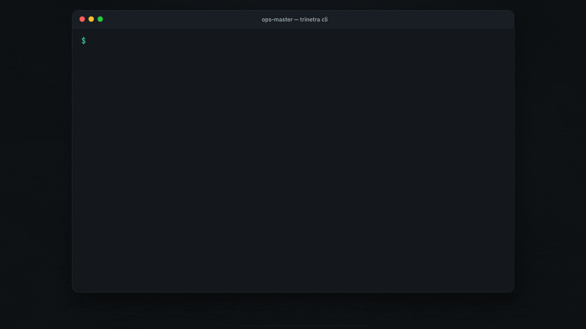
</p>

Details in [Quick start](#quick-start).

<br>

## Contents

- [What you get](#what-you-get): [dashboard](#a-live-dashboard-for-every-server) ·
  [monitoring](#containers-services-disks-and-processes) · [history](#history) ·
  [alerts](#alerts-where-your-team-already-is) · [fleet](#fleet-mode) ·
  [incidents](#incidents) · [silences](#silences-and-maintenance-windows) ·
  [status page](#a-public-status-page) · [updates](#updates-that-roll-themselves-back) ·
  [users](#users-and-passkeys) · [phone](#on-your-phone)
- [Small by design](#small-by-design) · [Security](#security) · [How it works](#how-it-works)
- [Quick start](#quick-start) · [Build a fleet](#build-a-fleet) ·
  [Upgrading from serverwatch](#upgrading-from-serverwatch)
- [Documentation](#documentation)

<br>

## What you get

### A live dashboard for every server

Live CPU, memory, load, temperature and network, the containers and services that
are up or down, disk usage, a 24-hour availability bar and the alerts firing right
now. In a fleet, <kbd>Ctrl</kbd> <kbd>K</kbd> jumps to any server.

<p align="center">
  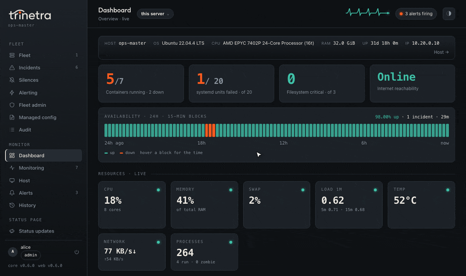
</p>

<br>

### Containers, services, disks and processes

Every Docker container, systemd service, filesystem and top process, discovered on
its own. Click a row for details and actions, filter as you type.

<p align="center">
  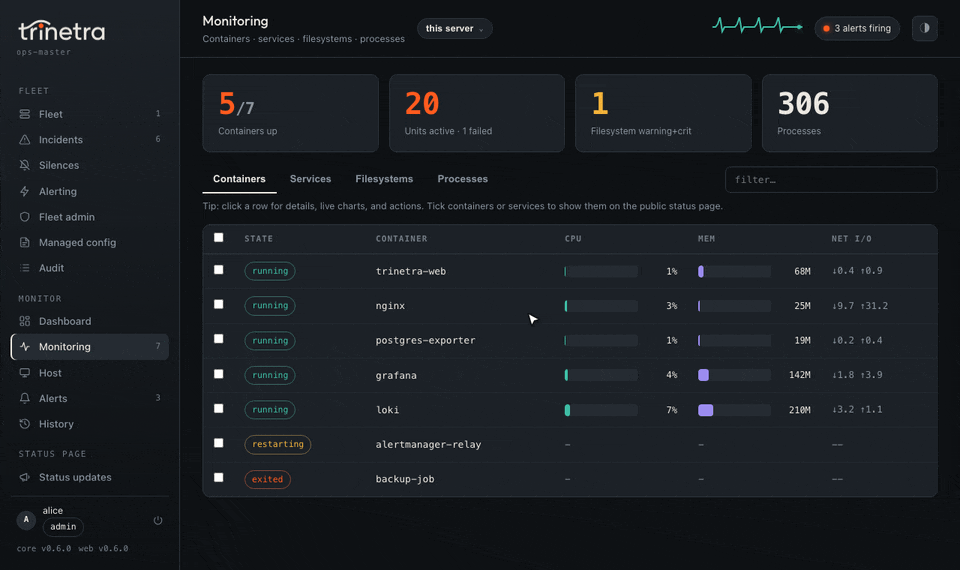
</p>

<br>

### History

CPU, memory, load and temperature for any range from the last hour to 30 days, disk
use per filesystem, and a downtime bar that shows exactly when the server was away.

<p align="center">
  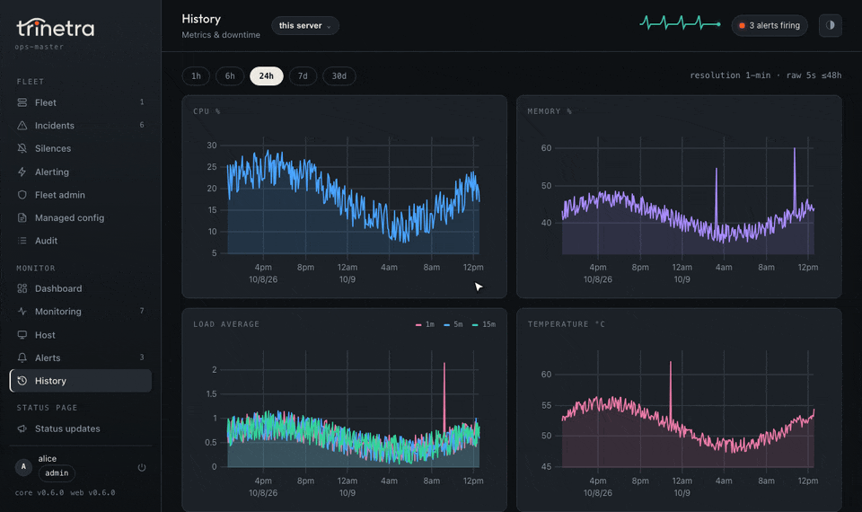
</p>

<br>

### Alerts where your team already is

Thresholds and a rolling per-server baseline ("not normal for this box") decide when
to alert. Each channel has its own minimum level and quiet-hours behaviour, and
**Who gets what** shows exactly which channels receive each kind of alert. Telegram
also works as a bot: `/stats`, history, ack and silence from your phone.

<p align="center">
  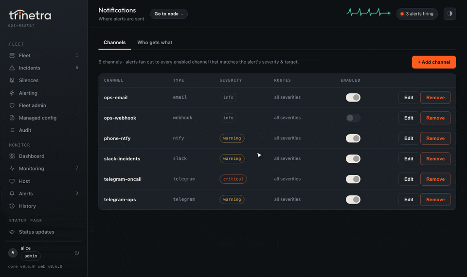
</p>

Add a channel from the browser or straight from the terminal:

<p align="center">
  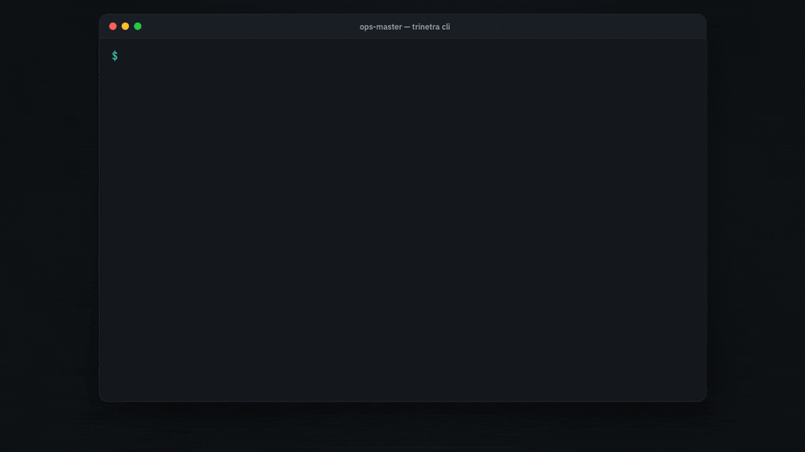
</p>

<br>

### Fleet mode

One server becomes the master with `sudo trinetra fleet init`; every other server
joins with one token. Each keeps monitoring and alerting on its own, streams its data
to the master over mutual TLS, and catches up after a network split without losing a
sample.

https://github.com/user-attachments/assets/8ba51154-faf6-4a01-b116-1c01fb26e760

Also in fleet mode: aggregate rules across servers, routing and escalation policies,
config managed from the master by tag, and an audit log of every change. See the
[fleet chapter](docs/handbook/13-fleet.md).

<br>

### Incidents

Related alerts from many servers become one incident, routed to the right people and
escalated if nobody acknowledges it. Each incident shows its member nodes, what was
delivered or held, and a full timeline.

<p align="center">
  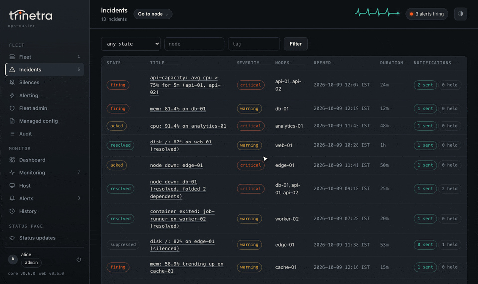
</p>

<br>

### Silences and maintenance windows

Planned work? Silence by node, tag, rule or severity for as long as you need, or set
up recurring maintenance windows so nobody is paged for a reboot.

<p align="center">
  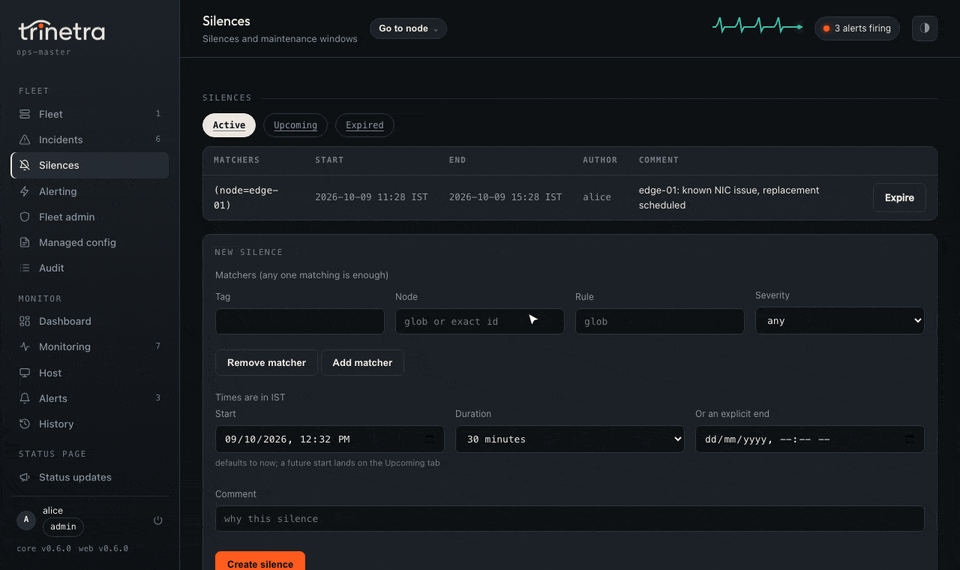
</p>

<br>

### A public status page

Pick the containers and services your customers depend on and publish them as named
services; visitors see the service and its state, never your container names.

<p align="center">
  
</p>

When something breaks, post an incident and keep customers updated:

<p align="center">
  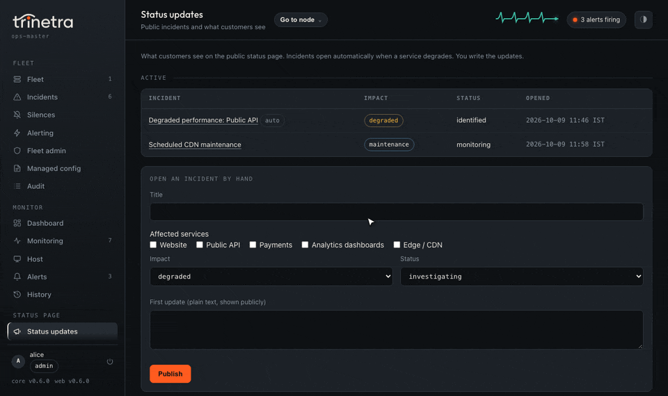
</p>

<br>

### Updates that roll themselves back

Every release is signed twice, by the build pipeline and offline by a maintainer.
A new build is staged, smoke-tested, swapped in and watched; if it isn't healthy,
the previous build comes back on its own and you're told why.

https://github.com/user-attachments/assets/70dd5ce9-b896-4d7d-96f8-f5761783620a

<br>

### Users and passkeys

Sign in with a passkey (phone, laptop or security key); no passwords. Invite people
as admin, responder or viewer from the web UI or the terminal.

<p align="center">
  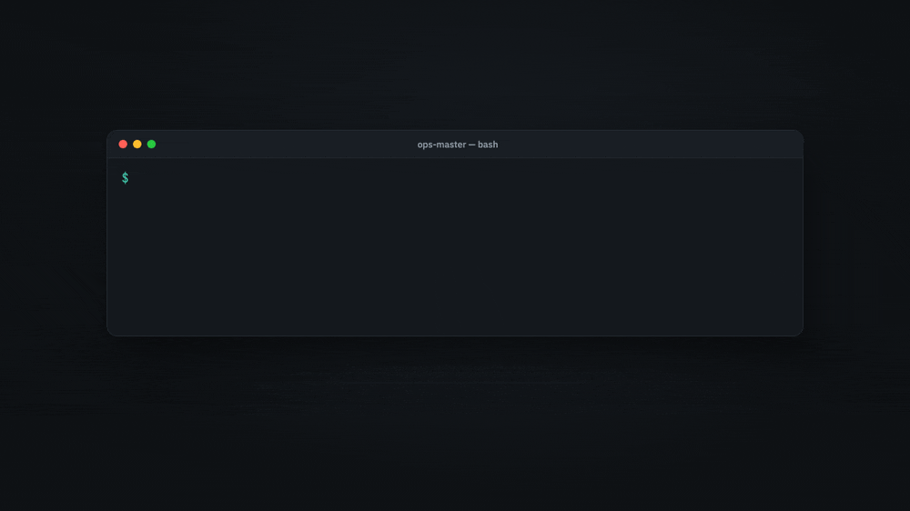
</p>

<br>

### On your phone

Every page works on a phone, with a bottom tab bar for the main sections.

<p align="center">
  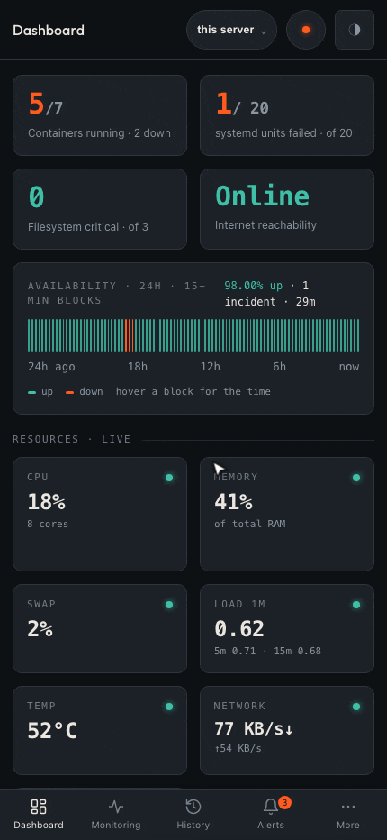
</p>

<br>

## Small by design

Most monitoring stacks are built for data centres: a scraper, a time-series
database, a dashboard service, an alert manager, and a pile of YAML to wire
them together. Trinetra is the opposite bet. Each server runs one daemon that
collects, stores, decides and notifies on its own. The same daemon becomes a
fleet master with one command.

| | Measured |
|---|---|
| **Core daemon binary** | 10.9 MB (arm64) / 11.8 MB (amd64) static, **4.3 to 4.7 MB gzipped** |
| **Memory (RSS)** | **11.6 MB** standalone · 12.4 MB as a fleet child · 14.0 MB as a master with two children |
| **CPU** | **~0.4% of one core** standalone, ~0.6% as a child, ~1.2% as a master with two children |
| **Disk** | ~0.3 MB of history per host after the first hour, in a compact binary store with tiered retention |
| **Web UI plugin** | 7.7 MB RSS, ~0.07% CPU, and it only runs if you enable it |
| **Third-party code in the core** | **none**: the `trinetra` daemon is Go standard library only, enforced by a test |

<sub>Measured on Linux containers with 8 vCPUs over about 72 minutes, sampling
every 10 s. That is six times the default 60 s interval, so a default install
is lighter still. Binaries are built with `-trimpath -ldflags "-s -w"`.</sub>

- **One binary, one service.** Drop it on the box, run `install`, set a token.
- **Rules you can read.** Alerts come from static thresholds and a rolling
  per-metric baseline ("not normal for this box"). Both are plain arithmetic:
  you can read the rule and predict when it fires. No AI in the decision path.
- **Configured by command, not by hand.** Every setting goes through the CLI,
  which writes an atomic, validated, private config store.
- **Heavy features are optional plugins.** The web UI and the terminal UI are
  separate binaries that talk to the core over a local socket, so their
  dependencies never touch the daemon.
- **Keeps working when the network doesn't.** Every host alerts on its own.
  In a fleet, a child hands alerts to the master, and falls back to
  delivering them itself if the master is unreachable.

<br>

## Security

- **Passkey sign-in** for the web UI (Touch ID, Windows Hello or a security
  key), with admin and viewer roles; after the first admin, new accounts need
  an invite link. No passwords.
- **Mutual TLS for the fleet.** `fleet init` creates a private CA; join codes
  pin the CA's key, so a child never trusts on first use, and every child
  gets its own certificate. Revoking a node cuts it off at once.
- **Verified plugins.** The daemon runs a plugin only after it checks the
  file's owner, its permissions and a SHA-256 hash recorded at install.
- **Signed updates, 2-of-2.** Every release ships a manifest of exact file
  sizes and SHA-256 hashes, signed by the build pipeline **and** co-signed
  offline by a maintainer. A host installs nothing unless both signatures
  verify against keys compiled into the binary it is already running; GitHub
  and the network are treated as untrusted transport. A version floor blocks
  downgrades, and signed channel pointers expire after 14 days so withheld
  updates raise an alert.
- **Automatic rollback.** `trinetra update apply` restarts onto the new build
  under a guard that runs the previous, known-good binary; if the new daemon
  is not healthy within 90 seconds it is rolled back, and a watchdog timer
  finishes the job even across a crash or reboot.
- **Check it yourself.** The release keys and fingerprints are published, and
  any download can be [verified by hand](docs/handbook/14-security.md#verify-a-download-yourself)
  with `sha256sum` and OpenSSL, without trusting trinetra at all.
- **Local only by default.** The control socket is a token-authenticated
  unix socket, and there is no telemetry. The one outbound call you did not
  configure is the daily signed-update check against GitHub releases (it only
  checks and notifies; turn it off with
  `sudo trinetra config set update.channel off`).

The whole model, key by key, is in the [Security chapter](docs/handbook/14-security.md).

<br>

## How it works


Trinetra is a lean **core** daemon with optional **plugins** around it. The
core runs the sampler, keeps the live picture and the history, decides and
sends alerts, answers Telegram, and exposes its whole internal API over a
local control socket (newline-delimited JSON on a unix socket, with a
token). Plugins are separate processes that dial that socket.

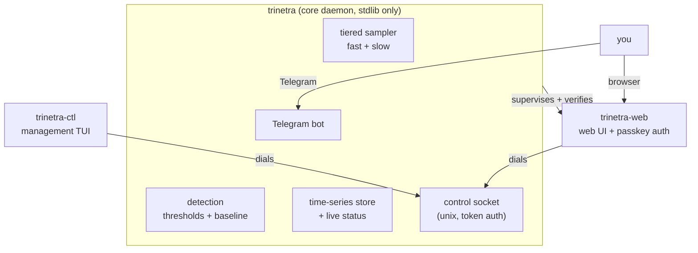

**In a fleet**, each child keeps monitoring and alerting on its own and
ships its data to the master over mutual TLS through a durable outbox, so a
network outage only delays delivery and loses nothing. The child hands each
alert to the master, which groups, routes and escalates it. If the master
doesn't take it in time, the child delivers the alert itself.

<br>

## Quick start

```bash
# On the server, pick your arch: linux-amd64 / linux-arm64 / linux-arm (older Pis)
mkdir -p ~/trinetra-download && cd ~/trinetra-download && arch=linux-amd64
for b in trinetra trinetra-ctl trinetra-web; do
  curl -fsSL -o "$b" "https://github.com/InfoDiveLabs/trinetra/releases/latest/download/$b-$arch"
done
chmod +x trinetra trinetra-ctl trinetra-web

# The signed release manifest and its two detached signatures (CI +
# maintainer), so install can verify what it's about to run.
for f in manifest.json manifest.ci.sig manifest.maint.sig; do
  curl -fsSL -o "$f" "https://github.com/InfoDiveLabs/trinetra/releases/latest/download/$f"
done

sudo ./trinetra install --require-signed   # installs the daemon AND both plugins, enables the systemd service
sudo trinetra cli                          # guided setup: web UI, first admin, where alerts go
```

`trinetra install --require-signed` verifies both signatures on the manifest
and every binary's hash (and refuses on any mismatch), copies the binaries to
`/usr/local/bin`, and starts the service. To check a download without trusting
trinetra itself, see [Verify a download
yourself](docs/handbook/14-security.md#verify-a-download-yourself). `trinetra cli` opens the
[trinetra-ctl](docs/handbook/plugins/trinetra-ctl.md#managing-with-trinetra-ctl)
terminal UI. On a new server it walks you through the web UI, prints a one-time
enroll link for your admin account, and asks where alerts go: Telegram, Slack,
Discord, email, ntfy, Gotify or a webhook, or later from the web UI. Every step
can be skipped. Prefer plain commands?

```bash
sudo trinetra users invite --role admin               # enroll link for the first admin
sudo trinetra channel add ops --type slack --set url=<webhook>   # or telegram, email, ...
sudo trinetra telegram set-token <token>              # Telegram, then /start <pin> to the bot
```

The two plugins are optional: leave them out of the download loop if you only
want the daemon and its alerts. Full steps are in [Installation and first
run](docs/handbook/03-installation.md).

<br>

## Build a fleet

```bash
# On the host that will be the master
sudo trinetra fleet init --address monitor.example.com,203.0.113.7
sudo systemctl restart trinetra
sudo trinetra fleet token create --tags prod --uses 3

# On each server you want to enroll, with the code the master printed
sudo trinetra fleet join swj1_...
sudo systemctl restart trinetra

# Back on the master
sudo trinetra fleet nodes --tag prod
```

From there, set up routing, silences, rules and managed config from the web
UI or with `trinetra fleet ...`. The whole story is in the
[Fleet chapter](docs/handbook/13-fleet.md).

## Upgrading from serverwatch

Trinetra is the new name for serverwatch: same daemon, same data. On a host
that runs `serverwatch`, download `trinetra` and the plugins you use into one
directory and run the same install:

```bash
sudo ./trinetra install     # run from the directory holding trinetra, trinetra-ctl, trinetra-web
```

It stops the old service, moves `/etc/serverwatch` and `/var/lib/serverwatch`
to their `trinetra` paths, and carries over config, history, alert state,
Telegram enrollment, web passkeys and fleet identity untouched. Nothing is
deleted before its replacement is proven in place. The old `serverwatch`
command keeps working for one release as a compatibility link. When anything
looks unexpected, it refuses rather than guesses, and tells you what to check.
Every case and the manual rollback steps are in [Upgrading from a
serverwatch install](docs/handbook/03-installation.md#upgrading-from-a-serverwatch-install).

## Documentation

Everything is in the handbook, one concern per chapter.

**[Read the handbook](docs/handbook/README.md)**

| | |
|---|---|
| [Introduction](docs/handbook/01-introduction.md) | What it is and the ethos |
| [Architecture](docs/handbook/02-architecture.md) | Daemon internals, the control socket, core + plugins, the safe-exec trust model |
| [Installation](docs/handbook/03-installation.md) | Getting it onto the server, enabled, and upgrading from serverwatch |
| [Configuration](docs/handbook/04-configuration.md) | The CLI-managed settings and per-target overrides |
| [Monitoring](docs/handbook/05-monitoring.md) | What is collected and how alerting decides |
| [Alerting and channels](docs/handbook/06-alerting-and-channels.md) | Telegram and the other channels |
| [Downtime and liveness](docs/handbook/07-downtime-and-liveness.md) | Heartbeats and power-down reconstruction |
| [Web UI](docs/handbook/08-web-ui.md) | The browser interface and its serving modes |
| [Storage and data model](docs/handbook/09-storage-and-data-model.md) | The time-series store and retention |
| [Operations](docs/handbook/10-operations.md) | Day-to-day running and troubleshooting |
| [Command reference](docs/handbook/11-command-reference.md) | Every CLI subcommand |
| [Roadmap and status](docs/handbook/12-roadmap-and-status.md) | Where it is and what is planned |
| [Fleet](docs/handbook/13-fleet.md) | Master and children: incidents, routing, silences, rules, managed config |
| [Security](docs/handbook/14-security.md) | Trust model, signed releases and keys, safe self-update, manual verification |

## Status

The current stable release is **v0.5.0**: the Trinetra rename (from
serverwatch, with an automatic in-place migration), fleet mode (master/child,
phases 1-3), and signed releases with a self-verifying, self-rolling-back
update path. See the [changelog](CHANGELOG.md) and [Roadmap and
status](docs/handbook/12-roadmap-and-status.md).

## License

Trinetra is source-available under the [Functional Source License, Version 1.1,
ALv2 Future License](LICENSE) (FSL-1.1-ALv2), © 2026 InfoDive Labs Pvt Ltd.

- **Free to use, self-host and modify**, for yourself or inside your company,
  including commercially, as long as you are not offering a competing product
  or service. Education, research, and professional services (e.g. setting it
  up for a client) are explicitly allowed.
- **Not allowed:** selling or hosting Trinetra, or a product built on it, as a
  competing commercial offering.
- **Becomes Apache-2.0 after two years.** Each release converts to the Apache
  License 2.0 on the second anniversary of its release.

Releases up to and including v0.4.1 (published as serverwatch) remain under the
MIT License they were released with.
