<p align="center">
  <picture>
    <source media="(prefers-color-scheme: dark)" srcset="docs/assets/trinetra-wordmark-ash.png">
    <source media="(prefers-color-scheme: light)" srcset="docs/assets/trinetra-wordmark-ink.png">
    
  </picture>
</p>

<p align="center"><strong>Sees what you can't.</strong></p>

<p align="center">
One small Go daemon per server. Live dashboards, readable alert rules, Telegram in your pocket,<br>
and, when you have more than one box, a whole fleet with incidents, routing and escalation.<br>
No agent zoo, no cloud, no Prometheus, no external database.
</p>

<p align="center">
  
  
  
  
  
  
</p>

<p align="center">
  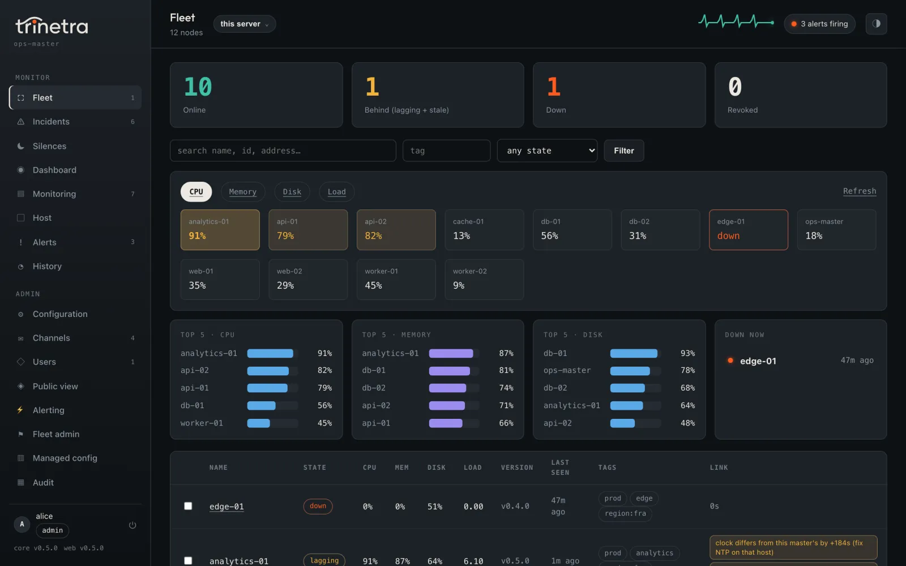
</p>

```bash
sudo trinetra install                      # one systemd service
sudo trinetra telegram set-token <token>   # the only required setting
# then, from your phone:  /start <pin>  ->  /stats
```

---

## Contents

- [Small by design](#small-by-design)
- [Feature tour](#feature-tour): [dashboard](#live-dashboard) ·
  [monitoring](#containers-services-filesystems-processes) ·
  [history](#history) · [alerts](#alerts-and-channels) ·
  [fleet](#fleet-overview) · [incidents](#incidents) ·
  [routing](#routing-and-escalation) · [rules](#fleet-wide-rules) ·
  [silences](#silences-and-maintenance-windows) ·
  [managed config](#managed-config) · [admin and audit](#fleet-admin-and-audit) ·
  [security](#security) · [any screen](#any-screen-any-theme)
- [How it works](#how-it-works)
- [Quick start](#quick-start) · [Build a fleet](#build-a-fleet) ·
  [Upgrading from serverwatch](#upgrading-from-serverwatch)
- [Documentation](#documentation)

## Small by design

Most monitoring stacks are built for data centres: a scraper, a time-series
database, a dashboard service, an alert manager, and a pile of YAML to wire
them together. Trinetra is the opposite bet. Each server runs one daemon that
collects, stores, decides and notifies on its own. The same daemon becomes a
fleet master with one command.

| | Measured |
|---|---|
| **Core daemon binary** | 10.9 MB (arm64) / 11.8 MB (amd64) static, **4.3 to 4.7 MB gzipped** |
| **Memory (RSS)** | **11.6 MB** standalone · 12.4 MB as a fleet child · 14.0 MB as a master with two children |
| **CPU** | **~0.4% of one core** standalone, ~0.6% as a child, ~1.2% as a master with two children |
| **Disk** | ~0.3 MB of history per host after the first hour, in a compact binary store with tiered retention |
| **Web UI plugin** | 7.7 MB RSS, ~0.07% CPU, and it only runs if you enable it |
| **Third-party code in the core** | **none**: the `trinetra` daemon is Go standard library only, enforced by a test |

<sub>Measured on Linux containers with 8 vCPUs over about 72 minutes, sampling
every 10 s. That is six times the default 60 s interval, so a default install
is lighter still. Binaries are built with `-trimpath -ldflags "-s -w"`.</sub>

- **One binary, one service.** Drop it on the box, run `install`, set a token.
- **Rules you can read.** Alerts come from static thresholds and a rolling
  per-metric baseline ("not normal for this box"). Both are plain arithmetic:
  you can read the rule and predict when it fires. No AI in the decision path.
- **Configured by command, not by hand.** Every setting goes through the CLI,
  which writes an atomic, validated, private config store.
- **Heavy features are optional plugins.** The web UI and the terminal UI are
  separate binaries that talk to the core over a local socket, so their
  dependencies never touch the daemon.
- **Keeps working when the network doesn't.** Every host alerts on its own.
  In a fleet, a child hands alerts to the master, and falls back to
  delivering them itself if the master is unreachable.

## Feature tour

Screens below are the real web UI (`trinetra-web`) with a demo fleet of twelve
servers.

### Live dashboard

The whole box on one screen, streamed live: containers, systemd units,
filesystems, reachability, a 24-hour availability strip, CPU, memory, swap,
load, temperature, network and processes, plus whatever is firing right now.

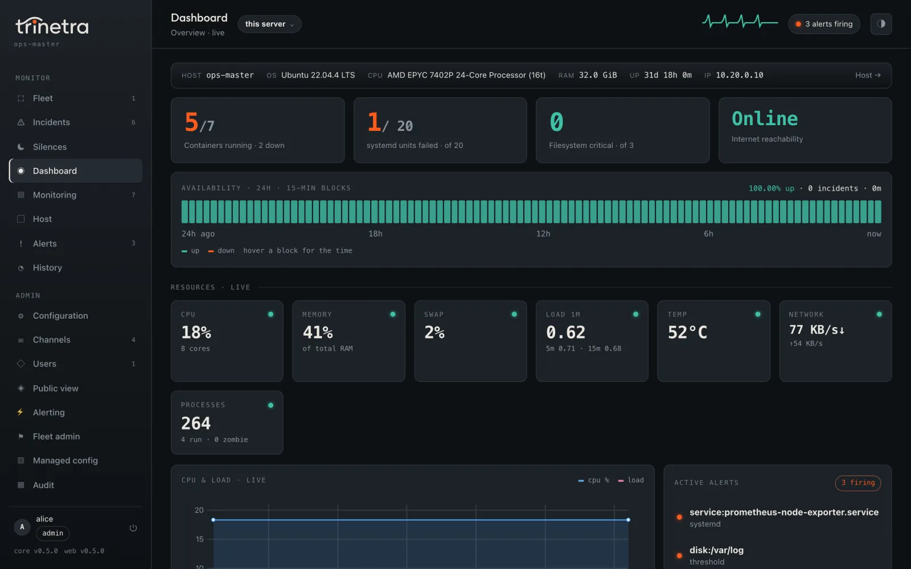

### Containers, services, filesystems, processes

Drill into every Docker container, systemd unit, mount and process, with
live charts and actions from the row detail.


### History

Every metric is kept locally in a compact time-series store with tiered
retention, from 1 hour to 30 days, plus a downtime record that survives
reboots and power cuts.


### Alerts and channels

Static thresholds and baselines, with boot and recovery reports, a daily
digest and a weekly rollup. Deliver to **Telegram** (with a full bot: `/stats`,
history, controls), **email, webhook, Slack, Discord, ntfy and Gotify**, each
with its own severity floor and quiet-hours behaviour.

<table>
<tr>
<td width="50%"></td>
<td width="50%"></td>
</tr>
</table>

### Fleet overview

Turn one host into a master and enroll the rest with a join code. The
`/fleet` page shows every node at a glance: online, lagging, down and revoked
counts, a heatmap you can switch between CPU, memory, disk and load, top-5
lists, what is down right now, and link health with clock skew and outbox
depth.

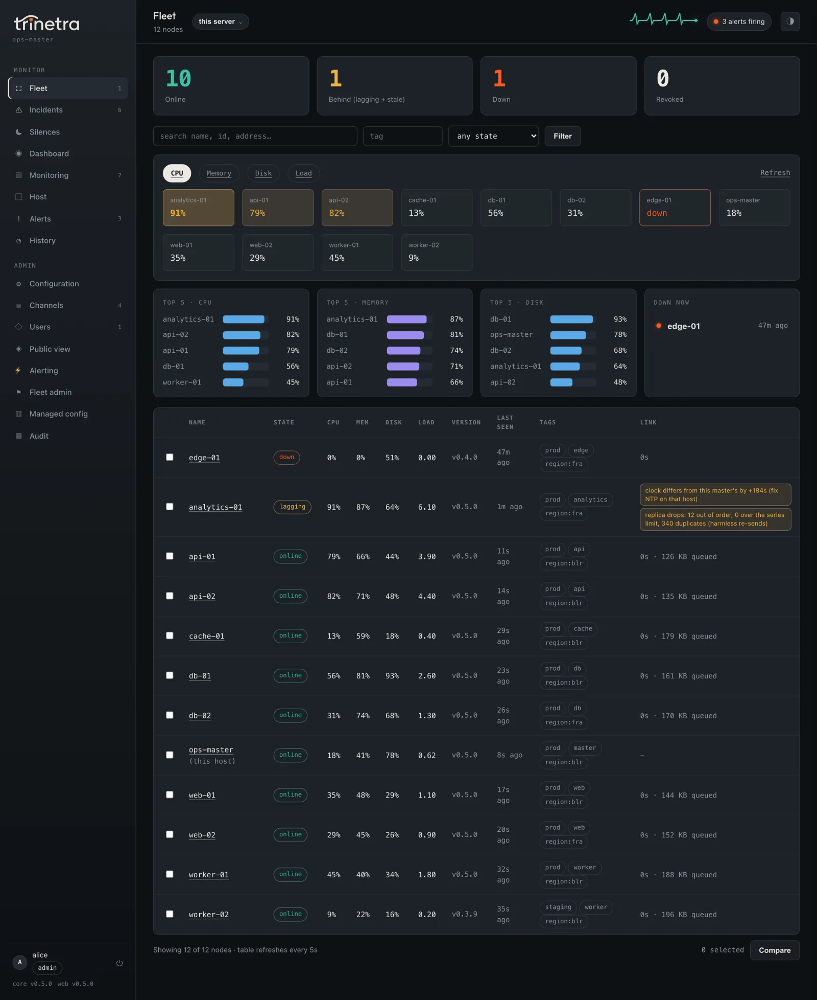

**Every node is one click away.** The node switcher (or <kbd>Ctrl</kbd>/<kbd>⌘</kbd>+<kbd>K</kbd>)
opens any child's full dashboard, monitoring and history, served from the
master's replica of its data. **Compare** overlays any metric across the
nodes you tick.

<table>
<tr>
<td width="50%">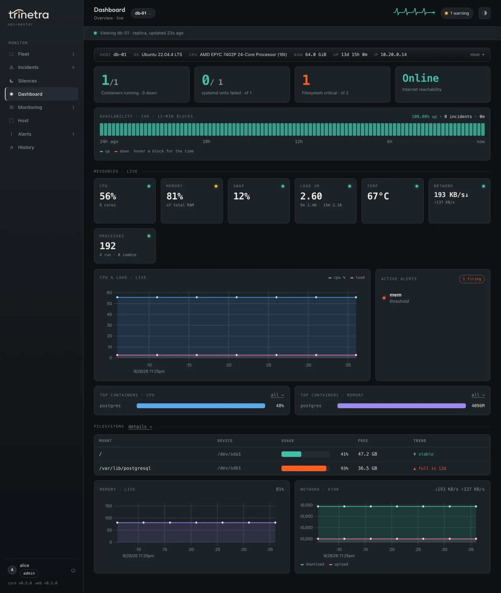</td>
<td width="50%">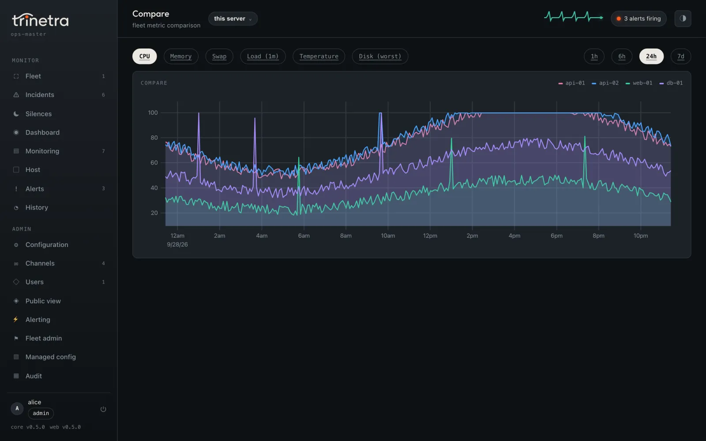</td>
</tr>
</table>

### Incidents

Alerts from across the fleet are grouped into incidents, so ten web servers
with the same problem page you once, not ten times. A dependency map folds
downstream noise under its cause (api nodes under a database outage). Each
incident has a timeline that shows exactly what fired, who was notified,
what was suppressed and why. Ack or silence it from the page, or straight
from Telegram with the **Ack** and **Silence 1h** buttons.

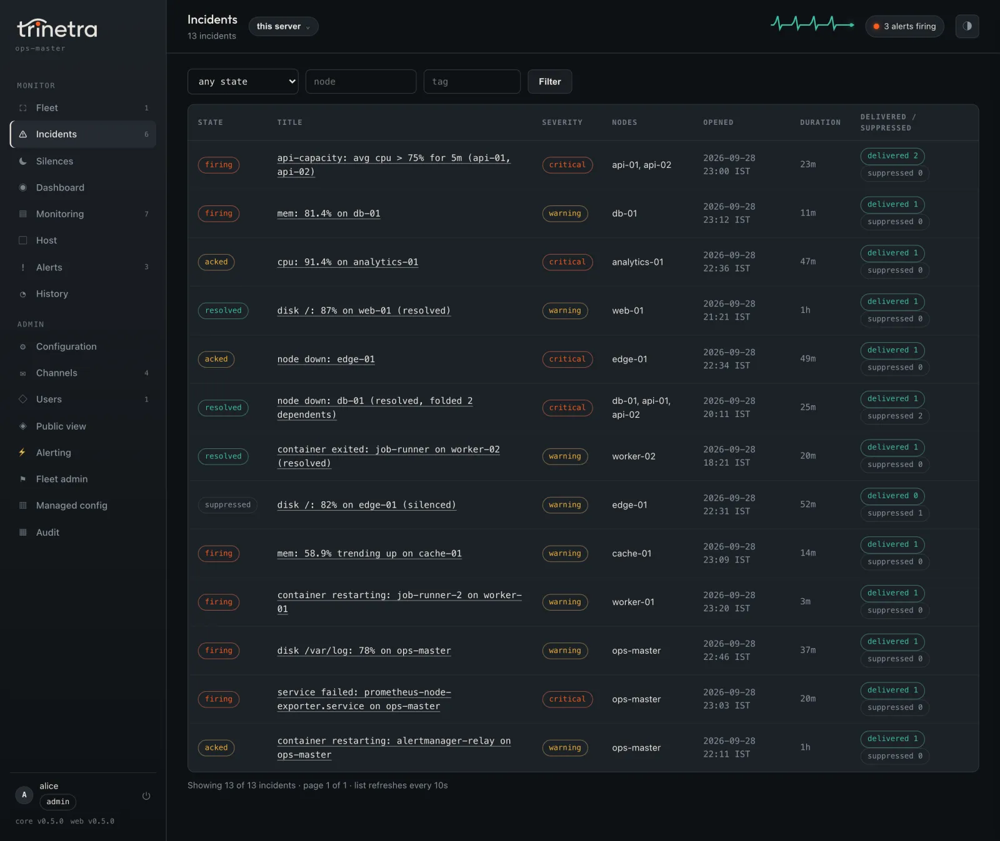

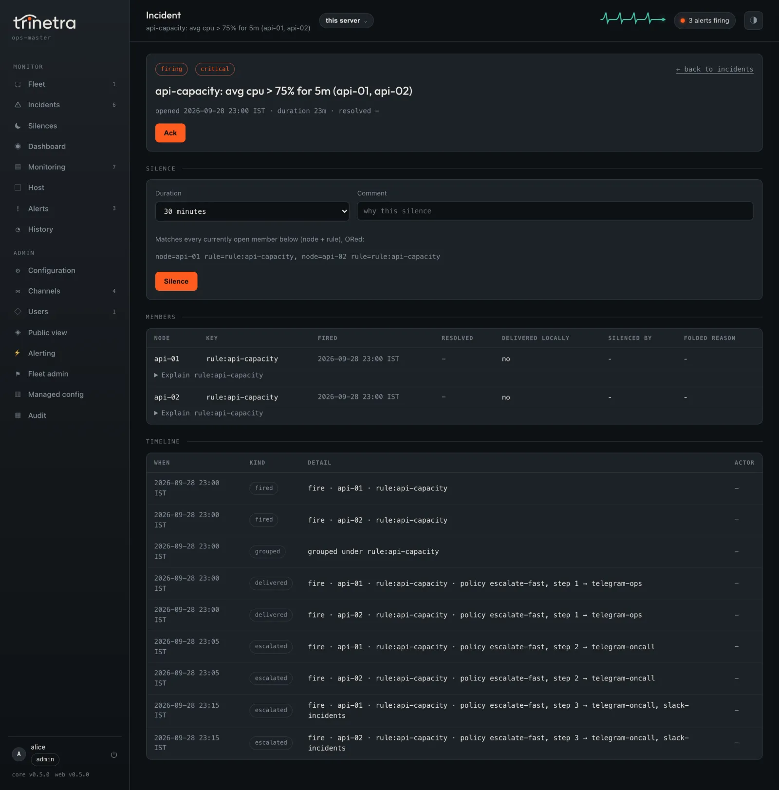

### Routing and escalation

Routes match on tag, node, rule and severity and send each incident to a
policy. A policy is a list of escalation steps (Telegram ops now, on-call
after 5 minutes, everyone after 15), with repeat and resolved notifications.
Routes can continue to fan out to several policies, and every one escalates
on its own. Edit in the form or as JSON, and check any path with the route
tester before you save.

<table>
<tr>
<td width="50%">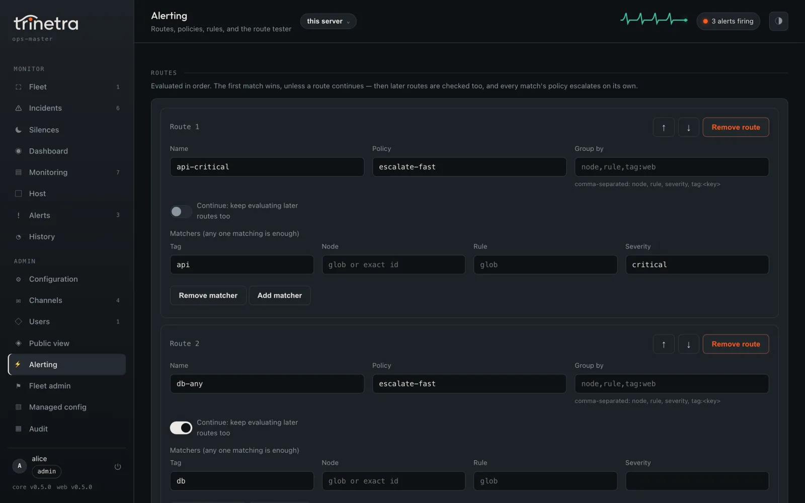</td>
<td width="50%">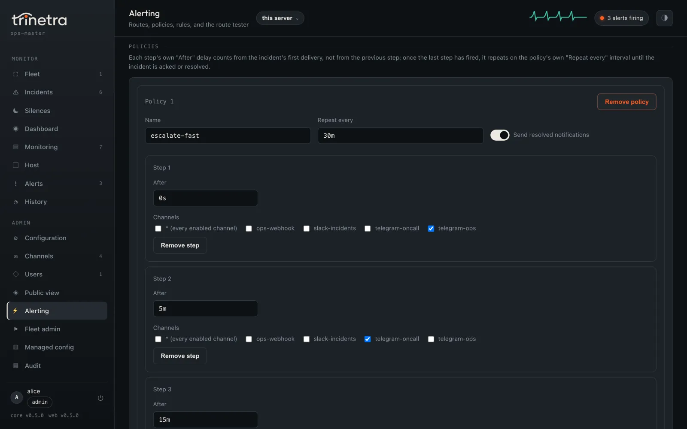</td>
</tr>
</table>

### Fleet-wide rules

Alert on the fleet as a whole with a small, readable expression language:

```text
avg(tag:api, cpu) > 75 for 5m            # the api tier is running hot
online(tag:prod) < 8 for 2m              # lost production capacity
absent(tag:staging, 10m)                 # staging went quiet
count(tag:web, disk > 90) >= 1 for 5m    # any web node nearly full
```

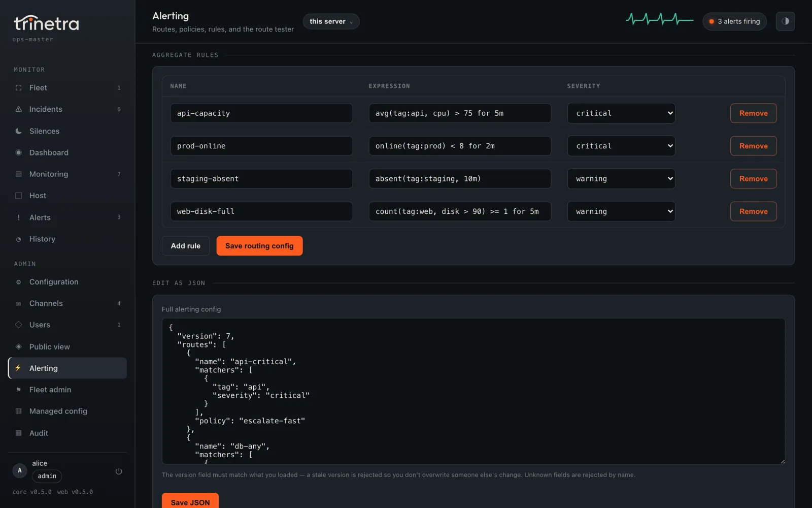

### Silences and maintenance windows

One-off silences for a node, tag, rule or severity, and recurring
maintenance windows by weekday and time zone, so planned work never pages
anyone.

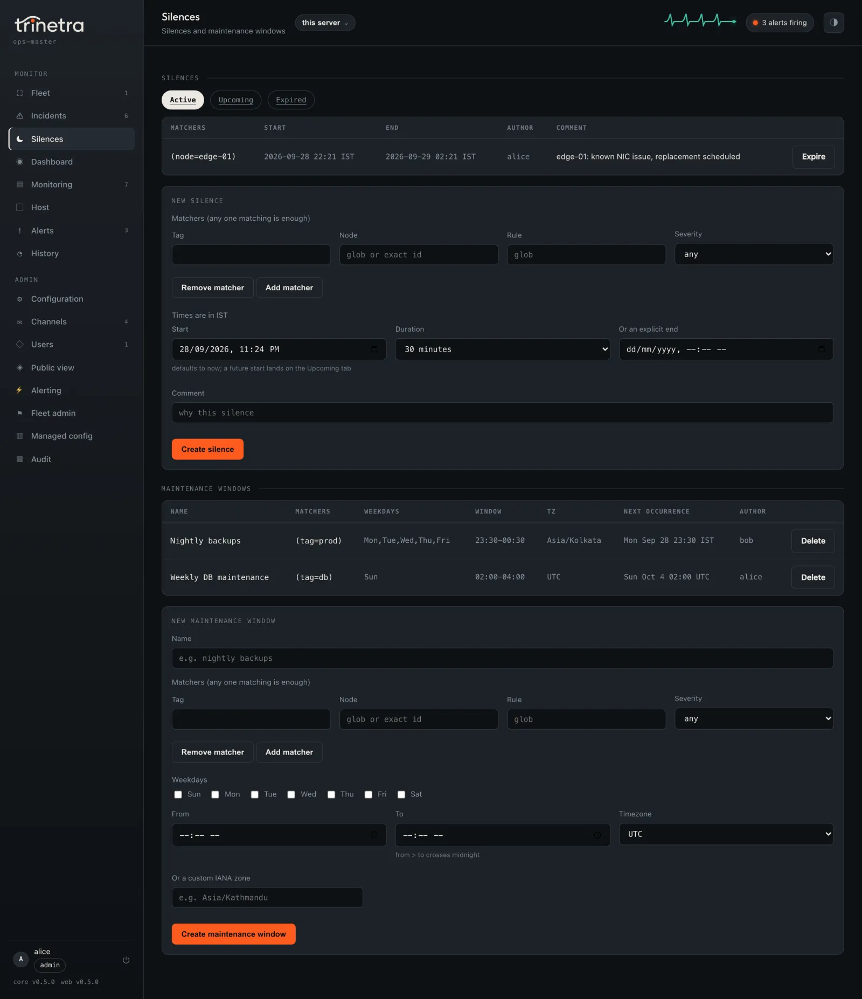

### Managed config

Push settings from the master to every node, or to all nodes with a tag:
thresholds, quiet hours, baseline alerts. Each node reports what it applied,
and drift or conflicts show up per node.

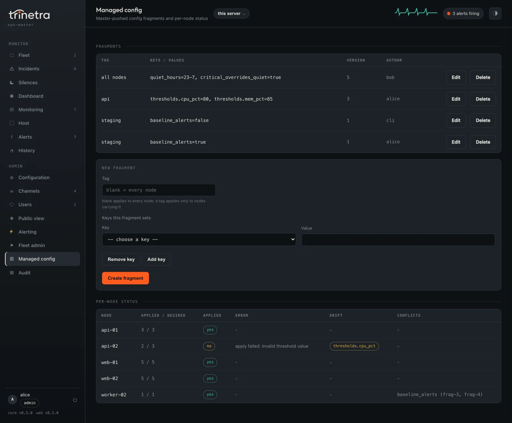

### Fleet admin and audit

Mint join tokens (TTL, uses, tags), rename, re-tag, revoke or remove nodes,
and watch link health. Every change to the fleet, from the web, the CLI or
Telegram, lands in the audit log with who did it.

<table>
<tr>
<td width="50%">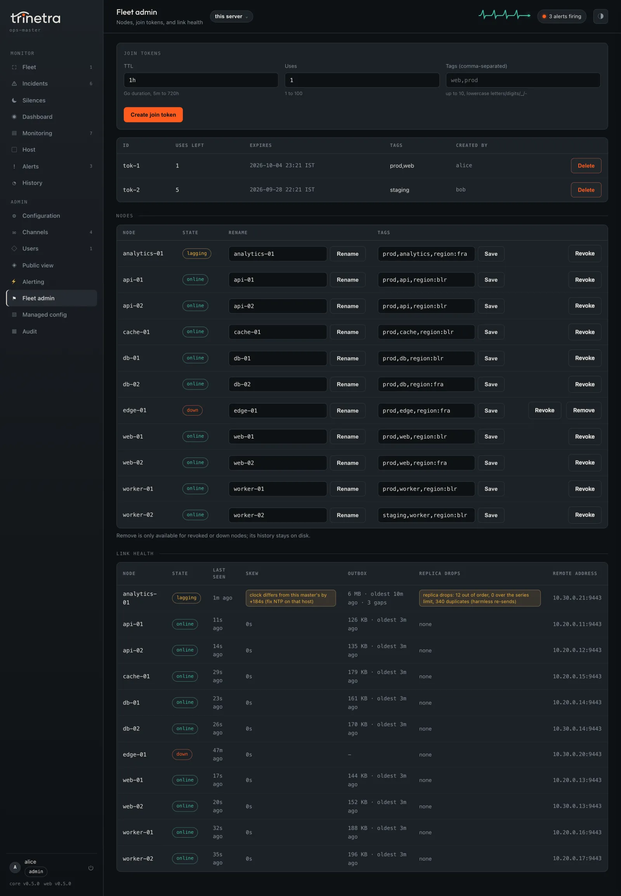</td>
<td width="50%">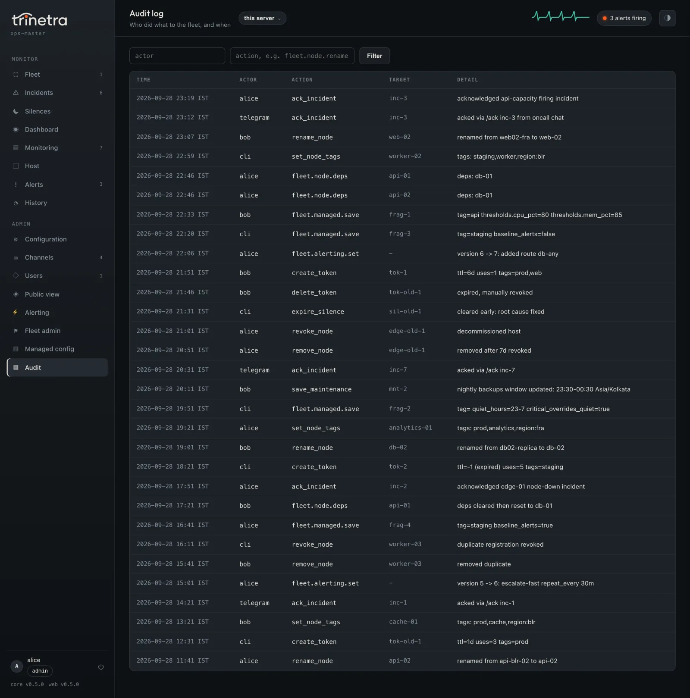</td>
</tr>
</table>

### Security

- **Passkey sign-in** for the web UI (Touch ID, Windows Hello or a security
  key), with admin and viewer roles; after the first admin, new accounts need
  an invite link. No passwords.
- **Mutual TLS for the fleet.** `fleet init` creates a private CA; join codes
  pin the CA's key, so a child never trusts on first use, and every child
  gets its own certificate. Revoking a node cuts it off at once.
- **Verified plugins.** The daemon runs a plugin only after it checks the
  file's owner, its permissions and a SHA-256 hash recorded at install.
- **Signed updates, 2-of-2.** Every release ships a manifest of exact file
  sizes and SHA-256 hashes, signed by the build pipeline **and** co-signed
  offline by a maintainer. A host installs nothing unless both signatures
  verify against keys compiled into the binary it is already running; GitHub
  and the network are treated as untrusted transport. A version floor blocks
  downgrades, and signed channel pointers expire after 14 days so withheld
  updates raise an alert.
- **Automatic rollback.** `trinetra update apply` restarts onto the new build
  under a guard that runs the previous, known-good binary; if the new daemon
  is not healthy within 90 seconds it is rolled back, and a watchdog timer
  finishes the job even across a crash or reboot.
- **Check it yourself.** The release keys and fingerprints are published, and
  any download can be [verified by hand](docs/handbook/14-security.md#verify-a-download-yourself)
  with `sha256sum` and OpenSSL, without trusting trinetra at all.
- **Local only by default.** The control socket is a token-authenticated
  unix socket, and there is no telemetry. The one outbound call you did not
  configure is the daily signed-update check against GitHub releases (it only
  checks and notifies; turn it off with
  `sudo trinetra config set update.channel off`).

The whole model, key by key, is in the [Security chapter](docs/handbook/14-security.md).


### Any screen, any theme

Light and dark themes, a tablet layout with an icon rail, and a phone layout
with a bottom tab bar.

<table>
<tr>
<td width="46%"></td>
<td width="32%"></td>
<td width="22%"></td>
</tr>
</table>

## How it works

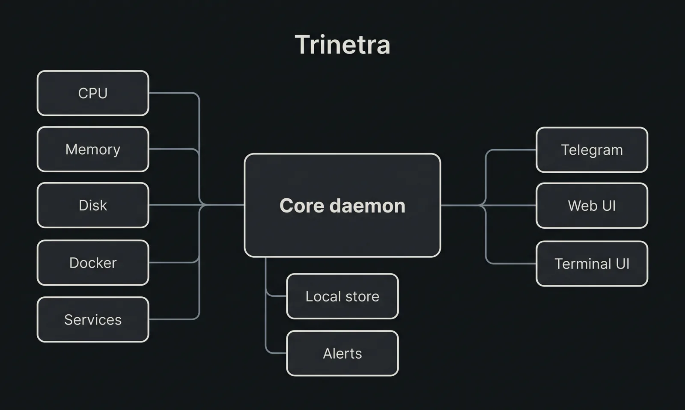

Trinetra is a lean **core** daemon with optional **plugins** around it. The
core runs the sampler, keeps the live picture and the history, decides and
sends alerts, answers Telegram, and exposes its whole internal API over a
local control socket (newline-delimited JSON on a unix socket, with a
token). Plugins are separate processes that dial that socket.

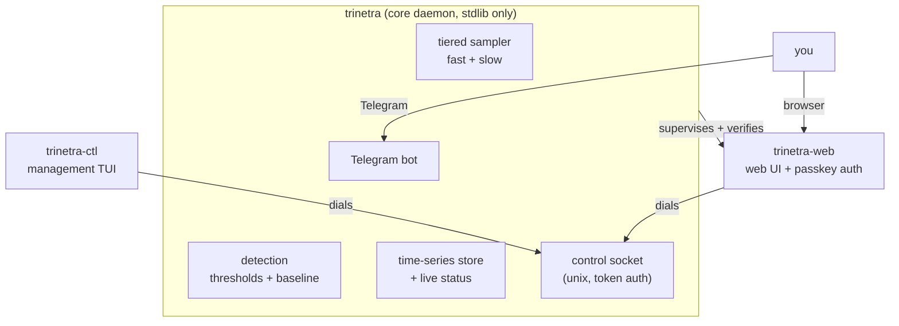
```mermaid
flowchart TD
    subgraph core["trinetra (core daemon, stdlib only)"]
        sampler["tiered sampler<br/>fast + slow"]
        detect["detection<br/>thresholds + baseline"]
        store["time-series store<br/>+ live status"]
        tg["Telegram bot"]
        sock["control socket<br/>(unix, token auth)"]
    end
    ctl["trinetra-ctl<br/>management TUI"] -->|dials| sock
    web["trinetra-web<br/>web UI + passkey auth"] -->|dials| sock
    core -->|supervises + verifies| web
    user["you"] -->|Telegram| tg
    user -->|browser| web
```

**In a fleet**, each child keeps monitoring and alerting on its own and
ships its data to the master over mutual TLS through a durable outbox, so a
network outage only delays delivery and loses nothing. The child hands each
alert to the master, which groups, routes and escalates it. If the master
doesn't take it in time, the child delivers the alert itself.

<table>
<tr>
<td width="50%">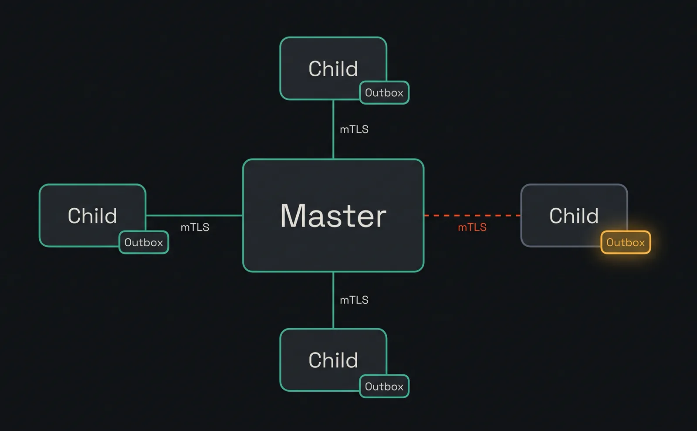</td>
<td width="50%">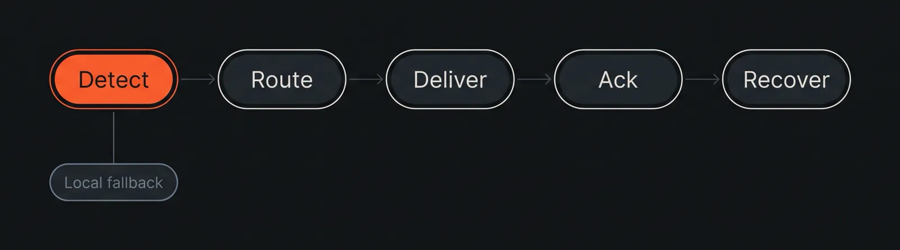</td>
</tr>
</table>

## Quick start

```bash
# On the server, pick your arch: linux-amd64 / linux-arm64 / linux-arm (older Pis)
mkdir -p ~/trinetra-download && cd ~/trinetra-download && arch=linux-amd64
for b in trinetra trinetra-ctl trinetra-web; do
  curl -fsSL -o "$b" "https://github.com/InfoDiveLabs/trinetra/releases/latest/download/$b-$arch"
done
chmod +x trinetra trinetra-ctl trinetra-web

# The signed release manifest and its two detached signatures (CI +
# maintainer), so install can verify what it's about to run.
for f in manifest.json manifest.ci.sig manifest.maint.sig; do
  curl -fsSL -o "$f" "https://github.com/InfoDiveLabs/trinetra/releases/latest/download/$f"
done

sudo ./trinetra install --require-signed   # installs the daemon AND both plugins, enables the systemd service
sudo trinetra cli                          # guided first-run setup: bot token, enrollment PIN, web UI
```

`trinetra install --require-signed` verifies both signatures on the manifest
and every binary's hash (and refuses on any mismatch), copies the binaries to
`/usr/local/bin`, and starts the service. To check a download without trusting
trinetra itself, see [Verify a download
yourself](docs/handbook/14-security.md#verify-a-download-yourself). `trinetra cli` opens the
[trinetra-ctl](docs/handbook/plugins/trinetra-ctl.md#managing-with-trinetra-ctl)
terminal UI, which walks you through the Telegram bot token, `/start <pin>`
enrollment and, optionally, the web UI. Prefer plain commands? The one
required setting is the bot token:

```bash
sudo trinetra telegram set-token <token>   # token from @BotFather
sudo trinetra web                          # optional: the browser UI
```

The two plugins are optional: leave them out of the download loop if you only
want the Telegram daemon. Full steps are in [Installation and first
run](docs/handbook/03-installation.md).

## Build a fleet

```bash
# On the host that will be the master
sudo trinetra fleet init --address monitor.example.com,203.0.113.7
sudo systemctl restart trinetra
sudo trinetra fleet token create --tags prod --uses 3

# On each server you want to enroll, with the code the master printed
sudo trinetra fleet join swj1_...
sudo systemctl restart trinetra

# Back on the master
sudo trinetra fleet nodes --tag prod
```

From there, set up routing, silences, rules and managed config from the web
UI or with `trinetra fleet ...`. The whole story is in the
[Fleet chapter](docs/handbook/13-fleet.md).

## Upgrading from serverwatch

Trinetra is the new name for serverwatch: same daemon, same data. On a host
that runs `serverwatch`, download `trinetra` and the plugins you use into one
directory and run the same install:

```bash
sudo ./trinetra install     # run from the directory holding trinetra, trinetra-ctl, trinetra-web
```

It stops the old service, moves `/etc/serverwatch` and `/var/lib/serverwatch`
to their `trinetra` paths, and carries over config, history, alert state,
Telegram enrollment, web passkeys and fleet identity untouched. Nothing is
deleted before its replacement is proven in place. The old `serverwatch`
command keeps working for one release as a compatibility link. When anything
looks unexpected, it refuses rather than guesses, and tells you what to check.
Every case and the manual rollback steps are in [Upgrading from a
serverwatch install](docs/handbook/03-installation.md#upgrading-from-a-serverwatch-install).

## Documentation

Everything is in the handbook, one concern per chapter.

**[Read the handbook](docs/handbook/README.md)**

| | |
|---|---|
| [Introduction](docs/handbook/01-introduction.md) | What it is and the ethos |
| [Architecture](docs/handbook/02-architecture.md) | Daemon internals, the control socket, core + plugins, the safe-exec trust model |
| [Installation](docs/handbook/03-installation.md) | Getting it onto the server, enabled, and upgrading from serverwatch |
| [Configuration](docs/handbook/04-configuration.md) | The CLI-managed settings and per-target overrides |
| [Monitoring](docs/handbook/05-monitoring.md) | What is collected and how alerting decides |
| [Alerting and channels](docs/handbook/06-alerting-and-channels.md) | Telegram and the other channels |
| [Downtime and liveness](docs/handbook/07-downtime-and-liveness.md) | Heartbeats and power-down reconstruction |
| [Web UI](docs/handbook/08-web-ui.md) | The browser interface and its serving modes |
| [Storage and data model](docs/handbook/09-storage-and-data-model.md) | The time-series store and retention |
| [Operations](docs/handbook/10-operations.md) | Day-to-day running and troubleshooting |
| [Command reference](docs/handbook/11-command-reference.md) | Every CLI subcommand |
| [Roadmap and status](docs/handbook/12-roadmap-and-status.md) | Where it is and what is planned |
| [Fleet](docs/handbook/13-fleet.md) | Master and children: incidents, routing, silences, rules, managed config |
| [Security](docs/handbook/14-security.md) | Trust model, signed releases and keys, safe self-update, manual verification |

## Status

The current stable release is **v0.5.0**: the Trinetra rename (from
serverwatch, with an automatic in-place migration), fleet mode (master/child,
phases 1-3), and signed releases with a self-verifying, self-rolling-back
update path. See the [changelog](CHANGELOG.md) and [Roadmap and
status](docs/handbook/12-roadmap-and-status.md).

## License

Trinetra is source-available under the [Functional Source License, Version 1.1,
ALv2 Future License](LICENSE) (FSL-1.1-ALv2), © 2026 InfoDive Labs Pvt Ltd.

- **Free to use, self-host and modify**, for yourself or inside your company,
  including commercially, as long as you are not offering a competing product
  or service. Education, research, and professional services (e.g. setting it
  up for a client) are explicitly allowed.
- **Not allowed:** selling or hosting Trinetra, or a product built on it, as a
  competing commercial offering.
- **Becomes Apache-2.0 after two years.** Each release converts to the Apache
  License 2.0 on the second anniversary of its release.

Releases up to and including v0.4.1 (published as serverwatch) remain under the
MIT License they were released with.
