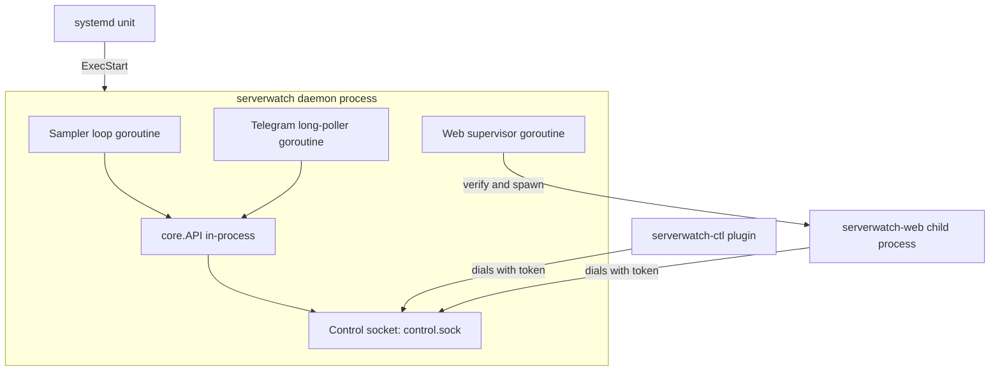
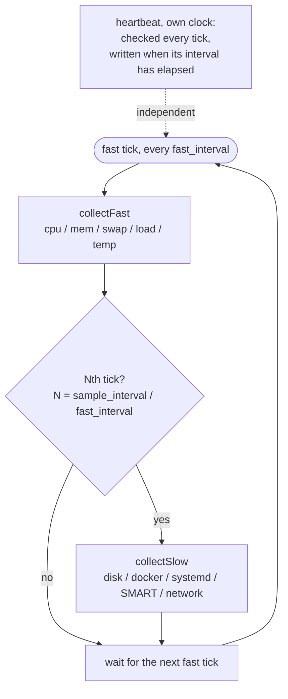
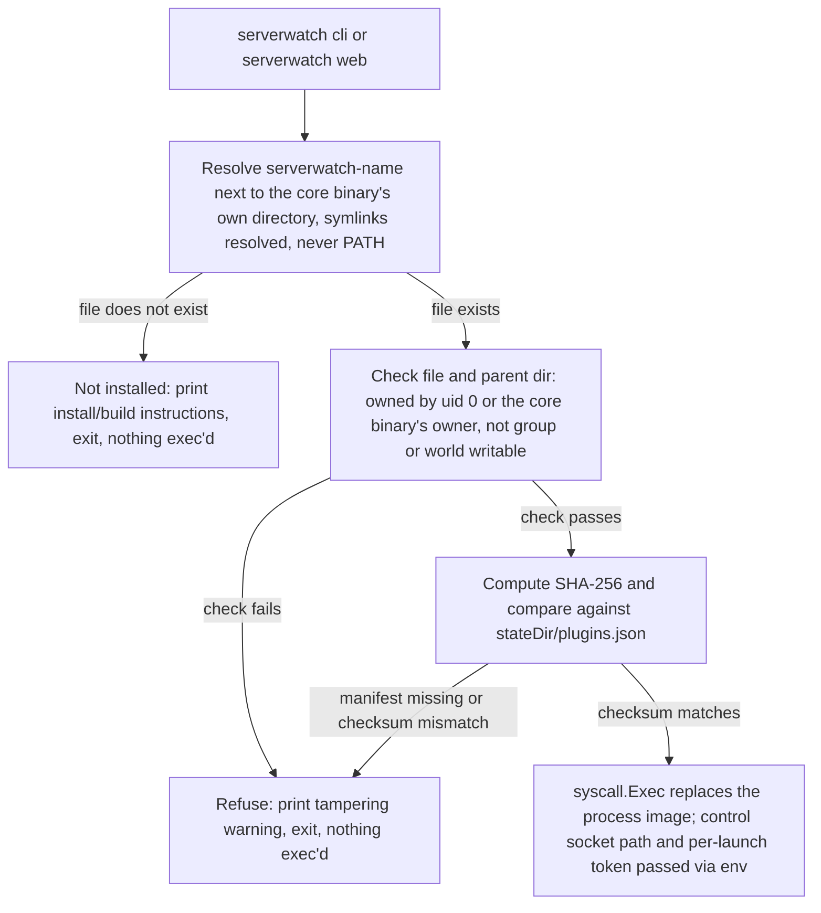
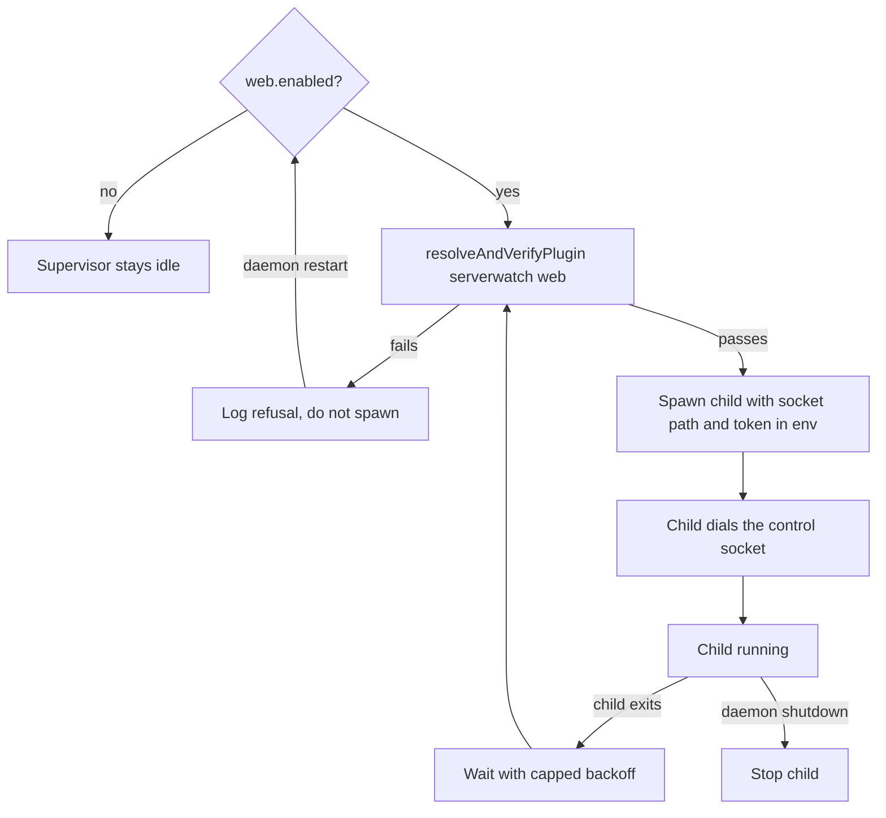
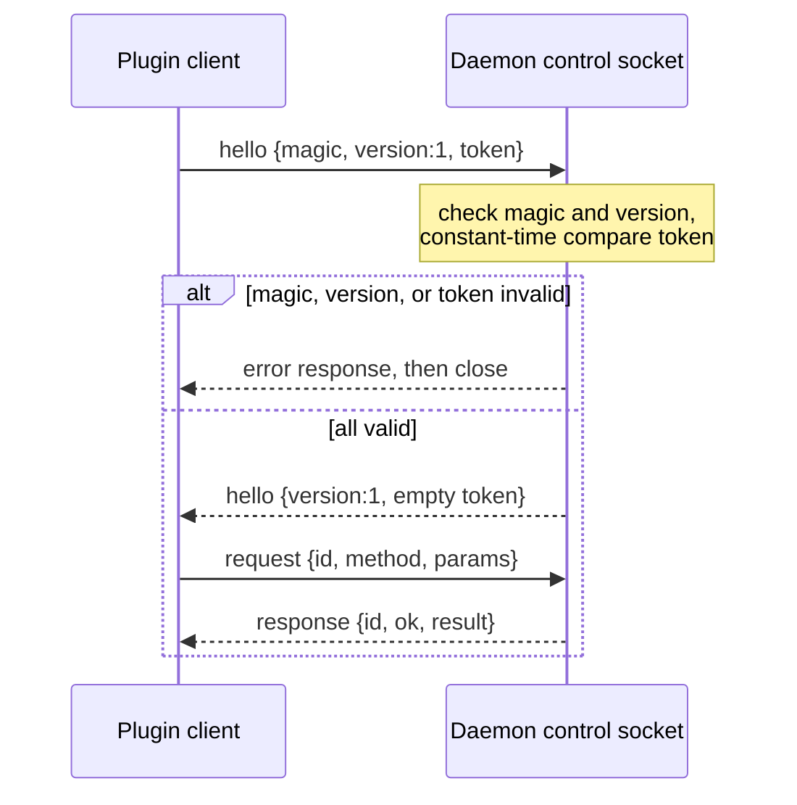
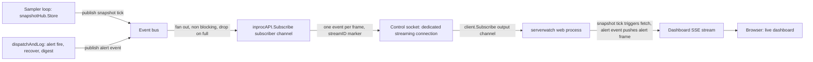
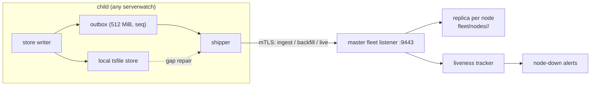

# Architecture

serverwatch is one Go binary that runs as one systemd service. There is no
agent-plus-collector split, no sidecar, no message broker, and no external
database. Everything the daemon needs, it does inside a single long-running
process started by systemd and kept alive by it. This chapter is about what
that process is made of: the goroutines it runs, the tiered sampling model that
sets its rhythm, the internal contract every consumer reads it through, and the
local control socket that lets separate plugin processes talk to it without the
daemon ever growing a dependency it does not need.

If you read only one chapter of this handbook, read this one. The pieces
introduced here (the core contract, the control socket, and the plugin model
layered on top of them) are the load-bearing structure the rest of the system
hangs off of, and the control socket in particular appears in no other
document.

## The daemon process

The whole thing runs as `serverwatch daemon`, the long-running process systemd
starts from the unit's `ExecStart`. You never launch it by hand; systemd owns
its lifecycle. Inside that one process, work is split across a small number of
goroutines, each with a clear owner and no shared mutable state beyond a couple
of carefully guarded values.

Two goroutines always run:

| Goroutine | What it does | Cadence |
|-----------|--------------|---------|
| Sampler loop | Collects host metrics, evaluates anomaly checks, writes `status.json`, appends to the time-series store, feeds the watchdog | Ticks at `fast_interval` |
| Telegram long-poller | Answers inbound bot commands (`/stats`, `/disk`, and so on) and handles owner enrollment | Blocks on Telegram's long-poll, replies in about a second |

When `web.enabled` is set and the control socket is up, the daemon also runs
a third: a web supervisor goroutine that verifies and spawns `serverwatch-web`
as a separate child process, rather than linking any web code into the
daemon itself. See [Web supervisor](#web-supervisor) below.

The shape of the process, and the plugin binaries that dial in from outside it,
looks like this:



The sampler loop is the heart of the daemon and lives in `cmdDaemon`
(`internal/serverwatch/daemon.go`). It is the sole owner of most of the
daemon's stateful pieces: the previous CPU sample it diffs against, the network
rate calculator, the per-process CPU calculator, the SMART scan cache, and the
`merged` snapshot it rebuilds every tick. Because that state belongs to one
goroutine, almost none of it needs locking.

The Telegram poller runs in its own goroutine (`pollLoop`) and deliberately
keeps its own copy of the state it needs (its own CPU sample, for instance), so
no pointer is shared across the goroutine boundary. When an authorized command
comes in, it collects a fresh full snapshot on the spot and replies. Ownership
is claimed once, through a one-time enrollment PIN printed to the log (see
[Installation and first run](03-installation.md)), and only the owner chat is
ever answered.

Config is shared between goroutines through one `sync.RWMutex` and a
pointer-swap discipline: the live `*config.Config` is never mutated in place.
When a `SIGHUP` arrives (every CLI write sends one), the config is re-read from
disk and swapped in atomically, so readers always see a complete, consistent
config struct. This is why almost every setting reloads live with no restart.

The daemon is written to stay up. If config on disk is corrupt at startup, it
falls back to defaults rather than crashing (under `Restart=always` a crash
would become a crash-loop). If the time-series store fails to open, store
writes are disabled and the daemon keeps running. If the web supervisor fails
to verify or spawn `serverwatch-web`, or the control socket fails to start,
that failure is logged and the daemon carries on without it. The guiding rule
is that enhancements are never a reason to take
the monitor down.

## The tiered sampler

The single most important design decision in the daemon is that not all checks
cost the same, so not all checks run at the same rate. Reading a few numbers
out of `/proc` is nearly free; shelling out to `df`, `docker`, `systemctl`, and
`smartctl` is not. serverwatch splits collection into two tiers plus an
independent heartbeat, and one loop drives all three.

The loop ticks at `fast_interval`. Every Nth tick, where `N =
sample_interval / fast_interval`, it also runs the slow tier. The heartbeat
runs on its own clock, checked every tick but written only when its own
interval has elapsed.



### The fast tier

The fast tier is cheap and never spawns a subprocess. It reads `/proc/stat`,
`/proc/meminfo`, `/proc/loadavg`, and the first thermal zone under
`/sys/class/thermal`, and turns them into CPU percent, memory percent, swap
percent, the three load averages, and a temperature. This is `collectFast`.

Because it is cheap, the fast tier runs on every tick and drives the things
that need to be current:

- The live status view (`status.json`, see [Storage and the data
  model](09-storage-and-data-model.md), is rewritten every fast tick).
- The rolling baseline that anomaly detection compares against.
- The threshold and baseline checks for `cpu`, `mem`, `swap`, and `temp`.
- A raw sample per fast-tier metric appended to the time-series store
  (`cpu`, `mem`, `swap`, `load1`, `load5`, `load15`, `temp`).

The default `fast_interval` is 5 seconds (minimum 1).

### The slow tier

The slow tier is where the expensive checks live. This is `collectSlow`, and it
runs only on slow ticks:

- `df` for per-filesystem usage, plus device, filesystem type, inode usage, and
  a linear fill-rate projection.
- `docker ps` for container up/down state, plus the opt-in `docker stats` for
  per-container CPU, memory, and network.
- `systemctl --failed` for the alerting unit list, plus the opt-in full unit
  inventory.
- `smartctl` for device health, plus the opt-in per-device attribute read; the
  scan itself is throttled to `collect.smart_interval` (default 30 minutes)
  because it is the heaviest call in the tier.
- The opt-in `/proc/net/dev` throughput read.
- The opt-in process-table snapshot.
- A connectivity dial to decide whether the box's own internet is up.

On each slow tick the loop also appends the slow-tier series (`disk:<mount>`,
and, for whichever opt-in collectors are enabled, `docker:<name>:cpu`/`:mem`,
`net:<iface>:rx`/`:tx`, and `smart:<dev>:temp`), pings `healthchecks.url` if
set, tracks internet-down intervals, and runs the store's downsample and prune
pass.

The default `sample_interval` is 60 seconds (minimum 5), and it must be an
integer multiple of `fast_interval`.

One detail worth calling out: the very first tick after startup or a config
reload (`tick == 0`) always runs the slow tier too, so the first `status.json`
and the first anomaly evaluation are already fully populated instead of waiting
up to N-1 fast ticks for the disk and docker data to show up. Between slow
ticks, the `merged` snapshot keeps the last-collected slow values, so every
`status.json` write and every anomaly evaluation sees a complete picture, even
if the slow half of it is up to `sample_interval` old.

### The heartbeat

The heartbeat is not a tier. It runs on `heartbeat_interval` (default 30
seconds, minimum 1), independent of both tiers, and does exactly one thing:
rewrite the `heartbeat` file with the current time. Its only purpose is to let
a future boot measure how long the process was down. On startup the daemon
reads the previous heartbeat, and if the gap is larger than twice the heartbeat
interval it reconstructs a `power_down` event and can send a boot/recovery
report. Writing the heartbeat more often than its own interval would buy
nothing, so it is gated by `shouldHeartbeat`.

### Live reload of the cadence

All three intervals reload live. The sampler loop reads the current config at
the top of every tick; if `fast_interval` or `sample_interval` changed, it
resets the ticker in place and recomputes N from that point, so a new cadence
takes effect on the very next tick with no restart. The one exception across
the whole config surface is `storage.*` (see [Configuration](04-configuration.md)):
the time-series store is opened once
at startup and is not reopened on `SIGHUP`, so a storage backend or retention
change needs a `systemctl restart`.

## The core contract and the plugin model

Everything that reads daemon state or changes daemon config goes through one
Go interface, `core.API`, defined in `internal/core/api.go`. It is deliberately
the only boundary:

> `API` is the single boundary through which every consumer (the web UI, the
> CLI, and the control-socket client) reads daemon state and applies changes.

The interface splits cleanly into reads and writes:

```go
type API interface {
    // reads
    Snapshot() (DashboardView, error)
    Monitoring() (MonitoringView, error)
    Series(metric string, from, to int64, res Resolution) ([]SeriesPoint, error)
    Events(from, to int64) ([]DownEventView, error)
    ActiveAlerts() ([]AlertRecord, error)
    AlertHistory(since int64, limit int) ([]AlertRecord, error)
    Config() (*config.Config, error)
    Doctor() (DoctorReport, error)
    EnrollmentPIN(ctx context.Context) (pin string, enrolled bool, err error)
    MonitorTargets(ctx context.Context) ([]TargetView, error)

    // writes
    ApplyConfig(*config.Config) error
    AckAlert(key string) error
    UnackAlert(key string) error
    TestChannel(name string) error
    ValidateChannel(cc config.ChannelConfig) error
    Subscribe(ctx context.Context) (<-chan Event, error)
}
```

The two context-taking reads, `EnrollmentPIN` (the Telegram `/start <pin>`
enrollment pin, see [Command reference](11-command-reference.md#90-telegram-set-token-now-prints-the-enrollment-pin))
and `MonitorTargets` (live host discovery for the monitor-thresholds screen),
need a live daemon to answer; the file-backed implementation below returns an
error for them rather than a meaningless value.

There are a couple of implementations of this interface. Inside the running
daemon there is an in-process one (`newInprocAPI`) that reads the live snapshot
and config directly and applies changes through the same reload path a `SIGHUP`
would. For the separate CLI process there is a file-backed one that reads the
same on-disk state. The point of the interface is that a consumer does not care
which one it holds.

This is what makes the plugin model possible. The daemon serves its in-process
`core.API` over a local control socket (described in the next section) so that a
separate process can dial in and call the very same methods. A plugin is just a
separate binary that connects to that socket and talks the contract.

The reason to keep plugins as separate processes is dependency hygiene, and it
is a hard rule here. The default `serverwatch` binary is 100% standard library.
Anything heavier lives in a plugin binary that carries its own dependencies and
never bloats the daemon. Concretely:

| Binary | Build | Dependencies | Role |
|--------|-------|--------------|------|
| `serverwatch` | default | stdlib only | The daemon and the CLI |
| `serverwatch-web` | no build tag | passkey/webauthn stack and more | Web UI, a separate binary the daemon supervises |
| `serverwatch-ctl` | no build tag | its own | A richer out-of-process control client |

The build seam that enforces this is simple, not tag-based: the daemon
package never imports `internal/web` at all. `internal/web` is an ordinary,
untagged package like any other, but only `cmd/serverwatch-web` imports it,
so none of its dependencies ever reach the daemon. The control-socket code, by
contrast, ships inside the daemon itself, because `internal/control` imports
only the standard library plus `internal/core` and `internal/config`, so
serving it never drags a third-party dependency into the default build.

A word on status: `serverwatch-web` is a plain, separate binary that the
daemon verifies, spawns, restarts, and stops on its own (see [Web
supervisor](#web-supervisor)). `serverwatch-ctl` is deliberately not
supervised: it is an interactive client you run by hand when you want it, not
a background service, so nothing manages its process. It is the primary way to
manage a running serverwatch day to day, with guided screens for schedule,
quiet hours, healthchecks, monitor thresholds, and channels, plus a first-run
Telegram onboarding flow (see [Managing with
serverwatch-ctl](plugins/serverwatch-ctl.md#managing-with-serverwatch-ctl)).

### The front-door safe-exec trust model

The core does not expect you to know where the plugin binaries live or invoke
them directly. Two subcommands on the core binary itself act as front-doors:
`serverwatch cli` execs `serverwatch-ctl`, and `serverwatch web` execs
`serverwatch-web` (see [Command reference](11-command-reference.md) for the
full command details). Both are typically run as root, via `sudo serverwatch
cli` or `sudo serverwatch web`, because that is how the daemon itself runs.
That single fact is what makes this front-door security-sensitive rather than
a convenience shim: launching a plugin as root and exec'ing whatever happens to
be at that path would let an attacker who can plant or modify a file escalate
to root the moment someone runs the command. So before it ever execs, the core
proves the plugin is the genuine, unmodified binary it installed.

Three checks all have to pass, in order, or the core refuses and prints why:

1. **Absolute path from the core's own directory.** The plugin path is
   `serverwatch-<name>` in the same directory as the running `serverwatch`
   binary (`filepath.Dir(os.Executable())`), symlink-resolved. It is never
   looked up via `$PATH`; a `$PATH` lookup would let an attacker with a
   writable `PATH` entry (or a loosened `sudo secure_path`) plant a malicious
   binary the core would then exec as root.
2. **Owner and permissions.** The plugin file, and its parent directory, must
   be owned by uid 0 (root) or by whichever user owns the core binary, and
   neither may be group- or world-writable. Either check failing is a refusal.
3. **Checksum against the install manifest.** `serverwatch install` records
   the SHA-256 of each companion binary it finds into a root-only manifest,
   `<stateDir>/plugins.json` (mode `0600`; see [Installation and first
   run](03-installation.md)). Before exec, the core recomputes the plugin's
   SHA-256 and requires it to match the manifest entry for that name. A
   missing manifest, a missing entry, or a mismatch is a refusal, never a
   silent pass; `serverwatch uninstall` removes the manifest.



On a successful launch, the core passes the control socket path and a
per-launch token to the plugin via the `SERVERWATCH_CONTROL_SOCKET` and
`SERVERWATCH_CONTROL_TOKEN` environment variables, the same way the plugin
would discover them by hand (see the control socket section below). For the
interactive `cli` front-door specifically, the core uses `syscall.Exec` to
replace its own process image rather than forking a child, so the terminal is
handed over to `serverwatch-ctl` cleanly with no wrapper process in between.

Anyone who places `serverwatch-ctl` or `serverwatch-web` next to the daemon
binary by hand, whether that is a fresh build or a manual copy, must
(re-)run `serverwatch install` afterward. Until the manifest has a checksum
entry for that exact file, the front-door has nothing to verify it against and
refuses to run it.

## Web supervisor

`web.enabled` does not start a goroutine inside the daemon: it tells the
daemon to supervise `serverwatch-web` as a separate child process. The
supervisor's job is to keep that child alive for as long as the daemon
considers the web UI wanted, and to stay out of the way otherwise.

At startup, the daemon checks `web.enabled` once. If it is off, the
supervisor does nothing. If it is on and the control socket came up, the
supervisor runs the exact same `resolveAndVerifyPlugin` check the [front-door
trust model](#the-front-door-safe-exec-trust-model) above uses for
`serverwatch cli` and `serverwatch web`: the plugin path must resolve next to
the core binary's own directory, be owned and permissioned correctly, and
match the SHA-256 recorded in the install manifest. A verification failure is
logged as a refusal, and the supervisor does not spawn the child; a plain
`serverwatch install` after a rebuild refreshes the manifest and clears the
refusal on the next daemon start. `web.enabled` is not reloaded on SIGHUP, so
toggling it takes effect on the next `systemctl restart serverwatch`, the
same as any other `web.*` key.

Once verified, the supervisor spawns `serverwatch-web` as a child process,
passing the control socket path and a per-launch token through the same
`SERVERWATCH_CONTROL_SOCKET` and `SERVERWATCH_CONTROL_TOKEN` environment
variables the front-door uses. The child dials the control socket like any
other plugin and never sees daemon internals directly.

If the child exits, the supervisor treats that as a restart trigger rather
than a fatal event: it waits under a capped backoff (starting at 1 second,
doubling up to a 30 second cap, reset to the minimum once a child has stayed
up longer than 60 seconds) and spawns it again, re-running the verification
check on every respawn so a binary swapped in between restarts is caught the
same way a swap before the first spawn would be. On daemon shutdown, the
supervisor stops the child instead of leaving it orphaned.



The same front-door checks, the same environment variables, and the same
control socket transport are shared between the manual `serverwatch web`
front-door and this automatic supervisor; the only difference is who decides
when to launch the child.

## The control socket

The control socket is how a separate process reaches the daemon's live
`core.API`. It is the transport under the plugin model, and it is worth getting
precise, because the details are all in the code and nowhere else.

### Where it lives

The socket is a unix domain socket named `control.sock`, created inside the
daemon's runtime directory:

```
$RUNTIME_DIRECTORY/control.sock   ->   /run/serverwatch/control.sock
```

`RUNTIME_DIRECTORY` is set by systemd because the unit declares
`RuntimeDirectory=serverwatch`. That one line tells systemd to create
`/run/serverwatch` on a tmpfs before the service starts, own it as
`User=root`, export its path into the service's environment, and remove it when
the service stops. So the directory always exists with the right lifetime and
the daemon never has to create or clean it up. When you run the daemon by hand
outside systemd, `RUNTIME_DIRECTORY` is unset and the code falls back to
`/run/serverwatch`, creating the directory itself as a best effort.

### Permissions

The socket is defended two ways: file permissions and a token. The permissions
come first.

| Path | Mode | Owner |
|------|------|-------|
| `/run/serverwatch/` (parent dir) | `0700` | root |
| `/run/serverwatch/control.sock` | `0600` | root |
| `/run/serverwatch/token` | `0600` | root |

systemd creates the runtime directory `0755`, so `serveControlSocket`
explicitly chmods it down to `0700` before binding, closing the window where a
non-owner could connect between the listen and the socket's own chmod.
`net.Listen` honors the umask rather than an explicit mode, so the socket is
chmodded to `0600` right after it is created. Any stale socket left over from
an unclean shutdown is removed first, because `net.Listen` on a leftover socket
file fails with "address already in use".

The file mode is defense in depth against other local users on a multi-user
host. The actual authentication is the token.

### The token

On every launch the daemon generates a fresh token: 16 random bytes rendered as
32 hexadecimal characters. It writes that token to a sibling `token` file next
to the socket, mode `0600`, root-owned. A plugin running as the same user reads
that file to learn the token it must present. Because the token is regenerated
per launch, a token from a previous run is worthless after a restart.

Token generation and the token file are treated as enhancements, the same way
the socket itself is: if the token cannot be generated or written, the daemon
logs it and continues serving the socket with no token auth rather than
crash-looping over it.

### The wire protocol

The protocol is newline-delimited JSON. Every frame is a single JSON object on
one line, terminated by a newline so the other end can delimit frames with a
buffered reader. There are three frame shapes: a handshake `hello`, a
`request`, and a `response`.

A connection opens with a hello handshake in both directions. The client sends
a hello carrying the fixed magic string, the protocol version, and its token.
The server checks the magic and version, then constant-time compares the token
(`crypto/subtle`) against its own. If the magic or version is wrong, or the
token does not match, the server writes an error response and closes the
connection. Only on success does the server echo its own hello (with an empty
token) and start accepting requests.

```
client -> server   {"hello":"serverwatch-control","version":1,"token":"<32 hex>"}
server -> client   {"hello":"serverwatch-control","version":1}     (on success)
```



The current `ProtocolVersion` is 1. A version mismatch is rejected outright; the
handshake exists precisely so the two ends agree before any real frame flows.

After the handshake, each call is a request frame with a monotonically
increasing id, a method name, and JSON params, answered by a response frame
carrying the same id. When a call succeeds, `ok` is true and `result` holds the
method's return value; when it fails, `ok` is false and `error` carries the
message.

```
request    {"id":1,"method":"Snapshot","params":{}}
response   {"id":1,"ok":true,"result":{ ... }}
```

The connection is guarded by two read deadlines so a peer that connects and
then goes silent cannot tie up a goroutine forever: a 10 second deadline on the
opening hello, and a 5 minute idle deadline on each request frame after that.
The client side holds a mutex for the whole round trip of each call, so request
and response frames and their ids never interleave across goroutines sharing
one client, and it bounds each call with its own 30 second timeout.

### The methods

The methods exposed over the socket mirror `core.API` exactly. The reads return
the method's data; the writes return an empty result and surface only success
or an error.

| Kind | Methods |
|------|---------|
| Reads | `Snapshot`, `Monitoring`, `Series`, `Events`, `ActiveAlerts`, `AlertHistory`, `Config`, `Doctor`, `EnrollmentPIN`, `MonitorTargets` |
| Writes | `ApplyConfig`, `AckAlert`, `UnackAlert`, `TestChannel`, `ValidateChannel` |
| Streaming | `Subscribe` (live event push, see [The live event stream](#the-live-event-stream) below) |

`Subscribe` is the one method that does not fit the request/response shape
the rest of the table follows. Calling it does not get one response; it
dedicates the whole connection to a one-way stream of events, described in
its own section next.

## The live event stream

The dashboard used to be entirely poll driven: the web UI asked the daemon
for a fresh snapshot on a timer and had no way to hear about anything the
moment it happened. `core.API.Subscribe` replaces that with a push: the
daemon now maintains an in-process event bus, and anything with a live
subscription (in-process or over the control socket) is told about a new
snapshot or a dispatched alert as soon as it occurs.

### The event bus

The bus lives inside the daemon process (`eventBus` in
`internal/serverwatch/eventbus.go`) and fans out `core.Event` values to any
number of subscribers. There are two publish points:

- The sampler loop, right after it stores the merged snapshot
  (`snapshotHub.Store`), publishes a `core.Event{Kind: "snapshot"}` tick.
  This event carries no view of its own; it is only a signal that a fresh
  `DashboardView` is available by calling `Snapshot()`.
- `dispatchAndLog`, the daemon's single choke point for every dispatched
  alert (fire, recover, and the daily/weekly digest), publishes one
  alert-shaped `core.Event` per dispatch, carrying the same
  `Kind`/`Severity`/`Source`/`Title`/`Time` the alert itself has.

Both publish points share the same non-blocking guarantee: `Publish` sends
to each subscriber's channel under `select`/`default`, so a subscriber whose
buffer is full simply misses that event rather than making the publisher
wait. This matters because the publisher, in both cases, is on the sampler
loop's own goroutine: a slow, stalled, or entirely absent subscriber can
never stall a sample tick or a dispatch. Snapshot ticks are coalescable (the
next one supersedes a dropped one), and alerts are also durably recorded in
the alert log, so a drop here is never the only record of what happened.

`core.API.Subscribe(ctx context.Context) (<-chan core.Event, error)`
is the read side of the bus. The in-process implementation
(`inprocAPI.Subscribe`) registers a new buffered subscriber on the daemon's
bus and returns its channel; a goroutine watches `ctx.Done()` and
unsubscribes when the caller is done. The file-backed API used by
out-of-process tooling with no live daemon to subscribe to still returns an
error, since there is no bus for it to attach to.

### Streaming over the control socket

The control socket protocol described above is fundamentally
request/response: one connection, mutex-serialized on the client side, one
frame in and one frame out per call. A live stream does not fit that shape,
so `Subscribe` is handled as a special case on both ends.

On the server, `handleConn` recognizes `Subscribe` before it reaches the
normal per-method dispatch and switches that connection into STREAMING mode
instead of looping for another request: it writes one ack response, then
calls `api.Subscribe(ctx)` with a `ctx` derived from the connection's own
lifetime, and loops writing one frame per event it receives. Every event
frame reuses the `response` struct with a reserved marker: `const streamID =
-1`, so the client's normal one-shot `call` (which always looks for its own
request id) never mistakes a stream frame for its response. A goroutine
reads from the connection in parallel purely to detect disconnect: any read
error there means the client went away, so it cancels the derived `ctx`,
which is what makes `api.Subscribe`'s own unsubscribe run. Deriving the
subscription's `ctx` from the connection lifetime this way is what keeps a
client disconnect from ever leaking a subscriber on the bus: the moment the
connection dies, the context is cancelled, and cancellation is what removes
the subscriber from the bus's map.

On the client, `Subscribe(ctx)` cannot reuse the primary connection, because
that connection's `call` method holds a mutex for the whole round trip of
every request and a stream would hold that mutex forever. Instead it opens
a second, DEDICATED connection to the same socket path and token (remembered
from the original `Dial`), sends the `Subscribe` request on it, reads the
ack, and then hands off to a goroutine that reads stream frames and decodes
each one into a `core.Event` on an output channel. That dedicated connection
is owned solely by the subscription: closing it, whether because the caller
cancelled `ctx` or because the read loop hit an error, tears down only the
stream, leaving the primary connection and its mutex completely unaffected.
A normal call like `Snapshot` can run on the primary connection at the same
time a subscription is live on the dedicated one with no risk of the two
blocking each other.



The end result: a subscriber, whether in-process inside the daemon or a
plugin dialing in over the socket, learns about a new snapshot or a
dispatched alert within one bus `Publish` call, with no polling interval in
between, while a subscriber that never shows up or falls behind costs the
publisher nothing more than a dropped send.

One subtlety in `Config`/`ApplyConfig`: they carry the raw `config.Config`
value rather than a display-formatted projection, so the `omitempty` semantics
of the opt-in `collect.*` toggles survive the round trip intact.

### Failure handling

Serving the socket is non-fatal. `cmdDaemon` starts it
and, if binding fails (for example, a permission problem on `/run`), logs the
failure and leaves the daemon running without it. This mirrors how the web
server is treated: the control socket is an enhancement, never a reason to take
the monitor down. When the daemon stops, the stop function closes the listener
and removes both the socket and the token file.

## The systemd unit

The unit is written by `serverwatch install`, rendered by `renderUnit` in
`internal/serverwatch/systemd.go`, and installed to
`/etc/systemd/system/serverwatch.service`. There is exactly one unit, wrapping
the `serverwatch` daemon binary; `install` always copies whichever binary is
running to `/usr/local/bin/serverwatch` and writes this same file around it.
`serverwatch-web`, when installed, runs as a supervised child of this same
unit rather than getting a unit of its own; see [Web
supervisor](#web-supervisor). Here it is exactly as emitted:

```ini
[Unit]
Description=server-watcher host monitor
After=network-online.target docker.service
Wants=network-online.target

[Service]
Type=simple
ExecStart=/usr/local/bin/serverwatch daemon
Restart=always
RestartSec=5
WatchdogSec=90
User=root
RuntimeDirectory=serverwatch
StandardOutput=journal
StandardError=journal

[Install]
WantedBy=multi-user.target
```

Most of these lines are ordinary, but a few are load-bearing and worth
explaining.

`After=network-online.target docker.service` and
`Wants=network-online.target` order the daemon after the network is up and
after docker, so its first slow tick has a working network and a reachable
docker socket to probe. `Wants` (rather than `Requires`) keeps the ordering
without making the network a hard dependency that could block the service from
starting.

`Type=simple` means systemd considers the service started as soon as it forks
`ExecStart`; there is no readiness protocol. This works fine alongside the
watchdog because the `WATCHDOG=1` notification is accepted from the main PID
regardless of `Type`, unlike `READY=1` which would require `Type=notify`.

`ExecStart=/usr/local/bin/serverwatch daemon` runs the daemon subcommand. This
is the process this whole chapter is about, and it is the only way the daemon is
meant to start.

`Restart=always` with `RestartSec=5` is the survive-crashes half of the
resilience story: if the process exits for any reason, systemd restarts it after
5 seconds. Paired with `WantedBy=multi-user.target` in the install section
(which is what `systemctl enable` hooks into), the daemon both starts at boot
and comes back after a crash.

`RuntimeDirectory=serverwatch` is the line that makes the control socket
possible. As covered above, it is what creates `/run/serverwatch` with the
right ownership and lifetime and exports its path into the environment, so the
socket has a home that appears before the daemon starts and vanishes when it
stops.

`WatchdogSec=90` is the line that catches a wedged daemon. systemd expects a
`WATCHDOG=1` ping from the service at least every 90 seconds; if none arrives,
it kills and restarts the unit. The sampler loop sends exactly that ping on
every fast tick, which at the default 5 second cadence is far inside the 90
second window. The pairing is deliberate: `Restart=always` catches a process
that has died, but only the watchdog catches a process that is still alive yet
stuck, because a sampler loop that has wedged stops sending pings and systemd
restarts it. The comment on `renderUnit` in the source spells this out, and it
is the reason the number is 90 and not something tighter: it has to leave
comfortable headroom above the fast interval.

`User=root` is required because the daemon reads privileged data and shells out
to privileged tools (`smartctl`, docker, and so on). `StandardOutput=journal`
and `StandardError=journal` send all logging to the journal, which is why
`journalctl -u serverwatch` is the way to read the daemon's output, including
the one-time Telegram enrollment PIN.

## Fleet mode

Everything above describes one host watching itself. Fleet mode lets one
serverwatch collect the history of many others, without changing what any of
them does locally. It lives in `internal/fleet` (standard library only, like
the daemon) plus a thin adapter layer in `internal/serverwatch`.

### Three roles

Every install has a `fleet.role`:

| Role | What it does |
|------|--------------|
| solo (empty) | The default and exactly the behaviour described in the rest of this chapter. No fleet goroutine, no listener, no fleet directories on disk. |
| master | Everything solo does, plus a TLS listener (`fleet.listen`, default `:9443`) that enrolls children and stores a replica of each one's history. The master shows itself as the node `self`. |
| child | Everything solo does, plus a shipper that sends a copy of what it records to its master. |

The role is written only by `serverwatch fleet init|join|leave|disable`, never
by `config set`, because it has to change together with the certificates those
commands create. A child keeps sampling, storing and alerting locally exactly
as a solo host would; the master adds to that, it never replaces it. If the
master disappears, every child carries on as if it were solo and catches up
later.

### Enrollment

`serverwatch fleet init` creates a private certificate authority on the master
(10 years) and a server certificate (2 years) for the addresses children will
use, under `/var/lib/serverwatch/fleet/pki/`. Running it again reuses the
existing CA, so enrolled children never have to re-join; it refuses to replace
a CA it cannot read rather than silently minting a new one.

`serverwatch fleet token create` prints a one-line join code (`swj1_...`). The
code carries the master's URL, a short-lived single- or multi-use token
(`swt_...`), and the CA pin: a SHA-256 of the CA's public key. On the child,
`serverwatch fleet join <code>` generates a private key locally, connects to
the master, and refuses to send anything unless the certificate chain the
master presents matches that pin. So the only trust decision is copying the
code; there is no trust-on-first-use. The master spends the token, registers
the node, and signs a 90-day client certificate for it. Joins are rate-limited
per source IP.

From then on every request from the child is mutual TLS: the master knows
which node is talking from the client certificate, not from anything in the
request body. The child renews its certificate over that same connection once
two thirds of its life has passed, so a healthy node never expires.
`serverwatch fleet node revoke` marks a node revoked in the master's registry;
its requests are refused from then on, it stops shipping and raises a local
alert, and its history on the master is kept. `serverwatch fleet node remove`
goes further: it deletes the node from the registry and from liveness
tracking and resolves any open node-down alert for it, keeping only its
replicated history on disk.

`serverwatch fleet leave` on a child is local only; the master is not told.
Until the node is revoked or removed on the master, the master keeps
expecting it and pages it as down, so `leave` prints the exact command to run
there (`sudo serverwatch fleet node revoke <node-id>`).

### The data path

On a child, the store writer appends every sample to the local time-series
store first, exactly as on a solo host, and only then tees a copy into the
**outbox**: a durable, append-only spool under `/var/lib/serverwatch/outbox/`
where each record gets an increasing sequence number. Down events and alert
log entries go through the same outbox. A failure to write the outbox is
logged and counted but never blocks the local write; the local store is the
source of truth.

The shipper reads the outbox in batches (at most 1 MiB or 5000 records) and
posts them to the master's `ingest` endpoint. The master applies a batch to
that node's replica, a normal tsfile store under
`/var/lib/serverwatch/fleet/nodes/<id>/`, syncs it to disk, records the last
applied sequence number, and only then acknowledges. The child deletes outbox
segments once they are acknowledged. A batch the master has already applied
is acknowledged again without being re-applied, so a retry after a lost
response never duplicates data.

The replica also has an ordering guard: tsfile series must only grow in time,
so the master drops any point whose timestamp is not newer than the last one
it stored for that series (and counts it in the node's `ingest.state`). That
guard is what makes gap repair, below, safe to retry.



Separately from the durable path, the child sends a small **live** update every
fast interval: the current snapshot, alert state and version, plus host
inventory every ten minutes. It is latest-wins and not spooled; it is what the
master shows as the node's current state.

### Store and forward, and gap repair

When the master is unreachable, the outbox simply grows and the shipper retries
with backoff (1 s up to 60 s, jittered). When the master comes back, the
backlog drains in order, and the replica ends up identical to the child's own
store.

The outbox is capped (`fleet.outbox_max_mb`, default 512 MiB). If a long
outage fills it, the oldest segments are dropped and the dropped range is
recorded as a **gap** (sequence range and time range) before anything is
deleted. Nothing is lost, because the same data still sits in the child's
local store. Before sending anything newer from the outbox, the shipper
repairs the oldest gap first: it rebuilds that time range from local history
(raw points while raw retention still holds them, 1-minute rollups before
that) and posts it to the master's `backfill` endpoint. Only then does the
remaining outbox follow. Oldest-first matters: because of the ordering guard,
sending newer data first would make the master reject the older points
forever.

A gap that cannot be rebuilt locally after several attempts is given up on and
logged, so one broken range cannot hold back everything newer.

### Liveness and node-down alerts

The master tracks when it last heard from each node. A node is `online` while
it is in contact, `lagging` when it is in contact but its oldest unsent data
is more than five minutes old, `stale` after 30 seconds of silence, and `down` after
`fleet.node_down_after` (default 2 minutes); revoked nodes show as `revoked`.
When the master itself starts, every node gets a fresh grace period, so the
master's own downtime is never blamed on its nodes.

A node going down raises one alert on the master, and its return resolves it.
If half or more of the fleet (at least three nodes) drops at once, that is
almost always the master's own network, so the master raises a single "fleet
connectivity" alert instead of one per node. On the child side, a link that
has been down for ten minutes raises a local warning (telemetry is still being
spooled), and it resolves when the link is back.

In this release children still send every one of their own alerts locally,
exactly as before; the master only adds the node-down and fleet-connectivity
alerts. Nothing is silenced by joining a fleet.

### What a replica can answer today

The control socket accepts an optional `node` on each request, so
`serverwatch-ctl`, the web UI and any other plugin can read a remote node the
same way they read the local one: status, history, metrics, down events, the
alert log and host inventory all come from the replica. Requests without a
`node` go to the local daemon, as before. Fleet management itself is a small
set of `Fleet.*` methods (status, nodes, rename, tags, revoke, remove,
tokens).

Some things still need the live child and are refused for a remote node in
this release: container logs, config changes, alert acks, channel tests,
`doctor`, and the live event stream. Thresholds shown for a remote node come
from the master's config, not the child's.

## Putting it together

Step back and the shape is simple. One process, started and kept alive by
systemd, runs a tiered sampler loop and a Telegram poller (and, when
`web.enabled`, a supervisor that keeps a separate `serverwatch-web` child
process alive). The sampler sets the rhythm: cheap checks every few
seconds, expensive checks every minute, a heartbeat on its own clock, and a
watchdog ping every tick that lets systemd restart the process if the loop ever
wedges. Every consumer, in-process or out, reads and writes daemon state
through one interface, `core.API`, and the daemon serves that interface over a
token-authenticated local socket so that separate, dependency-carrying plugin
processes can drive it while the default binary stays pure standard library.
The systemd unit ties the resilience and the socket lifetime together in a
dozen lines. Fleet mode, when you turn it on, adds a spool and a shipper on
children and a listener and replicas on the master, without changing any of
that. That is the architecture the rest of this handbook builds on.

---

[Previous: Introduction](01-introduction.md) | [Handbook index](README.md) | [Next: Installation and first run](03-installation.md)
