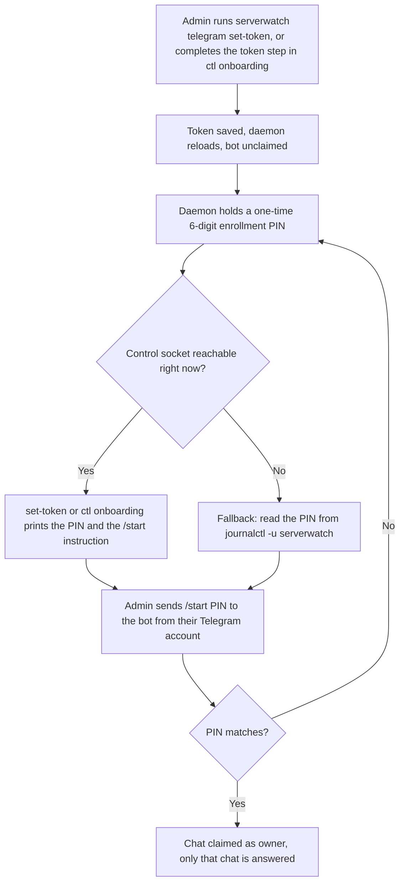

# Installation and first run

This chapter walks you from a bare Linux host to a running `serverwatch`
service that answers you over Telegram. It is written as a runbook: follow the
numbered steps in order and you will end up with a monitored server. Each step
also explains what happens under the hood, so you understand what you just did
rather than only that it worked.

By the end you will have installed the binary, registered it as a systemd
service that survives reboots, confirmed what the host exposes, and claimed the
bot as its owner from your own Telegram account.

## 1. Prerequisites

Before you start, make sure the host and your accounts are ready.

**A Linux host with systemd.** This covers Ubuntu, Debian, Raspberry Pi OS,
Fedora, RHEL, CentOS, and almost every mainstream distribution. The service is
managed entirely through systemd, so a host without it is not supported.

**Root access.** The service runs as `root`. This is deliberate, not lazy:
root is what lets the daemon read every container and process on the box, pull
SMART health data straight off the disks, and start automatically at boot with
no interactive login. You will run the install command with `sudo`.

**A Telegram bot token.** Message **@BotFather** on Telegram, send `/newbot`,
follow the prompts to name your bot, and copy the token it hands back. It looks
like `123456789:AAExampleTokenStringFromBotFather`. Keep it handy; you will set
it in step 5. This is the one setting that is genuinely required. Everything
else has a working default.

The rest are optional and are auto-discovered when present:

- **Docker.** If the daemon can reach Docker, every container becomes a
  monitored target automatically. Nothing to configure.
- **smartmontools.** Install it (`apt install smartmontools`, or the
  equivalent for your distro) to unlock SMART disk-health reporting. Without
  it, SMART is simply skipped.
- **A healthchecks.io check URL.** This drives the real-time dead-man switch
  described in a [later chapter](07-downtime-and-liveness.md), the one mechanism
  that can alert you while the
  box itself is offline. Optional, and set later with a single command.

Anything in that optional list that is missing is reported as unavailable and
left unmonitored. A missing tool never stops the daemon from running.

## 2. Get the binary

You have two ways to obtain the binary: download a prebuilt release asset, or
build it from source. Pick one.

### Option A: prebuilt release asset

The releases page publishes one asset per architecture. Choose the one that
matches your host:

| Host | Asset |
|------|-------|
| x86-64 server or NUC | `serverwatch-linux-amd64` |
| Raspberry Pi 3/4/5 on a 64-bit OS | `serverwatch-linux-arm64` |
| Older 32-bit Pi or ARMv7 | `serverwatch-linux-arm` |

Download the matching asset to `/tmp` and make it executable. The example below
grabs the arm64 build; swap the filename for your architecture.

```bash
curl -fsSL -o /tmp/serverwatch \
  https://github.com/Suraj-Tiwari/server-monitor/releases/latest/download/serverwatch-linux-arm64
chmod +x /tmp/serverwatch
```

Verify what you downloaded before trusting it. Each release includes a
`checksums.txt` file. Compute the SHA-256 of your download and confirm it
matches the line for your asset:

```bash
sha256sum /tmp/serverwatch
```

Compare the printed hash against the matching line in `checksums.txt`. If they
differ, do not install it; re-download and try again.

The release also publishes matching assets for the two plugin binaries,
`serverwatch-ctl-<arch>` and `serverwatch-web-<arch>`. They are optional;
grab them the same way if you want the management TUI or the web UI, and
verify them against the same `checksums.txt`.

### Option B: build from source

If you would rather build it yourself, clone the repository and cross-compile
the Linux binaries. This needs Go 1.22 or newer.

```bash
git clone git@github.com:Suraj-Tiwari/server-monitor.git
cd server-monitor
make linux
```

`make linux` produces `dist/serverwatch-linux-amd64` and
`dist/serverwatch-linux-arm64`. Copy the one you need to the server:

```bash
scp dist/serverwatch-linux-arm64 myserver:/tmp/serverwatch
```

The two plugin binaries build the same way, with no build tag, from their own
`./cmd` package:

```bash
GOOS=linux GOARCH=arm64 go build -o dist/serverwatch-ctl-linux-arm64 ./cmd/serverwatch-ctl
GOOS=linux GOARCH=arm64 go build -o dist/serverwatch-web-linux-arm64 ./cmd/serverwatch-web
```

(`make cross` builds this whole matrix, plus `serverwatch`, for every
supported platform in one pass.) Copy whichever of them you want next to
`/tmp/serverwatch` on the server; `serverwatch install` picks up whatever it
finds beside the binary it is installing (see step 3 below).

Either way, you now have an executable at `/tmp/serverwatch` on the host, ready
to install.

## 3. Install as a systemd service

One command turns that loose binary into a managed, boot-persistent service:

```bash
sudo /tmp/serverwatch install
```

That single command does six things. It is worth knowing each one, because
this is the moment your host goes from "has a binary in /tmp" to "runs a
monitored service."

1. **Copies the binary to `/usr/local/bin/serverwatch`.** This is the real,
   permanent home of the executable. The systemd unit points at this absolute
   path.

2. **Symlinks it into `/usr/bin/serverwatch`.** This is a small but important
   detail. On some distributions, notably RHEL and CentOS-family hosts, sudo's
   `secure_path` does not include `/usr/local/bin`. Without the symlink,
   `sudo serverwatch ...` would fail with "command not found" on those hosts
   even though the service itself runs fine. The symlink puts the command on a
   directory that is on sudo's `secure_path` everywhere, so the `sudo
   serverwatch` shortcut always resolves. The symlink is created only if
   nothing already lives at that path, so it never clobbers a distro-provided
   binary, and it is non-fatal: if the link cannot be made, the binary and unit
   are already in place and only the shortcut is affected.

3. **Records the plugin checksum manifest.** `install` scans the directory it
   just copied the binary into for the companion plugin binaries,
   `serverwatch-ctl` and `serverwatch-web`, and writes the SHA-256 of any it
   finds to `/var/lib/serverwatch/plugins.json`, mode `0600`, root-only. This
   manifest is the trust anchor the safe front-door commands (`serverwatch
   cli` / `serverwatch web`, see [Architecture](02-architecture.md) and
   [Command reference](11-command-reference.md)) check before they will exec
   either plugin. A companion binary that is not present yet is simply
   skipped, not an error, and a hiccup writing the manifest is non-fatal to
   the rest of install. If you build or hand-copy `serverwatch-ctl` or
   `serverwatch-web` into place yourself, either now or later, you must
   (re-)run `serverwatch install` afterward so its checksum gets recorded; the
   front-door refuses to run a plugin binary that is not in the manifest.

4. **Writes and enables the systemd unit** at
   `/etc/systemd/system/serverwatch.service`, then runs `systemctl
   daemon-reload` followed by `systemctl enable --now serverwatch`. The unit it
   writes looks like this:

   ```ini
   [Unit]
   Description=server-watcher host monitor
   After=network-online.target docker.service
   Wants=network-online.target

   [Service]
   Type=simple
   ExecStart=/usr/local/bin/serverwatch daemon
   Restart=always
   RestartSec=5
   WatchdogSec=90
   User=root
   RuntimeDirectory=serverwatch
   StandardOutput=journal
   StandardError=journal

   [Install]
   WantedBy=multi-user.target
   ```

   Two lines in that unit are worth calling out. `WatchdogSec=90` arms the
   systemd watchdog: the sampler loop pings systemd on every fast tick (default
   every 5 seconds), comfortably inside the 90-second window, so if the loop
   ever wedges and the pings stop, systemd restarts the unit for you.
   `RuntimeDirectory=serverwatch` tells systemd to create `/run/serverwatch`
   before the service starts and remove it when the service stops; that is
   where the daemon puts its control socket (see
   [Architecture](02-architecture.md)), so the directory is always present
   with the right lifetime. Together with `Restart=always` and
   `WantedBy=multi-user.target`, the service survives crashes and comes back on
   every boot.

5. **Seeds `/etc/serverwatch/config.json`** if it does not already exist. The
   file is created with mode `0600`, root-owned, because it holds your bot
   token and other secrets. An existing config is left untouched, so a re-run
   of `install` (for example, to upgrade the binary) never overwrites your
   settings.

6. **Starts the service.** By the time the command returns, the daemon is
   already running.

You will see a confirmation line ending with a reminder to set a token, which
is exactly what you do in step 5 below.

## 4. Verify discovery and permissions

Before wiring up Telegram, confirm the daemon can actually see the host. Run
the built-in doctor:

```bash
sudo serverwatch doctor
```

This runs the same probes the daemon itself uses and prints what works on this
particular machine. The report covers:

- **Docker access and method.** Whether Docker is reachable and how, reported
  as one of `socket`, `group`, or `sudo`, or `unavailable` if the daemon
  cannot reach it at all.
- **smartctl availability.** Whether `smartctl` responds (directly or through
  sudo), which tells you if SMART health data will be collected.
- **Thermal zones.** How many `/sys/class/thermal` zones exist, the source of
  temperature readings.
- **Discovered target count.** The total number of things discovery found to
  monitor across containers, filesystems, interfaces, thermal zones, and SMART
  devices.
- **Collector on/off state.** The current setting of each opt-in extended
  collector: `container_stats`, `net_throughput`, `services`, `processes`, and
  `smart_attrs`.
- **Time-series store stats.** The configured store's current series count and
  on-disk size, printed like `time-series: 14 series, 2.3 MB on disk
  (raw+1m)`, or `unavailable` if the store failed to open. This is a quick
  sanity check on how much history you are keeping, especially handy on a small
  device.

Anything the host does not expose (no Docker, no SMART) shows up as unavailable
and is simply not monitored. Nothing here crashes the daemon; doctor is a
read-only diagnostic. This is a good command to run right after install, and
again any time you are chasing a permission gap.

To see the individual targets discovery found, along with each one's on/off
state and effective threshold:

```bash
sudo serverwatch monitor list
```

## 5. Connect Telegram and enroll as owner

Now give the bot its token. You can do this from the command line as shown
below, or from the guided `serverwatch-ctl` first-run onboarding screen
(`sudo serverwatch cli`; see [Managing with
serverwatch-ctl](plugins/serverwatch-ctl.md#managing-with-serverwatch-ctl)); both
paths surface the same enrollment PIN. This runbook continues with the
command line: use the token you copied from @BotFather in step 1:

```bash
sudo serverwatch telegram set-token <token>
```

This writes the token into the config and signals the running daemon to reload,
so there is no restart to do. The daemon starts talking to Telegram
immediately, and `telegram set-token` prints the next step straight to your
terminal.

At this point the bot is running but **unclaimed**. It will not answer just
anyone. To stop a stranger who stumbles onto your bot from reading your data,
serverwatch requires a one-time enrollment step that ties the bot to a single
Telegram chat: yours.

Here is how enrollment works, and it is important to get this right because the
old "just message the bot" behavior is gone. While the bot is unclaimed, the
daemon holds a one-time **6-digit enrollment PIN**. `telegram set-token`
dials the daemon over the control socket right after saving the token and
prints that PIN along with the `/start` instruction, so in the normal case
you never have to leave the terminal you ran it in. The `serverwatch-ctl`
first-run onboarding screen (see the [Command
reference](plugins/serverwatch-ctl.md)) shows the exact
same PIN the same way, if you set the token through the guided TUI instead.
If the daemon cannot be reached, for example it is not installed yet or is
still starting, `telegram set-token` falls back to pointing you at the
journal, where the daemon also logs the PIN.



1. **Get the PIN.** `telegram set-token` prints it directly:

   ```
   Telegram token saved. To finish enrollment, from your Telegram account message the bot:
     /start 123456
   ```

   If it could not reach the daemon, it prints a fallback instead, and you
   read the PIN from the journal:

   ```bash
   sudo journalctl -u serverwatch | grep "/start"
   ```

2. **Claim the bot from your Telegram account.** Open Telegram, find your bot,
   and send it the `/start` command with the PIN, like so:

   ```
   /start 123456
   ```

   Send `/start <pin>`, with the actual six digits in place of `123456`. This
   is the exact form the daemon expects. Sending the bot a plain message, or
   `/start` with no PIN, will not claim it; the PIN is what proves the chat is
   yours.

Once you send the correct PIN, that chat is registered as the owner chat. From
then on, only that chat is answered. Anyone else who messages the bot is
ignored, and they cannot claim it because the PIN was single-use.

3. **Confirm it works.** Still in Telegram, send the bot a command:

   ```
   /stats
   ```

   You should get back the current readings: CPU, memory, swap, load,
   temperature, internet reachability, and disk usage. Send `/help` to see the
   full list of commands the bot understands.

If `/stats` comes back with live numbers, you are done. The service is
installed, enabled at boot, discovering the host, and reporting to you over
Telegram. From here everything else, thresholds, schedules, quiet hours,
extra notification channels, is optional tuning (see
[Configuration](04-configuration.md)); the defaults already work.

---

[Previous: Architecture](02-architecture.md) | [Handbook index](README.md) | [Next: Configuration](04-configuration.md)
