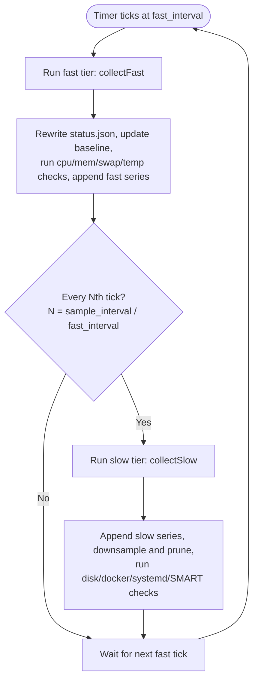

# Monitoring: what gets collected

serverwatch earns its keep by sampling the machine on a schedule and turning
those readings into three things: a live picture of right now, a rolling
history you can query, and the raw material the alerting engine reasons over.
This chapter is about the collection half of that job. It walks the two
sampling tiers and what each one reads, the self-discovery that means you never
hand-list a disk or a container, and the target namespaces you use to turn
individual things on and off. How a reading becomes an alert, thresholds,
baselines, and hysteresis, lives in the [Alerting
chapter](06-alerting-and-channels.md); here we stay with the
question of what serverwatch looks at and how often.

## Two tiers, one loop

There is a single sampler loop, and it ticks at `fast_interval`. Every Nth tick
it also runs the slow tier, where N is `sample_interval / fast_interval`. With
the defaults that means the fast tier runs every 5 seconds and the slow tier
runs every 60 seconds, so the slow tier piggybacks on every twelfth fast tick.
Splitting the work this way keeps the cheap readings frequent without paying the
cost of the expensive ones twelve times a minute.

| Tier | Cadence | Default | Cost | Reads |
|------|---------|---------|------|-------|
| Fast | `fast_interval` | 5s | Cheap, no subprocess | `/proc` and sysfs |
| Slow | `sample_interval` | 60s | Pricier, spawns subprocesses | `df`, `docker`, `systemctl`, `smartctl`, and more |



A third cadence, the heartbeat, runs on its own `heartbeat_interval` and is
independent of both tiers. It only rewrites the heartbeat marker so a future
boot can measure how long the process was down. It is a liveness mechanism
rather than a metric collector, so it is covered in the Downtime chapter, not
here.

## The fast tier

The fast tier is deliberately the cheapest thing serverwatch does. It never
shells out to another program. Every reading comes from a `/proc` file or a
sysfs node, which are ordinary kernel-backed reads, so running it every 5
seconds costs almost nothing.

On each fast tick it collects:

| Series | Source | Meaning |
|--------|--------|---------|
| `cpu` | `/proc/stat` | Busy percentage since the previous tick |
| `mem` | `/proc/meminfo` | Used memory percent (total minus available) |
| `swap` | `/proc/meminfo` | Used swap percent |
| `load1` | `/proc/loadavg` | 1-minute load average |
| `load5` | `/proc/loadavg` | 5-minute load average |
| `load15` | `/proc/loadavg` | 15-minute load average |
| `temp` | `/sys/class/thermal/thermal_zone*/temp` | Thermal-zone temperature in Celsius |

CPU busy is computed as a delta: the sampler remembers the previous
`/proc/stat` counters and reports the fraction of time that was not idle or
waiting on I/O between the two ticks. Memory and swap are simple ratios out of
`/proc/meminfo`. The three load figures come straight from `/proc/loadavg`, and
the temperature is read from the first thermal zone under sysfs.

Each of those seven readings does three jobs at once. It is appended as a raw
sample to the time-series store (see [Storage and the data
model](09-storage-and-data-model.md)), so you can query its history later with
`serverwatch dump`. It updates the live picture in `status.json`, which is what
the dashboard and the Telegram status reply read. And it feeds the rolling
baseline and the anomaly engine, so the cpu, mem, swap, and temp checks always
have fresh, high-resolution input to reason about. Because these four scalar
metrics are the ones that move fastest and matter most, giving them a 5-second
cadence is what lets serverwatch notice a spike promptly rather than a minute
after the fact.

## The slow tier

The slow tier runs once every `sample_interval` and handles everything that is
too expensive to do on the fast cadence, mostly because it means spawning a
subprocess or walking a lot of state. Some of it is always on; a good deal of
it is opt-in, gated by the `collect.*` toggles described in the
[Configuration chapter](04-configuration.md). Here opt-in means toggle-gated,
not off by default: every one of those toggles defaults to enabled, so a
stock install already gathers all of it, and you turn one off on a small or
busy host where the extra work is not worth it.

### Filesystem usage

Every slow tick runs `df` and records the used percentage of each real mount,
along with device, filesystem type, inode, and free/total byte detail. Each
mount is stored as its own `disk:<mount>` series, so disk history is queryable
per mount rather than as a single number for the whole box.

### Docker containers

The slow tier runs `docker ps` to read the state of every container. Container
up/down state is evaluated as a binary health check (running is good, anything
else is bad) and is alert-only: it drives alerting but is not written as a
time-series.

serverwatch also runs `docker stats` to collect per-container CPU, memory, and
network figures, gated by `collect.container_stats` (default on, so a stock
install already gathers it). The CPU and memory readings become
`docker:<name>:cpu` and `docker:<name>:mem` series; the per-container network
I/O is snapshot-only, meaning it lands in `status.json` for the live view but is
never persisted as a series. Per-container collection is the heavier of the two
docker calls, which is why it has its own toggle instead of being tied to the
always-on `docker ps` check.

### systemd units

Every slow tick runs `systemctl --failed` and treats each failed unit as a
binary check that recovers on its own once the unit is no longer listed. This is
alert-only and always on; it is how serverwatch tells you a service died.

It also runs a full `systemctl list-units` inventory of every service and its
load/active/sub state, gated by `collect.services` (default on). That full
list is snapshot-only: it populates the live services view but is never
stored as a series, because the cardinality of every unit name on every host
makes a poor fit for time-series storage.

### SMART disk health

Disk health uses `smartctl`. A `smartctl --scan` enumerates devices, and a
`-H` health read per device gives the overall pass/fail verdict, which is
evaluated as a binary check (a `FAILED` verdict is bad). Both of these are
always on and cheap relative to the attribute read below.

The extra, gated by `collect.smart_attrs` (default on, like the rest), is the
`-A` attribute read, which pulls the detailed SMART attributes including
device temperature. This is the heaviest per-device call serverwatch makes,
so it is throttled independently by `collect.smart_interval`
(default 1800 seconds, that is 30 minutes). Even when the slow tier runs every
minute, the attribute read only happens at most once per `smart_interval`. When
it does run, device temperature is recorded as a `smart:<device>:temp` series.

### Network throughput (default on)

Gated by `collect.net_throughput`, the slow tier reads `/proc/net/dev` and
computes per-interface receive and transmit throughput, stored as
`net:<iface>:rx` and `net:<iface>:tx` series and surfaced in `status.json` as
`net_rates`. Interfaces are discovered and appear in `monitor list`, but
throughput does not yet drive alert firing; today it is collected for history
and the live view only.

### Process table (default on)

Gated by `collect.processes`, the slow tier snapshots the process table:
total process counts plus a top-N by resource use. This is snapshot-only. It
feeds the live view so you can see what is running heavy right now, and it is
the collector most worth turning off (`collect.processes false`) on a host
that churns through hundreds of short-lived processes.

### Reachability and healthchecks.io

Every slow tick also does an internet reachability dial, a plain outbound
connection attempt that answers the "can this box reach the internet" question.
Separately, if you have set `healthchecks.url`, the slow tier pings that URL on
each tick so an external healthchecks.io check can notice if serverwatch itself
stops reporting. The dial is about the server's connectivity; the ping is about
proving the daemon is alive to a third party. Both are covered further in the
[Downtime and liveness chapter](07-downtime-and-liveness.md).

### What the slow tier stores

Pulling the storage shape together, since it is easy to lose track of which
collector produces history and which only produces a live reading:

| Collector | Series | Snapshot | Alert |
|-----------|--------|----------|-------|
| Filesystem `df` | `disk:<mount>` | yes | yes |
| Docker `ps` state | no | yes | yes |
| Docker `stats` cpu/mem (default on) | `docker:<name>:cpu`/`:mem` | yes | no |
| Docker `stats` network (default on) | no | yes | no |
| systemd `--failed` | no | yes | yes |
| systemd full inventory (default on) | no | yes | no |
| SMART `-H` health | no | yes | yes |
| SMART `-A` attrs (default on, throttled) | `smart:<device>:temp` | yes | no |
| Network throughput (default on) | `net:<iface>:rx`/`:tx` | yes | not yet |
| Process table (default on) | no | yes | no |
| Reachability dial | no | yes | yes |

## Self-discovery

You do not hand-configure any of the targets above. On startup and periodically
after, the daemon's `Discover` step enumerates what is actually present on the
box and builds the target list from that.

| Kind | Discovered from |
|------|-----------------|
| Docker containers | `docker ps` output |
| Filesystems | real mounts from `df` (pseudo-mounts filtered out) |
| Network interfaces | every non-loopback interface in `/proc/net/dev` |
| Thermal zones | every `/sys/class/thermal/thermal_zone*/temp` |
| SMART devices | `smartctl --scan` output |

Docker and SMART both need privilege that may or may not be there, so discovery
probes for access rather than assuming it. For docker it tries methods in order
and remembers the one that worked: a plain `docker ps` first, which succeeds if
the daemon runs as root or its user is in the `docker` group, and then
`sudo docker ps` as a fallback. `doctor` and `monitor list` report which method
won, shown as `socket`, `group`, or `sudo`. SMART falls back to sudo the same
way.

The important property is that discovery never crashes the daemon over a missing
tool or missing privilege. If there is no docker, no `smartctl`, or no way to
elevate, that whole class of target is simply reported as unavailable and left
unmonitored. You see it in `monitor list` with an `unavailable` state instead of
`on` or `off`, and the daemon carries on with everything else. Nothing about the
configuration changes; the box just has less to watch.

## Host inventory

Separate from the live metrics, serverwatch also reports the static facts about
the machine it runs on: hostname, OS and kernel, CPU model with its physical
core and logical thread counts, total RAM, uptime, and each disk's model, type
(SSD or HDD), size, and filesystem. This is read straight from the host
(`/proc`, `/sys/block`, `df`) and does not change while the box is up, so it is
fetched on demand rather than sampled.

It also reports the host's own **local IP** (the primary non-loopback address).
The **public IP** is off by default because looking it up means an outbound call
to a third-party service; turn it on with `serverwatch config set
collect.public_ip true` if you want the internet-facing address shown too.

See it in the web panel's **Host** page, or from a terminal with:

```bash
serverwatch-ctl host          # formatted
serverwatch-ctl --json host   # machine-readable
```

## Target namespaces and managing targets

Every discovered target has a namespaced id, and the namespace prefix tells you
what kind of thing it is:

| Prefix | Example | What it is |
|--------|---------|------------|
| `docker:` | `docker:web` | A docker container by name |
| `disk:` | `disk:/` | A filesystem by mount point |
| `iface:` | `iface:eth0` | A network interface by name |
| `smart:` | `smart:/dev/sda` | A SMART block device |
| `temp` | `temp` | The host temperature reading (a single scalar id, not a namespace) |

Those four prefixes plus the single `temp` id are the complete set of monitor
targets. An older design note listed `service:`, `net`, and `load` as targets
as well; that was never
right and you should ignore it. Failed systemd units, network throughput, and
the load averages are collected and alerted on through other paths, but they are
not things you enable, disable, or threshold as monitor targets.

Managing a target means one of three things: seeing its namespaced id and
state, which is `on`, `off`, or `unavailable`; flipping whether it is
monitored; or setting a per-target threshold override for the checks that
carry a numeric threshold, so you can hold `disk:/` to a tighter bound than the
rest of the disks without changing the global `thresholds.*` defaults.

The primary, recommended way to do this is `serverwatch-ctl`'s Monitor
thresholds screen. From Home, press `m` to open the management menu, then
choose **Monitor thresholds**. The screen lists every target the daemon has
discovered, fetched live from the daemon rather than probed locally, so it
shows the same `on`, `off`, and `unavailable` states described above.
`enter`/`space` toggles the target under the cursor on or off, and `t` opens a
threshold-edit input for a per-target override. Each toggle or edit applies
immediately over the control socket, so there is no separate save step and no
daemon restart needed. See [Managing with
serverwatch-ctl](plugins/serverwatch-ctl.md#managing-with-serverwatch-ctl) for the
full walkthrough of that screen and the rest of the management menu.

For automation, cron jobs, or a headless box without `serverwatch-ctl`
installed, the same three operations are available as scriptable
`serverwatch monitor` subcommands:

```bash
# List every discovered target with its state and any threshold
sudo serverwatch monitor list

# Turn a specific target on or off
sudo serverwatch monitor enable docker:web
sudo serverwatch monitor disable iface:eth0

# Set a per-target threshold override
sudo serverwatch monitor threshold disk:/ 85
```

`monitor list` prints one line per target: the namespaced id and its state.
`enable` and `disable` flip whether a target is monitored. `threshold` sets
the per-target override described above. Each of these commands writes the
config through the CLI and signals the running daemon to reload, so, just
like a change made in `serverwatch-ctl`, it takes effect without a restart.
See [Daemon-only config
management](11-command-reference.md#3-daemon-only-config-management) for the
full command reference.

What a threshold means, when the baseline deviation checks fire, and how firing
and recovery are debounced, are all the alerting engine's concern. The next
chapter picks the story up there.

## Docker Swarm services (#118)

On a host that is an active Swarm node (detected once via `docker info`), the
daemon keys containers by their **service** rather than the ephemeral task
container name. A Swarm task is named `<service>.<slot>.<taskid>`, and the
`taskid` changes on every redeploy, so keying on the raw name would create two
new permanent series (`docker:<task>:cpu`/`:mem`) per redeploy and fire false
"container down" churn as old task names disappear. Instead:

- **Series and UI** key on the service name, so per-service CPU/Mem history is
  continuous across redeploys and cardinality tracks the service count, not the
  lifetime task count. A service's tasks are summed, so the chart is the
  service's total footprint.
- **Up/down alerting** is by service: as long as one task is running (a rolling
  deploy), the service is up, so a normal deploy no longer flaps down/recover.

Plain (non-Swarm) docker hosts are entirely unaffected.

## Collector health: fail-visible collection (#110)

A monitoring daemon must never silently degrade. When a slow-tier collection
command (`docker`, `df`, `systemctl`, `smartctl`) fails or times out, the daemon
does **not** publish missing data or flip a healthy target to gone: it carries
the last-known values forward (marking the snapshot stale) and tracks the
failure. A collector that fails for three consecutive cycles raises a
`collector:<name>` alert (see the next chapter), which recovers on the first
success. The current per-collector health (consecutive failures, last success,
last error) is in `status.json`, shown as a warning banner on the web dashboard,
and printed by `serverwatch-ctl status`.

## Series cardinality guardrail (#112)

Stale series (a container removed, a mount that disappeared) are reaped once
their newest point ages past retention, so `seriesCount` tracks live targets.
`serverwatch doctor` warns when the count is abnormally high (a healthy host is
in the low hundreds), which usually points at ephemeral targets churning, e.g. a
Swarm host from before the service-keying fix above.

---

[Previous: Configuration](04-configuration.md) | [Handbook index](README.md) | [Next: Alerting and notification channels](06-alerting-and-channels.md)
