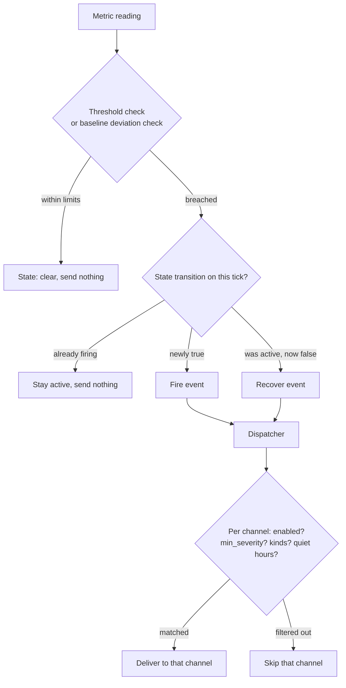

# Alerting and notification channels

trinetra does two separate jobs when something goes wrong. First it
*decides* that something is wrong, which is the anomaly engine reducing every
sampled metric to a small set of fire and recover events. Then it *delivers*
that decision, which is the dispatcher fanning each event out to whichever
notification channels you have configured and routed. This chapter covers both
halves: how a reading becomes an alert, and how that alert reaches your phone.

## The anomaly engine

The engine turns each sample into a `Check`: a key such as `disk:/`, the
current value, and the rules that apply to it. Every check is evaluated on
every relevant tick, and each one is in exactly one of two states, firing or
clear. The engine only emits an event on a transition, so you get one message
when a condition starts and one when it ends, never a stream of repeats while
it stays true.

The path from a reading to your phone looks like this:



### Static thresholds, always on

Threshold checks run for `cpu`, `mem`, `swap`, `temp`, and every discovered
`disk:<mount>`. Each has a number it compares against, and it fires the moment
the reading meets or exceeds that number. These checks are always active. You
cannot turn threshold alerting off globally, though you can retune the numbers
or disable a specific target. The defaults come from your config (see
[Configuration](04-configuration.md)), and you adjust them per family or per
target:

```bash
sudo trinetra config set thresholds.disk_pct 85   # any filesystem at or above 85%
sudo trinetra config set thresholds.temp_c 75
sudo trinetra monitor threshold disk:/boot 70     # override just this mount
sudo trinetra monitor disable docker:some-noisy-container
```

When a threshold check fires, its reason reads like `disk:/ = 91.0 ≥ threshold
85.0`, and when it clears it reports `disk:/ back to normal`. For CPU and memory
the fire message also names the culprit, the top process and container consuming
that resource, so a `cpu` alert reads like `cpu = 96.0 ≥ threshold 95.0 (top:
ffmpeg 82%, container web 30%)`. This is drawn from the process and container
data already collected, so it appears when `collect.processes` is on and there
is something to name, and is simply omitted otherwise.

### Rolling-baseline deviation, opt-in

Alongside the fixed numbers, trinetra keeps a rolling baseline (a mean and
variance that decay over time) for those same metrics. A baseline check fires
when the current reading sits too many standard deviations away from that
mean, which is meant to catch "this is not normal for this box" without you
having to guess a threshold in advance.

This second branch is off by default. It is opt-in through the
`baseline_alerts` config key, and threshold alerting is unaffected by that
switch either way:

```bash
sudo trinetra config set baseline_alerts true   # enable z-score deviation checks
sudo trinetra config set baseline_sigma 3       # how many sigma is "too far"
```

The reason it is opt-in is field experience. On a real home server, cpu, mem,
and temperature often have a low and unstable mean, and their variance gets
underestimated, so a value can be many sigma from the mean while barely moving
in real terms. Left on, those metrics would fire and recover on sigma alone
almost every minute. To suppress that flapping the engine adds a second gate
even when baseline alerting is enabled: a reading must be materially far from
the mean in relative terms, not just many (possibly understated) standard
deviations away, before it fires. A baseline fire reads like `cpu = 74.0 is
3.2σ from baseline`. Even with that gate the metrics proved too noisy to alert
on by default, which is why the whole branch stays behind the flag.

Note that the baseline is always *maintained* regardless of the switch, and it
is updated after each check is evaluated so that a spike cannot fold itself
into the very mean it is being compared against. Enabling `baseline_alerts`
only turns on the alerting, not the bookkeeping.

### Firing, recovery, hysteresis, and dedup

Every check, threshold or baseline, shares the same lifecycle. A check that is
newly true and was not already active fires once and is recorded as active. A
check that goes false while it was active recovers once and is cleared. A
check that stays true simply stays active and sends nothing further, which is
the deduplication that keeps a sustained problem from spamming you. The
hysteresis is the same idea across a tick boundary: the state only changes on
an edge, so a metric hovering right at its threshold does not rattle off a fire
and a recover on alternating samples.

That active-alert state is persisted to `alerts.json` in the data directory (see
[Storage and the data model](09-storage-and-data-model.md)), so a daemon restart
does not re-fire everything that was already known to be down.
Each stored entry carries when it fired, its reason text, whether it was
acknowledged, and whether it was critical.

### Binary-state alerts

Three more checks are not about a number crossing a line but about a thing
being in a bad state or not. They carry the same fire, recover, and dedup
behavior as the scalar checks, but their messages are written in plain words
rather than as a numeric comparison:

- `docker:<name>` fires when a container is anything other than running and
  recovers when it comes back up.
- `service:<unit>` fires when a systemd unit shows up in `systemctl --failed`
  and recovers once it is no longer listed.
- `smart:<device>` fires when the drive's SMART health self-assessment reports
  `FAILED` and recovers when it reports healthy again.

These are the fire and recover messages the engine hands to a check verbatim
(the `FireMsg` and `RecoverMsg` fields), which is why they read as sentences
instead of formulas.

### A note on network interfaces

Every non-loopback interface is discovered as an `iface:<name>` target (see
[Monitoring: what gets collected](05-monitoring.md)) and its throughput is
collected into the `net:<iface>:rx` and `net:<iface>:tx` series,
visible in `status.json`'s network rates and in `monitor list`. It does not
yet raise any alerts. Per-interface throughput alerting is future work; today
the data is gathered and graphable but nothing fires on it.

## Alert history

Every fire and every recover is appended to `alertlog.jsonl` in the data
directory, and each entry records not just the transition but the per-channel
delivery outcome, so the log tells you both that an alert happened and whether
each channel actually received it. The file is pruned to roughly 30 days.

Read it with the `alerts` command. Bare `alerts` is the same as `alerts list`
and prints two sections. The first, ACTIVE ALERTS, lists each key currently
firing, how long ago it fired, its reason, and an `[acked ... ago]` marker if
you acknowledged it. The second, HISTORY, replays recent log entries, each
showing the timestamp, the kind (`fire` or `recover`), the key, the severity,
the title, and beneath it a per-channel delivery line reading `ok` or
`FAILED: <err>`.

```bash
trinetra alerts                               # active alerts + recent history
trinetra alerts list --since 12h --limit 50   # narrower window, more entries
```

`--since` defaults to `24h` and bounds how far back the history reaches;
`--limit` defaults to `20` and caps how many entries print, most recent first.

You can acknowledge an active alert to mark that you have seen it. Acknowledging
does not silence anything: it does not stop a future re-fire and it does not
suppress delivery, it only annotates the currently active entry so the ACTIVE
section shows it as handled.

```bash
trinetra alerts ack disk:/     # mark the active disk:/ alert as seen
trinetra alerts unack disk:/   # clear that acknowledgement
```

Both `ack` and `unack` write the state and then best-effort signal the running
daemon so it picks up the change promptly rather than on its next natural save.

## The channel model

Delivery is handled by a dispatcher. Every outbound message, whether an alert
fire or recover, a boot and recovery report, or a scheduled daily or weekly
digest, is handed to the dispatcher, which fans it out to every channel that is
both enabled and whose route matches the message. A channel that is disabled,
or enabled but filtered out by its route, simply does not receive that
particular message; the others still do.

Each channel carries a small set of routing knobs:

- **`min_severity`** is the lowest severity the channel accepts, one of `info`,
  `warning`, or `critical`. The default is `info`, meaning everything gets
  through. Set it to `critical` on a channel you only want to page for the
  worst events.
- **`include_kinds`** and **`exclude_kinds`** are comma-separated lists of
  *kinds*, where the kind of an alert is the part of its target before the
  colon: `disk:/` has kind `disk`, `docker:nginx` has kind `docker`. The
  kinds an alert can carry are `cpu`, `mem`, `swap`, `temp`, `disk`, `docker`,
  `service`, and `smart`. `include_kinds` restricts a channel to only those
  kinds; `exclude_kinds` blocks those kinds. An empty `include_kinds` means all
  kinds. The boot report and the digests carry no kind at all, so they still
  reach a channel unless you have set `include_kinds`, in which case they are
  filtered out along with everything else outside the list.
- **`critical_overrides_quiet`** decides, per channel, whether a `critical`
  alert still gets through during quiet hours.

Those per-channel knobs sit under one global setting, the quiet-hours window.
It suppresses non-critical messages during the hours you name, and it wraps
past midnight, so `23-8` covers eleven at night through eight in the morning:

```bash
sudo trinetra quiet-hours 23-8   # mute non-critical pings overnight
```

A critical alert during that window is only delivered to channels whose
`critical_overrides_quiet` is true.

## Channel types

Telegram is the original always-on channel and the rest are added on top of
it. Every channel, regardless of type, carries the same routing knobs from
the previous section (`min_severity`, `include_kinds`/`exclude_kinds`,
`critical_overrides_quiet`) plus a type-specific set of connection fields.

### Managing channels with trinetra-ctl (recommended)

The primary, recommended way to add, edit, remove, or test a channel is the
Channels screen in [`trinetra-ctl`](plugins/trinetra-ctl.md#managing-with-trinetra-ctl),
the interactive TUI. From Home, press `m` to open the management menu, then
select Channels. From there:

- `a` **adds** a channel. The screen walks you through picking a type
  (`telegram`, `email`, `webhook`, `slack`, `discord`, `ntfy`, or `gotify`)
  and then prompts for that type's fields one at a time, so you never have to
  remember a setting's key by name.
- `e` **edits** the channel under the cursor, reopening the same guided
  fields pre-filled with its current values.
- `d` or `x` **removes** it.
- `t` sends it a live **test** notification, the same synthetic-alert check
  described below.

Before an **enabled** channel is saved, whether newly added or edited, the
screen validates it over the control socket and refuses to persist it if
validation fails. That means a channel that would silently fail to deliver,
say a typo'd webhook URL or a bad SMTP host, can never be saved while turned
on; a disabled channel skips that gate, which is how you stage a channel's
settings before switching it on. See [Managing with
trinetra-ctl](plugins/trinetra-ctl.md#managing-with-trinetra-ctl) for
the full walk-through of the menu and every other guided screen.

### Managing channels from the command line

For scripting, automation, or a headless box without `trinetra-ctl`
installed, every one of those flows has a thin, scriptable equivalent on the
core `trinetra` binary: the `channel` subcommands, listed in full in
[Daemon-only config management](11-command-reference.md#3-daemon-only-config-management).
Each one that changes config also signals the running daemon so nothing needs
a restart:

```bash
trinetra channel list            # every channel with its type and routing
trinetra channel add <name> --type <type>
trinetra channel set <name> setting.<key> <value>
trinetra channel set <name> min_severity critical
trinetra channel remove <name>
trinetra channel test <name>     # send one synthetic alert now, report success/failure
```

`channel test` (or `t` on the Channels screen) is the first thing to reach
for when a channel is not delivering, because it builds the channel and sends
a single synthetic alert independent of all routing, so a success proves the
transport works and points you at routing (an `enabled=false`, or a
`min_severity` or `include_kinds` that is filtering real alerts out) as the
remaining cause.

The settings below are per-channel key/value pairs. On the command line,
write them with `channel set <name> setting.<key> <value>`, or pass them at
add time with `--set key=value`; in `trinetra-ctl` they are the fields the
Channels screen's add/edit flow prompts for.

| Type | Required settings | Optional settings |
|------|-------------------|-------------------|
| `telegram` | `chat_id` (unless already migrated from legacy config) | `token` (falls back to the legacy `telegram.token`) |
| `email` | `host`, `from`, `to` (comma-separated) | `port` (default `587`), `username`, `password`, `starttls` (default `true`) |
| `webhook` | `url` | `method` (default `POST`), `content_type` (default `application/json`), `template` (a Go `text/template` body; defaults to a generic `{"text": "..."}` payload) |
| `slack` | `url` (Slack incoming-webhook URL) | none; body is a fixed Slack format |
| `discord` | `url` (Discord webhook URL) | none; body is a fixed Discord format, truncated to Discord's 2000-character limit |
| `ntfy` | `topic` | `server` (default `https://ntfy.sh`), `token` (for protected topics) |
| `gotify` | `server`, `token` (a Gotify application token) | none |

The generic `webhook` type is the escape hatch for anything not on this list.
Its `template` is a Go `text/template` rendered into the request body, so you
can shape the JSON to whatever the receiving service expects; leave it unset
and it sends a plain `{"text": "..."}` payload. `slack` and `discord` are
really the webhook transport with a fixed, service-specific body baked in, so
you only supply the incoming-webhook URL.

Because the daemon runs as root and dials these URLs itself, a channel URL is
effectively trusted: treat setting one as a privileged action. If you want a
guardrail against a channel (or the healthchecks ping) reaching an internal
address, set `notify.block_private_targets true`. With it on, the daemon
refuses to dial loopback, link-local (including the `169.254.169.254` cloud
metadata endpoint), and private (RFC1918 / ULA) targets, checked against the
resolved IP so a hostname that points inward is blocked too. It defaults to
`false`, since posting to an intentionally-internal endpoint (a webhook on the
same box) is a legitimate setup.

A worked example, an email channel that only pages for criticals, scripted
against the core binary (the equivalent `trinetra-ctl` path is `m` ->
Channels -> `a` -> `email`, filling in the same host/from/to fields and
setting `min_severity` to `critical`):

```bash
sudo trinetra channel add ops-email --type email
sudo trinetra channel set ops-email setting.host smtp.fastmail.com
sudo trinetra channel set ops-email setting.from trinetra@home.lan
sudo trinetra channel set ops-email setting.to ops@home.lan
sudo trinetra channel set ops-email min_severity critical
sudo trinetra channel test ops-email
```

Other useful `channel set` keys are `enabled true|false`, `include_kinds
disk,docker`, `exclude_kinds smart`, and `critical_overrides_quiet
true|false`.

### Legacy Telegram migration

If you set a Telegram token the old way, with `telegram set-token`, that token
lives in the config's `telegram.token` key rather than in a channel. The first
time you run any `channel` subcommand, or open the Channels screen in
`trinetra-ctl`, trinetra back-fills a real `telegram`-typed channel from
those legacy keys, so an existing Telegram-only install needs no manual
conversion: the channel simply appears in `channel list` (or on the Channels
screen) and is managed like any other. The migration is idempotent and will
not create a second Telegram channel if one already exists under any name,
and the legacy `telegram.token` and `telegram.chat_id` keys keep working as a
fallback regardless, including as the source of the bot token for the
migrated channel and for the interactive command-reply interface.

On a brand-new install with no token at all, you will most likely never touch
this migration path directly: `trinetra-ctl`'s first-run onboarding (see
[Managing with trinetra-ctl](plugins/trinetra-ctl.md#managing-with-trinetra-ctl))
captures the bot token on first launch and then shows you the daemon's
`/start <pin>` enrollment PIN right there in the flow. If you set the token
from the command line instead, `trinetra telegram set-token` now prints
that same enrollment PIN in the terminal too (#90), rather than making you go
dig it out of the journal.

## Monitoring-failure alerts (`collector:<name>`, #110)

Besides alerting on what it monitors, the daemon alerts when monitoring itself
is failing. If a slow-tier collector (`docker`, `disk`, `services`, `smart`)
fails or times out for three consecutive cycles, a critical `collector:<name>`
alert fires, e.g. `collector docker failing: 3 consecutive collection failures
(last error: Cannot connect to the Docker daemon)`. One or two transient blips
carry the last-known values forward silently; only a sustained failure alerts.
The alert recovers automatically on the first successful collection.

---

[Previous: Monitoring: what gets collected](05-monitoring.md) | [Handbook index](README.md) | [Next: Downtime and liveness](07-downtime-and-liveness.md)
