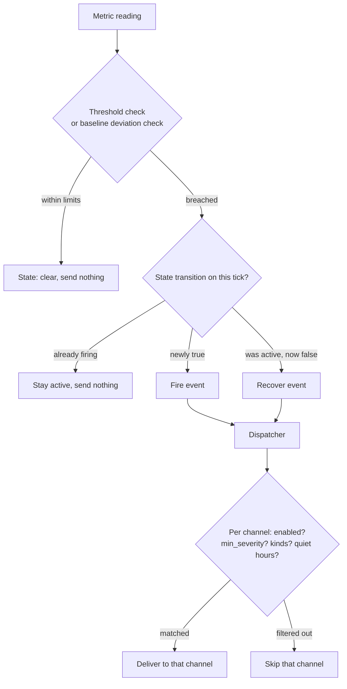
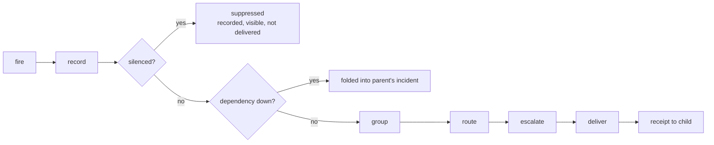

# Alerting and notification channels

trinetra does two separate jobs when something goes wrong. First it
*decides* that something is wrong, which is the anomaly engine reducing every
sampled metric to a small set of fire and recover events. Then it *delivers*
that decision, which is the dispatcher fanning each event out to whichever
notification channels you have configured and routed. This chapter covers both
halves: how a reading becomes an alert, and how that alert reaches your phone.

## The anomaly engine

The engine turns each sample into a `Check`: a key such as `disk:/`, the
current value, and the rules that apply to it. Every check is evaluated on
every relevant tick, and each one is in exactly one of two states, firing or
clear. The engine only emits an event on a transition, so you get one message
when a condition starts and one when it ends, never a stream of repeats while
it stays true.

The path from a reading to your phone looks like this:



### Static thresholds, always on

Threshold checks run for `cpu`, `mem`, `swap`, `temp`, and every discovered
`disk:<mount>`. Each has a number it compares against, and it fires the moment
the reading meets or exceeds that number. These checks are always active. You
cannot turn threshold alerting off globally, though you can retune the numbers
or disable a specific target. The defaults come from your config (see
[Configuration](04-configuration.md)), and you adjust them per family or per
target:

```bash
sudo trinetra config set thresholds.disk_pct 85   # any filesystem at or above 85%
sudo trinetra config set thresholds.temp_c 75
sudo trinetra monitor threshold disk:/boot 70     # override just this mount
sudo trinetra monitor disable docker:some-noisy-container
```

When a threshold check fires, its reason reads like `disk:/ = 91.0 ≥ threshold
85.0`, and when it clears it reports `disk:/ back to normal`. For CPU and memory
the fire message also names the culprit, the top process and container consuming
that resource, so a `cpu` alert reads like `cpu = 96.0 ≥ threshold 95.0 (top:
ffmpeg 82%, container web 30%)`. This is drawn from the process and container
data already collected, so it appears when `collect.processes` is on and there
is something to name, and is simply omitted otherwise.

### Rolling-baseline deviation, opt-in

Alongside the fixed numbers, trinetra keeps a rolling baseline (a mean and
variance that decay over time) for those same metrics. A baseline check fires
when the current reading sits too many standard deviations away from that
mean, which is meant to catch "this is not normal for this box" without you
having to guess a threshold in advance.

This second branch is off by default. It is opt-in through the
`baseline_alerts` config key, and threshold alerting is unaffected by that
switch either way:

```bash
sudo trinetra config set baseline_alerts true   # enable z-score deviation checks
sudo trinetra config set baseline_sigma 3       # how many sigma is "too far"
```

The reason it is opt-in is field experience. On a real home server, cpu, mem,
and temperature often have a low and unstable mean, and their variance gets
underestimated, so a value can be many sigma from the mean while barely moving
in real terms. Left on, those metrics would fire and recover on sigma alone
almost every minute. To suppress that flapping the engine adds a second gate
even when baseline alerting is enabled: a reading must be materially far from
the mean in relative terms, not just many (possibly understated) standard
deviations away, before it fires. A baseline fire reads like `cpu = 74.0 is
3.2σ from baseline`. Even with that gate the metrics proved too noisy to alert
on by default, which is why the whole branch stays behind the flag.

Note that the baseline is always *maintained* regardless of the switch, and it
is updated after each check is evaluated so that a spike cannot fold itself
into the very mean it is being compared against. Enabling `baseline_alerts`
only turns on the alerting, not the bookkeeping.

### Firing, recovery, hysteresis, and dedup

Every check, threshold or baseline, shares the same lifecycle. A check that is
newly true and was not already active fires once and is recorded as active. A
check that goes false while it was active recovers once and is cleared. A
check that stays true simply stays active and sends nothing further, which is
the deduplication that keeps a sustained problem from spamming you. The
hysteresis is the same idea across a tick boundary: the state only changes on
an edge, so a metric hovering right at its threshold does not rattle off a fire
and a recover on alternating samples.

That active-alert state is persisted to `alerts.json` in the data directory (see
[Storage and the data model](09-storage-and-data-model.md)), so a daemon restart
does not re-fire everything that was already known to be down.
Each stored entry carries when it fired, its reason text, whether it was
acknowledged, and whether it was critical.

### Binary-state alerts

Three more checks are not about a number crossing a line but about a thing
being in a bad state or not. They carry the same fire, recover, and dedup
behavior as the scalar checks, but their messages are written in plain words
rather than as a numeric comparison:

- `docker:<name>` fires when a container is anything other than running and
  recovers when it comes back up.
- `service:<unit>` fires when a systemd unit shows up in `systemctl --failed`
  and recovers once it is no longer listed.
- `smart:<device>` fires when the drive's SMART health self-assessment reports
  `FAILED` and recovers when it reports healthy again.

These are the fire and recover messages the engine hands to a check verbatim
(the `FireMsg` and `RecoverMsg` fields), which is why they read as sentences
instead of formulas.

### A note on network interfaces

Every non-loopback interface is discovered as an `iface:<name>` target (see
[Monitoring: what gets collected](05-monitoring.md)) and its throughput is
collected into the `net:<iface>:rx` and `net:<iface>:tx` series,
visible in `status.json`'s network rates and in `monitor list`. It does not
yet raise any alerts. Per-interface throughput alerting is future work; today
the data is gathered and graphable but nothing fires on it.

## Alert history

Every fire and every recover is appended to `alertlog.jsonl` in the data
directory, and each entry records not just the transition but the per-channel
delivery outcome, so the log tells you both that an alert happened and whether
each channel actually received it. The file is pruned to roughly 30 days.

Read it with the `alerts` command. Bare `alerts` is the same as `alerts list`
and prints two sections. The first, ACTIVE ALERTS, lists each key currently
firing, how long ago it fired, its reason, and an `[acked ... ago]` marker if
you acknowledged it. The second, HISTORY, replays recent log entries, each
showing the timestamp, the kind (`fire` or `recover`), the key, the severity,
the title, and beneath it a per-channel delivery line reading `ok` or
`FAILED: <err>`.

```bash
trinetra alerts                               # active alerts + recent history
trinetra alerts list --since 12h --limit 50   # narrower window, more entries
```

`--since` defaults to `24h` and bounds how far back the history reaches;
`--limit` defaults to `20` and caps how many entries print, most recent first.

You can acknowledge an active alert to mark that you have seen it. Acknowledging
does not silence anything: it does not stop a future re-fire and it does not
suppress delivery, it only annotates the currently active entry so the ACTIVE
section shows it as handled.

```bash
trinetra alerts ack disk:/     # mark the active disk:/ alert as seen
trinetra alerts unack disk:/   # clear that acknowledgement
```

Both `ack` and `unack` write the state and then best-effort signal the running
daemon so it picks up the change promptly rather than on its next natural save.

## The channel model

Delivery is handled by a dispatcher. Every outbound message, whether an alert
fire or recover, a boot and recovery report, or a scheduled daily or weekly
digest, is handed to the dispatcher, which fans it out to every channel that is
both enabled and whose route matches the message. A channel that is disabled,
or enabled but filtered out by its route, simply does not receive that
particular message; the others still do.

Each channel carries a small set of routing knobs:

- **`min_severity`** is the lowest severity the channel accepts, one of `info`,
  `warning`, or `critical`. The default is `info`, meaning everything gets
  through. Set it to `critical` on a channel you only want to page for the
  worst events.
- **`include_kinds`** and **`exclude_kinds`** are comma-separated lists of
  *kinds*, where the kind of an alert is the part of its target before the
  colon: `disk:/` has kind `disk`, `docker:nginx` has kind `docker`. The
  kinds an alert can carry are `cpu`, `mem`, `swap`, `temp`, `disk`, `docker`,
  `service`, and `smart`. `include_kinds` restricts a channel to only those
  kinds; `exclude_kinds` blocks those kinds. An empty `include_kinds` means all
  kinds. The boot report and the digests carry no kind at all, so they still
  reach a channel unless you have set `include_kinds`, in which case they are
  filtered out along with everything else outside the list.
- **`critical_overrides_quiet`** decides, per channel, whether a `critical`
  alert still gets through during quiet hours.

Those per-channel knobs sit under one global setting, the quiet-hours window.
It suppresses non-critical messages during the hours you name, and it wraps
past midnight, so `23-8` covers eleven at night through eight in the morning:

```bash
sudo trinetra quiet-hours 23-8   # mute non-critical pings overnight
```

A critical alert during that window is only delivered to channels whose
`critical_overrides_quiet` is true.

## Channel types

Telegram is the original always-on channel and the rest are added on top of
it. Every channel, regardless of type, carries the same routing knobs from
the previous section (`min_severity`, `include_kinds`/`exclude_kinds`,
`critical_overrides_quiet`) plus a type-specific set of connection fields.

### Managing channels with trinetra-ctl (recommended)

The primary, recommended way to add, edit, remove, or test a channel is the
Channels screen in [`trinetra-ctl`](plugins/trinetra-ctl.md#managing-with-trinetra-ctl),
the interactive TUI. From Home, press `m` to open the management menu, then
select Channels. From there:

- `a` **adds** a channel. The screen walks you through picking a type
  (`telegram`, `email`, `webhook`, `slack`, `discord`, `ntfy`, or `gotify`)
  and then prompts for that type's fields one at a time, so you never have to
  remember a setting's key by name.
- `e` **edits** the channel under the cursor, reopening the same guided
  fields pre-filled with its current values.
- `d` or `x` **removes** it.
- `t` sends it a live **test** notification, the same synthetic-alert check
  described below.

Before an **enabled** channel is saved, whether newly added or edited, the
screen validates it over the control socket and refuses to persist it if
validation fails. That means a channel that would silently fail to deliver,
say a typo'd webhook URL or a bad SMTP host, can never be saved while turned
on; a disabled channel skips that gate, which is how you stage a channel's
settings before switching it on. See [Managing with
trinetra-ctl](plugins/trinetra-ctl.md#managing-with-trinetra-ctl) for
the full walk-through of the menu and every other guided screen.

### Managing channels from the command line

For scripting, automation, or a headless box without `trinetra-ctl`
installed, every one of those flows has a thin, scriptable equivalent on the
core `trinetra` binary: the `channel` subcommands, listed in full in
[Daemon-only config management](11-command-reference.md#3-daemon-only-config-management).
Each one that changes config also signals the running daemon so nothing needs
a restart:

```bash
trinetra channel list            # every channel with its type and routing
trinetra channel add <name> --type <type>
trinetra channel set <name> setting.<key> <value>
trinetra channel set <name> min_severity critical
trinetra channel remove <name>
trinetra channel test <name>     # send one synthetic alert now, report success/failure
```

`channel test` (or `t` on the Channels screen) is the first thing to reach
for when a channel is not delivering, because it builds the channel and sends
a single synthetic alert independent of all routing, so a success proves the
transport works and points you at routing (an `enabled=false`, or a
`min_severity` or `include_kinds` that is filtering real alerts out) as the
remaining cause.

The settings below are per-channel key/value pairs. On the command line,
write them with `channel set <name> setting.<key> <value>`, or pass them at
add time with `--set key=value`; in `trinetra-ctl` they are the fields the
Channels screen's add/edit flow prompts for.

| Type | Required settings | Optional settings |
|------|-------------------|-------------------|
| `telegram` | `chat_id` (unless already migrated from legacy config) | `token` (falls back to the legacy `telegram.token`) |
| `email` | `host`, `from`, `to` (comma-separated) | `port` (default `587`), `username`, `password`, `starttls` (default `true`) |
| `webhook` | `url` | `method` (default `POST`), `content_type` (default `application/json`), `template` (a Go `text/template` body; defaults to a generic `{"text": "..."}` payload) |
| `slack` | `url` (Slack incoming-webhook URL) | none; body is a fixed Slack format |
| `discord` | `url` (Discord webhook URL) | none; body is a fixed Discord format, truncated to Discord's 2000-character limit |
| `ntfy` | `topic` | `server` (default `https://ntfy.sh`), `token` (for protected topics) |
| `gotify` | `server`, `token` (a Gotify application token) | none |

The generic `webhook` type is the escape hatch for anything not on this list.
Its `template` is a Go `text/template` rendered into the request body, so you
can shape the JSON to whatever the receiving service expects; leave it unset
and it sends a plain `{"text": "..."}` payload. `slack` and `discord` are
really the webhook transport with a fixed, service-specific body baked in, so
you only supply the incoming-webhook URL.

Because the daemon runs as root and dials these URLs itself, a channel URL is
effectively trusted: treat setting one as a privileged action. If you want a
guardrail against a channel (or the healthchecks ping) reaching an internal
address, set `notify.block_private_targets true`. With it on, the daemon
refuses to dial loopback, link-local (including the `169.254.169.254` cloud
metadata endpoint), and private (RFC1918 / ULA) targets, checked against the
resolved IP so a hostname that points inward is blocked too. It defaults to
`false`, since posting to an intentionally-internal endpoint (a webhook on the
same box) is a legitimate setup.

A worked example, an email channel that only pages for criticals, scripted
against the core binary (the equivalent `trinetra-ctl` path is `m` ->
Channels -> `a` -> `email`, filling in the same host/from/to fields and
setting `min_severity` to `critical`):

```bash
sudo trinetra channel add ops-email --type email
sudo trinetra channel set ops-email setting.host smtp.fastmail.com
sudo trinetra channel set ops-email setting.from trinetra@home.lan
sudo trinetra channel set ops-email setting.to ops@home.lan
sudo trinetra channel set ops-email min_severity critical
sudo trinetra channel test ops-email
```

Other useful `channel set` keys are `enabled true|false`, `include_kinds
disk,docker`, `exclude_kinds smart`, and `critical_overrides_quiet
true|false`.

### Legacy Telegram migration

If you set a Telegram token the old way, with `telegram set-token`, that token
lives in the config's `telegram.token` key rather than in a channel. The first
time you run any `channel` subcommand, or open the Channels screen in
`trinetra-ctl`, trinetra back-fills a real `telegram`-typed channel from
those legacy keys, so an existing Telegram-only install needs no manual
conversion: the channel simply appears in `channel list` (or on the Channels
screen) and is managed like any other. The migration is idempotent and will
not create a second Telegram channel if one already exists under any name,
and the legacy `telegram.token` and `telegram.chat_id` keys keep working as a
fallback regardless, including as the source of the bot token for the
migrated channel and for the interactive command-reply interface.

On a brand-new install with no token at all, you will most likely never touch
this migration path directly: `trinetra-ctl`'s first-run onboarding (see
[Managing with trinetra-ctl](plugins/trinetra-ctl.md#managing-with-trinetra-ctl))
captures the bot token on first launch and then shows you the daemon's
`/start <pin>` enrollment PIN right there in the flow. If you set the token
from the command line instead, `trinetra telegram set-token` now prints
that same enrollment PIN in the terminal too (#90), rather than making you go
dig it out of the journal.

## Monitoring-failure alerts (`collector:<name>`, #110)

Besides alerting on what it monitors, the daemon alerts when monitoring itself
is failing. If a slow-tier collector (`docker`, `disk`, `services`, `smart`)
fails or times out for three consecutive cycles, a critical `collector:<name>`
alert fires, e.g. `collector docker failing: 3 consecutive collection failures
(last error: Cannot connect to the Docker daemon)`. One or two transient blips
carry the last-known values forward silently; only a sustained failure alerts.
The alert recovers automatically on the first successful collection.

## Fleet alerting

Everything above this section is what a single host does on its own, and it
keeps doing exactly that in fleet mode: a child always detects and can always
alert locally. What fleet mode (see [Fleet mode](02-architecture.md#fleet-mode))
adds on top is a second decision-maker, the master, which re-evaluates the
child's alert against fleet-wide routing, silences, grouping, dependencies and
escalation before it reaches a channel, and a set of master-only aggregate
rules that have no single-host equivalent at all (`count(...) for ...` across
a whole tag). None of this exists outside fleet mode.

### The pipeline

Every alert the master handles, whether it arrived from a child or was raised
by a master-side aggregate rule, walks the same pipeline, in order:



A suppressed alert (silenced, or folded into a dependency's incident) is
never simply dropped: it is recorded and visible in `fleet incidents`/`fleet
explain` and on the incidents page, it is just not delivered to a channel on
its own. `trinetra fleet explain <key|id>` prints the exact trail an alert
took through this pipeline -- which silence matched, which route and policy,
whether it was grouped or folded, and every delivery/receipt event -- so a
"why didn't I get paged" question always has a concrete answer:

```bash
trinetra fleet explain cpu:high        # by alert key
trinetra fleet explain 4f2a9c1b0d3e    # by incident id
```

### Lease, receipt, and local fallback

Detection always stays on the child; only delivery ownership moves. While
the child holds a valid lease from the master (sent every 30s, valid 90s), a
firing alert is not delivered locally -- it is recorded `routed_to_master`
and shipped to the master on the priority lane. The master runs the alert
through the rest of the pipeline, delivers it, and sends the child a
`receipt{alert_key, fired_at}` once at least one channel accepted it.

If no receipt arrives within `fleet.fallback_after` (child config, default
`2m`, minimum `5s`) or the lease has expired, the child delivers the alert
itself, with the message prefixed `via local fallback: master unreachable`,
and ships the record with `delivered_locally=true`. The master records this
but never redelivers it: the dedup key is `(node, alert key, fired_at)`, so
the alert reaches a channel exactly once by design, whichever side sends it
first -- at-least-once delivery, never duplicated by the retry itself. If the
child's link stays down past `fleet.link_down_warn_after` (default `10m`,
minimum `30s`), the child raises its own local "fleet link down" warning, so
a prolonged outage is itself alertable even before any monitored condition
fires. See [Configuration](04-configuration.md#fleet-child-timing-keys) for
both keys.

Silences and maintenance windows are pushed to every child they could apply
to, so an alert that falls back locally during a master outage still honours
whatever was silenced before the link dropped.

### Silences and maintenance windows

A silence mutes matching alerts between a start and end time; a maintenance
window is a recurring silence on a weekday set and a daily time range in a
named IANA time zone. Both share the same matcher shape: `tag`, `node`,
`rule` (glob), and `severity`, ANDed within one matcher, ORed across several
matchers on the same silence.

**The node matcher is worth calling out precisely, because it changed from
the original design:** `node=` matches the node's current display **name as
a glob**, OR its exact node id -- never anything else. There is no separate
"match by id" syntax; a bare id string simply matches because it equals the
node's id exactly, while any other value is matched against the name with
shell-glob rules (`db*`, `web-??`). The practical consequence: **renaming a
node stops a name-based silence from matching it.** A silence written against
`node=old-name` keeps its literal text after a rename; if you want a silence
that survives a rename, match on the node's id or on a tag instead.

```bash
trinetra fleet silence add --match tag=web,rule=cpu* --for 2h --comment "known noisy deploy"
trinetra fleet silence add --match node=db-primary --for 30m
trinetra fleet silence list
trinetra fleet silence expire <id>

trinetra fleet maintenance add --name "weekly backup window" \
  --match tag=backup --days sat,sun --from 22:00 --to 02:00 --tz Asia/Kolkata
trinetra fleet maintenance list
trinetra fleet maintenance delete <id>
```

`--to` before `--from` means the window crosses midnight (as in the example
above: Saturday and Sunday 22:00 through 02:00 the next day). When a silence
or maintenance window ends and the alert it was suppressing is still firing,
it is delivered then, exactly as if it had just fired.

The web equivalent is the Silences admin page (see [The web
UI](08-web-ui.md#silences-and-maintenance)); every silence/maintenance time
there is shown in the master's own local time zone with its abbreviation,
never UTC, so what you type back matches what you meant.

### Routes and escalation policies

A **route** picks a **policy** for an alert. Routes are an ordered list;
`node` is a glob against name/tags/rule/severity fields, matched top to
bottom, and the first matching route wins -- unless it has `continue: true`,
in which case evaluation keeps going into later routes too, and *every*
route matched this way contributes its policy: the alert fans out to each
matched policy, and each one escalates on its own independent timeline (a
15-minute repeat on one policy never resets or delays another's). There is
always an implicit default route/policy so an alert with no explicit match
still gets delivered. **Route names are required and must be unique** --
duplicating a name, or leaving one blank, is rejected when the config is
saved.

A **policy** is a named escalation schedule: an ordered list of steps, each
`{after, channels}`, where `after` is measured from the incident's first
delivery (`after: "0s"` is immediate) and `channels` names channels from your
notification config, or the literal `"*"` for every enabled channel (still
gated by that channel's own quiet-hours/severity/kind filters). Once the last
step has fired, `repeat_every` (if set) re-notifies that last step's channels
on that cadence until the incident is acknowledged or resolved.
`send_resolved` (default true) gates whether a recover is actually delivered
for incidents on that policy.

A worked example -- two routes, the first with `continue: true` so a
critical alert on a tagged production database node fans out to both an
on-call pager policy and a database-team policy:

```json
{
  "version": 3,
  "default_policy": "default",
  "routes": [
    {
      "name": "prod-critical",
      "matchers": [{"tag": "prod", "severity": "critical"}],
      "policy": "page",
      "continue": true
    },
    {
      "name": "db-nodes",
      "matchers": [{"node": "db*"}],
      "policy": "db-oncall"
    }
  ],
  "policies": [
    {
      "name": "default",
      "steps": [{"after": "0s", "channels": ["*"]}],
      "send_resolved": true
    },
    {
      "name": "page",
      "steps": [
        {"after": "0s", "channels": ["telegram-ops"]},
        {"after": "5m", "channels": ["telegram-ops", "ops-email"]}
      ],
      "repeat_every": "15m",
      "send_resolved": true
    },
    {
      "name": "db-oncall",
      "steps": [{"after": "0s", "channels": ["pager-db"]}]
    }
  ]
}
```

Manage this either from the web UI's [Alerting admin
page](08-web-ui.md#alerting-admin-and-the-route-tester) (a structured form
plus a raw-JSON editor with optimistic-concurrency conflict detection via
`version`), or from the CLI:

```bash
trinetra fleet alerting show               # print the current config as JSON
trinetra fleet alerting apply routes.json  # replace it wholesale (no version check)
```

`fleet route test` dry-runs the routing/escalation/silence decision for a
hypothetical alert without actually firing one, printing the matched route,
every matched policy's steps, and whether a silence would suppress it:

```bash
trinetra fleet route test --node web1 --tag prod --rule cpu --severity critical
```

### Grouping

Alerts sharing a **group key** are collapsed into one incident instead of
paging separately. The default group key is `(rule, severity)`; a route's
`group_by` can override it with `node`, `rule`, `tag:<key>`, or a combination.
**Node-down alerts are not grouped by default**, because their key already
identifies the specific node (`fleet:node:<id>:down`) -- grouping several
different nodes' down alerts into one incident happens only through the
explicit dependency fold below, never through the default group key.

An incident waits `group_wait` (30s) after it opens before its first
delivery, collecting whatever else joins the same group key in that window,
then delivers again on further members at `group_interval` (5m) -- except
that while any member of the group is still a **child-pending** delivery
(routed to the master but not yet delivered/received), the effective delay
is capped at `min(group_interval, fleet.fallback_after / 2)`, so a grouped
update can never arrive so late that a member's own local fallback would
have beaten it. Silences apply **per member**: silencing one node's alert
inside a grouped incident does not silence the others in the same group, and
an incident's overall state reflects only its still-open, unsilenced
members.

### Dependencies

`depends_on` lets a node name its upstream (another node, or a tag): when the
parent is down, a dependent's own node-down or reachability alert folds into
the parent's already-open incident instead of raising a separate one, so a
switch or router outage does not page once per host behind it. `trinetra
fleet node depends <node> dep1,dep2,tag:t` sets the list (empty string
clears it); `trinetra fleet nodes` prints each node's `DEPENDS ON` column.

### Aggregate rules

Aggregate rules run only on the master, evaluated every 30s against the
latest snapshot and 1-minute series from every node's replica -- there is no
per-host equivalent of these. The grammar is fixed and hand-written, not
PromQL:

```
count(<sel>, <metric> <op> <num>) <op> <int> for <dur>
avg|max|min(<sel>, <metric>) <op> <num> for <dur>
online(<sel>) <op> <int> for <dur>
absent(<sel>, <dur>)
```

`<sel>` is one of `tag:<t>`, `node:<glob>`, or `all`. Metrics are `cpu`,
`mem`, `swap`, `disk` (worst mount), `load1`, and `temp`. Operators are `>
>= < <= == !=`. `for` is required on every form except `absent`, and its
duration has a **1 minute minimum** -- shorter values are rejected when the
rule is saved. **`all` and `node:<glob>` both include the master's own node**
in the selection (a rule like `online(all) < 2 for 2m` counts the master
itself as one of the online nodes); `tag:<t>` only matches the master if the
master itself carries that tag. When a rule's inputs have **no data** to
evaluate (every matched node's data is currently missing), the rule **holds
its current state** rather than firing or recovering -- it neither
extinguishes a real problem nor invents a new one just because data is
temporarily absent.

```bash
trinetra fleet alerting apply rules.json   # rules live inside AlertingConfig.rules
trinetra fleet rules                       # table: name, state, value, since, expr
```

A rule saved with an invalid expression is rejected up front (`fleet
explain`-style error naming the exact position in the string), never stored
half-broken. The web UI's Alerting admin page shows the same table live,
next to the routes/policies editor.

> **Known limitation:** a master configured with `storage.backend=memory`
> excludes its own node from `disk`-metric aggregate rules, because the
> in-memory backend keeps no queryable 1-minute series for the master's own
> disk to aggregate over. Use the default `tsfile` backend on a master if
> disk aggregate rules need to see it.

### Managed config

The master can push small configuration fragments down to children by tag,
so a fleet-wide tuning change does not mean editing every host by hand. The
allowlist is a **closed set of exactly 10 keys** -- nothing else can be
pushed through this mechanism:

`thresholds.cpu_pct`, `thresholds.mem_pct`, `thresholds.swap_pct`,
`thresholds.temp_c`, `thresholds.disk_pct`, `baseline_sigma`,
`baseline_min_pct`, `baseline_alerts`, `quiet_hours`,
`critical_overrides_quiet`.

A fragment targets either every node (no `--tag`) or every node carrying a
given tag; a node's desired values are the merge of every fragment that
applies to it. `fleet managed set` **merges** the given `key=value` pairs
into that tag's existing fragment by default, so a later `set --tag web
cpu=95` never silently drops keys an earlier `set --tag web mem=80` put
there; pass `--replace` to replace the fragment's values wholesale instead.

```bash
trinetra fleet managed list                                  # every fragment
trinetra fleet managed set --tag web thresholds.cpu_pct=90    # merge into web's fragment
trinetra fleet managed set --replace thresholds.disk_pct=85   # replace the fleet-wide fragment
trinetra fleet managed delete <id>
trinetra fleet managed status                                 # per-node applied/desired/drift
```

A managed value is **re-imposed on every local apply**: on child startup, on
every SIGHUP, and every time any other config write goes through the child's
shared apply path, so a stray direct edit of `config.json`, an offline
config restore, or an unrelated channel/config change made through the CLI
or web UI can never leave a managed key quietly reverted -- it is forced back
to the master's last-pushed value every time. The CLI's `config set`, the web
config editor, and `trinetra-ctl` all refuse to write a key that is
currently under management; unset it from the master's managed fragments
first if you need to change it locally. `fleet leave` keeps the last managed
values as ordinary local config once the node is solo again -- they stop
being read-only, but nothing about their value changes at that instant.

### Telegram buttons

On the master, an incident's fire notification carries two inline buttons,
**Ack** and **Silence 1h** -- a recover notification never does, and neither
button appears on a child's own local-fallback delivery, only on the
master's own incident messages. Authorization is **per chat, not per
Telegram user id**: any member of the enrolled owner chat can tap either
button, exactly as any member of that chat can already run text commands;
a callback from any other chat is answered "not authorized" and nothing
happens. "Silence 1h" creates a one-hour silence covering the incident's
still-open members only -- an already-resolved incident, or a stale button
on an old message for an incident every member of which has since recovered,
creates no silence at all.

---

[Previous: Monitoring: what gets collected](05-monitoring.md) | [Handbook index](README.md) | [Next: Downtime and liveness](07-downtime-and-liveness.md)
