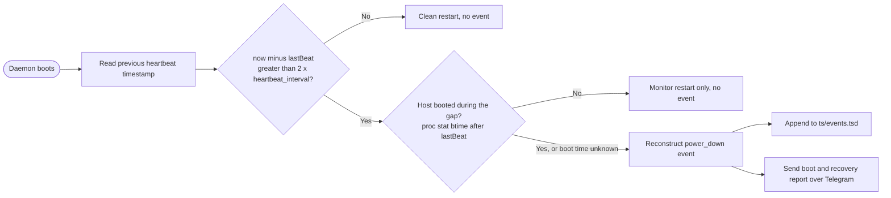
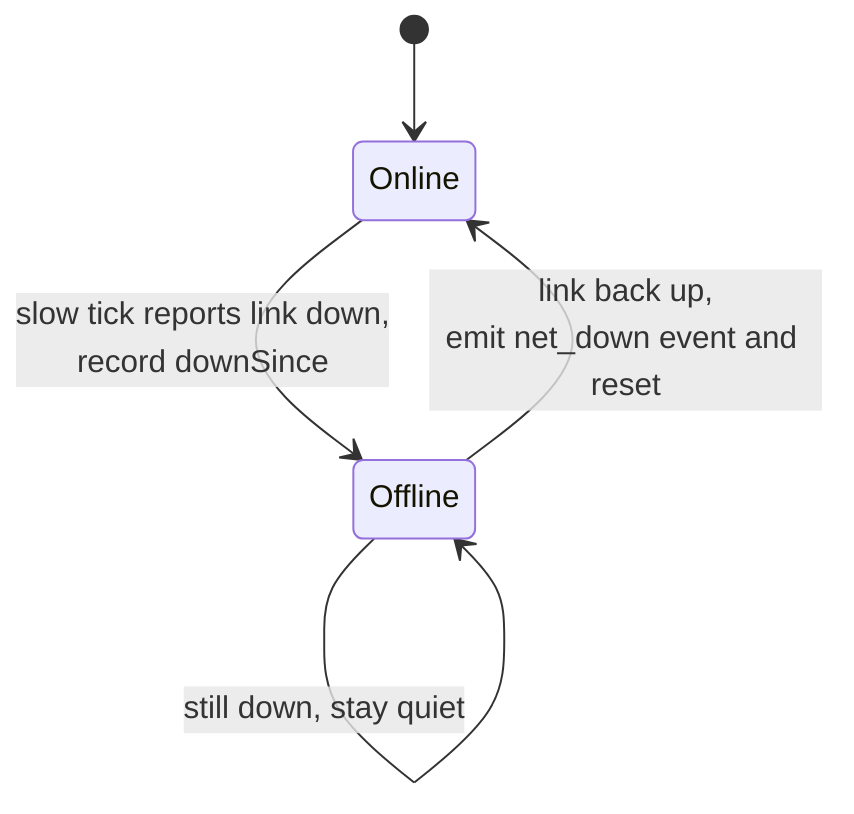

# Downtime and liveness

Most of this handbook is about what trinetra sees while it is running: CPU
creeping up, a disk filling, a container flapping. This chapter is about the
harder question, the one a monitor has to answer about its own absence. What
happened while the daemon was not watching, and how do you find out the host
went dark when the thing that would normally tell you went dark with it?

trinetra treats "down" as two distinct failure modes and keeps a separate,
purpose-built mechanism for each. On top of those it layers two liveness safety
nets whose only job is to make sure that a wedged loop or a dead host does not
pass silently. This chapter walks through all four, in the order you would meet
them.

## Two kinds of down

It helps to name the two failure modes up front, because the rest of the
chapter keeps circling back to them.

The first is the host being off or the daemon not running. The power dropped,
the kernel panicked, someone pulled the plug, or the process was killed. During
this window trinetra is not executing at all, so nothing can be written down
as it happens. This kind of downtime can only be reconstructed afterwards, from
whatever the daemon managed to leave on disk before it stopped.

The second is the host being up with its internet gone. The box is powered,
the daemon is looping happily, but the link to the outside world has dropped.
Here trinetra is very much alive and can record the outage live, moment to
moment, the way it records any other observation.

These two want opposite tools. The first needs a breadcrumb left behind and
read back after a gap. The second needs a live tracker that opens an interval
and closes it. trinetra builds exactly those two things, and we take them in
turn.

## The heartbeat and reconstructed power_down

The breadcrumb is a file called `heartbeat`, and it holds a single number: a
Unix timestamp. The sampler loop rewrites it on its own cadence, governed by
`heartbeat_interval` (default 30 seconds), independent of the fast and slow
sampling tiers:

```go
func writeHeartbeat(path string, now time.Time) error {
	return writeFileAtomic(path, []byte(strconv.FormatInt(now.Unix(), 10)), 0o644)
}
```

That is the whole write side. Every minute or so, "I was alive at this second"
is stamped over the previous value, atomically, so a crash mid-write never
leaves a torn file. The daemon does not write it any more often than the
heartbeat interval, because the file exists for exactly one purpose: to let a
future boot measure how long the process was gone. Writing it more frequently
would buy nothing.

The clever part is the read side, and it happens once, early in startup. Before
the daemon settles into its sampling loop it reads back the heartbeat that the
previous incarnation of itself left behind, and compares that timestamp to the
current time:

```go
func reconstructPowerDown(lastBeat, daemonStart, hostBoot time.Time, hostBootOK bool, interval time.Duration) (DownEvent, bool) {
	if !daemonStart.After(lastBeat) {
		return DownEvent{}, false // clock skew / no gap
	}
	if daemonStart.Sub(lastBeat) <= 2*interval {
		return DownEvent{}, false
	}
	if hostBootOK && !hostBoot.After(lastBeat) {
		return DownEvent{}, false // host stayed up: a monitor restart, not host downtime
	}
	end := daemonStart
	if hostBootOK && hostBoot.After(lastBeat) && hostBoot.Before(daemonStart) {
		end = hostBoot // a real reboot: the window ends when the host came back
	}
	return DownEvent{
		Type:        "power_down",
		Start:       lastBeat.Unix(),
		End:         end.Unix(),
		DurationSec: int64(end.Sub(lastBeat) / time.Second),
	}, true
}
```

Read that gap for what it is. If the daemon had been running continuously it
would have refreshed the heartbeat within the last interval, so the distance
between "last known alive" and "now" would be small. A large gap means the
daemon was not there to keep the file current, and the size of the gap is
exactly how long it was gone. trinetra turns that gap into a `power_down`
event with a start (the last heartbeat), an end (this boot), and a duration.

The threshold is two heartbeat intervals rather than one. A single interval of
slack absorbs the ordinary jitter of a healthy loop, a tick that ran a little
late, a heartbeat that landed a few seconds after schedule, so a clean restart
does not get misread as an outage. Anything past two intervals is a genuine
absence worth recording. The guard on the very first line quietly drops the
case where the clock has gone backwards, which would otherwise produce a
nonsensical negative gap.

A long gap on its own is not enough, though: the daemon restarting (a crash
loop, a deploy, `systemctl restart`) also leaves a stale heartbeat, and that is
NOT host downtime, the box was up the whole time. So the reconstruction also
reads the host boot time from `/proc/stat` (`btime`) and only records a
`power_down` when the host actually rebooted during the gap (its boot time falls
after the last heartbeat). If the host stayed up and only the monitor restarted,
nothing is recorded, so a restart storm can no longer fabricate hours of
downtime and tank the uptime percentage. When the host boot time cannot be read
(a non-Linux box, an unreadable `/proc`), it falls back to the old behavior of
recording any long gap, since over-reporting beats silently dropping a real
outage.

The payoff is that an unclean power loss, the exact case where the daemon never
got a chance to log anything, still ends up recorded. The daemon that comes back
after the outage reconstructs the outage retroactively from the breadcrumb the
previous one left. Nothing external is required. It works from local state
alone, which is what makes it reliable precisely when everything else has
failed.

If an older build (before this classification existed) already wrote bogus
`power_down` events during a crash loop, clear them with the purge command,
which removes short `power_down` events (the restart-storm shape) while leaving
genuine multi-minute outages alone:

```bash
trinetra downtime purge --type power_down --max-seconds 300
```

`--max-seconds 0` removes every event of the given type; the default 300 targets
only the short artifacts.

The reconstruction path on boot, from the heartbeat gap, is short:



## The live net_down tracker

Internet outages are the opposite situation and get the opposite treatment.
The daemon is running the whole time, so it can watch the state change and
write it down as it happens.

On each slow-tier tick the daemon checks whether the outside world is
reachable, by trying to reach well-known resolvers such as `1.1.1.1:53` and
`8.8.8.8:53`. That up-or-down result is fed into a small tracker that remembers
whether an outage is currently open:

```go
func (n *NetTracker) Update(online bool, now int64) (DownEvent, bool) {
	if online {
		if n.downSince == 0 {
			return DownEvent{}, false
		}
		ev := DownEvent{
			Type:        "net_down",
			Start:       n.downSince,
			End:         now,
			DurationSec: now - n.downSince,
		}
		n.downSince = 0
		return ev, true
	}
	if n.downSince == 0 {
		n.downSince = now
	}
	return DownEvent{}, false
}
```

The logic is a plain state machine. The first tick that reports the link down
records the moment the outage began and otherwise stays quiet, because the
outage is still in progress and its duration is not yet known. Every subsequent
down tick sees that the start is already set and does nothing. Then the first
tick that reports the link back up closes the interval, emits a completed
`net_down` event spanning the whole outage, and resets the tracker so it is
ready for the next one.



So a `net_down` event is only written when connectivity returns. That is
deliberate. The event describes a finished outage with a real duration, not a
guess about one still unfolding. It also means the reachability check is fed
into the tracker only on slow ticks, since that is when the online field is
actually refreshed, keeping the two in step.

## Where downtime lives

Both event types, `power_down` and `net_down`, share the same struct and land
in the same place:

```go
type DownEvent struct {
	Type        string `json:"type"` // power_down | net_down
	Start       int64  `json:"start"`
	End         int64  `json:"end"`
	DurationSec int64  `json:"duration_sec"`
}
```

They are stored as events in the time-series store (see [Storage and the data
model](09-storage-and-data-model.md)), in a file called `ts/events.tsd`
alongside the raw samples and the one-minute rollups. This is
worth being precise about, because an older design note described a standalone
`downtime.jsonl` file and that is not where these events live. There is no
`downtime.jsonl`. Downtime events go into `ts/events.tsd`, written through the
same store interface that handles metrics:

```go
if store != nil {
	_ = store.AppendEvent(ev)
}
```

Putting them inside the time-series store is not just tidiness. It means
downtime events inherit the store's retention and downsampling machinery for
free. They are kept for the same rollup retention window as the one-minute
rollups (`storage.rollup_retention`, default 720 hours, which is 30 days), and
they are pruned on the same schedule by the same code. There is no second
retention policy to reason about and no separate file to migrate, back up, or
forget. An event is just another thing the store knows how to keep and expire.

Reading recent downtime back is done over Telegram. The `/history` command
takes an optional number of days and defaults to 7; `/down` is a shorthand for
the same view. Both resolve to a query against `ts/events.tsd` over the
requested window:

```go
case "/history", "/down":
	days := 7
	if len(fields) > 1 {
		if n, err := strconv.Atoi(fields[1]); err == nil {
			days = n
		}
	}
	since := time.Unix(snap.TS, 0).AddDate(0, 0, -days).Unix()
	evs, err := store.Events(since, snap.TS)
```

The rendered reply lists each event with its start, end, and human-readable
duration, or a cheerful "no downtime recorded in window" when the window is
clean. Note that this is a different log from the one `trinetra alerts`
prints. That command reads `alertlog.jsonl`, the record of threshold alert
fires and recoveries (see [Alert
history](06-alerting-and-channels.md#alert-history)), which is an
adjacent event log but not the downtime log. If you want the power and network
outage history specifically, `/history` and `/down` are the way in.

## Boot and recovery reporting

Recording an outage is only half of it. You also want to be told about it. So
when the daemon reconstructs a `power_down` on startup, it does not just file
the event away. It sends a boot and recovery report over Telegram summarizing
what it missed, and it does so once, right after startup, rather than waiting
for the normal sampling cadence:

```go
if last, ok := readHeartbeat(st.HeartbeatPath(), fs); ok {
	if ev, ok := reconstructPowerDown(last, clock.Now(), interval); ok {
		if store != nil {
			_ = store.AppendEvent(ev)
		}
		now := clock.Now().Unix()
		snap := collectSnapshot(...)
		dispatchAndLog(getDispatcher(), alog, Alert{
			Title:    formatBootReport([]DownEvent{ev}, renderStatus(snap, c0)),
			Severity: SevInfo,
			Kind:     "fire",
			Source:   "boot",
			Time:     now,
		}, false) // reports bypass quiet hours
	}
}
```

The message itself is short and legible. It opens with "trinetra back
online", states the window that was lost, and attaches a fresh snapshot of the
host as it stands right now, so the first thing you see after an outage is both
the gap and the current health of the box:

```go
b.WriteString("🔌 trinetra back online")
for _, e := range evs {
	if e.Type == "power_down" {
		start := time.Unix(e.Start, 0).Format("15:04")
		end := time.Unix(e.End, 0).Format("15:04")
		fmt.Fprintf(&b, "\nwas down %s→%s (%s)", start, end, humanDur(e.DurationSec))
	}
}
```

Two details are worth calling out. The report bypasses quiet hours, because a
host that just came back from an outage is exactly the sort of thing you want
to hear about even at 3am. And the whole path is guarded: it only fires when
there was a real gap to report, and only once a Telegram token and chat id have
been claimed. On a host that restarted cleanly, within the two-interval slack,
there is no event and no message. Silence in that case is correct.

## Liveness safety nets

Reconstruction and live tracking both assume the daemon eventually gets to run
again. Two independent safety nets exist to make that assumption hold, one for
a daemon that is technically alive but stuck, and one for a host that is simply
gone.

### The systemd watchdog

The first net catches a wedged loop. It is possible for the process to be
running, from systemd's point of view, while its sampler loop has hung and is
doing nothing useful. A plain `Restart=always` will not save you there, because
nothing has actually crashed.

The systemd watchdog closes that gap. The unit that `trinetra install`
writes (see [Architecture](02-architecture.md)) sets a watchdog deadline:

```
[Service]
Type=simple
ExecStart=%s daemon
Restart=always
RestartSec=5
WatchdogSec=90
```

`WatchdogSec=90` tells systemd to expect a liveness ping at least every 90
seconds and to restart the unit if one does not arrive. The daemon supplies
that ping from inside the sampler loop, on every fast tick (default 5 seconds,
far inside the 90-second window):

```go
// feed the systemd watchdog (WatchdogSec in the unit). No-op when not run
// under systemd. A wedged sampler loop stops pinging -> systemd restarts us.
_ = sdNotify("WATCHDOG=1")
```

The pairing is the point. As long as the loop is turning it pings well within
the deadline, and nothing happens. The moment the loop wedges, the pings stop,
the 90-second window lapses, and systemd restarts the service. A hung daemon
becomes a restarted daemon without anyone having to notice. The ping is a
no-op when the process is not running under systemd, so the same binary run by
hand behaves normally. And because `WATCHDOG=1` is accepted from the main PID
regardless of unit type, this works under the plain `Type=simple` unit without
the extra ceremony that `Type=notify` would demand.

### The healthchecks.io dead-man switch

The watchdog can only help while the host is alive to run systemd. If the whole
box is off, or its own internet is down, nothing local can send you anything.
That is the one situation none of the mechanisms above can escape: they all
depend on trinetra getting to run, and here it does not.

The answer is to invert the signal and put it outside the host entirely. With
an optional healthchecks.io dead-man switch configured, the daemon pings a
remote URL on the slow cadence, once per slow tick, so a healthy host produces
a steady trickle of pings:

```go
if isSlowTick {
	// Healthchecks pings stay on the slow cadence: pinging every fast
	// tick would be 12x today's volume for no added signal.
	pingHealthchecks(c.Healthchecks.URL, httpPing)
```

healthchecks.io is watching for those pings to stop. As long as they keep
arriving it stays quiet. When the box goes dark, for any reason at all, the
pings stop and healthchecks.io messages you directly. This is the only
mechanism in the whole system that can alert you while the host itself cannot
speak, because the thing raising the alarm is not on the host.

You point it at a check URL with:

```bash
sudo trinetra healthchecks set https://hc-ping.com/<your-uuid>
```

and turn it off again with:

```bash
sudo trinetra healthchecks off
```

The same setting is also the Healthchecks screen in `trinetra-ctl`'s
management menu (see [Managing with
trinetra-ctl](plugins/trinetra-ctl.md#managing-with-trinetra-ctl)), if
you would rather use the guided TUI than type the URL on the command line.

It is optional, and it is the one piece here that depends on an external
service, which is precisely why it can cover the gap the others cannot.

## Putting it together

The four mechanisms are best understood by what each one is blind to and which
of the others covers that blindness.

The heartbeat reconstructs a `power_down` after the fact, so an unclean power
loss is captured retroactively, but only once the daemon is back. The
`net_down` tracker records internet outages live while the daemon runs, but
only while it runs. Both write into `ts/events.tsd`, share the store's
retention, and surface over Telegram through `/history` and `/down`, with a
boot and recovery report pushed the moment the daemon returns from an outage.

The systemd watchdog restarts a daemon that is stuck rather than crashed, so a
wedged loop cannot sit silent. And the healthchecks.io dead-man switch, alone
among the four, can reach you when the host itself is dark, because it lives
somewhere else and alerts on silence.

No single one of these covers every case. Together they mean that whether the
daemon hangs, the link drops, or the whole host goes down, the outage is either
caught as it happens or reconstructed the moment trinetra can run again, and
you hear about it.

---

[Previous: Alerting and notification channels](06-alerting-and-channels.md) | [Handbook index](README.md) | [Next: The web UI](08-web-ui.md)
