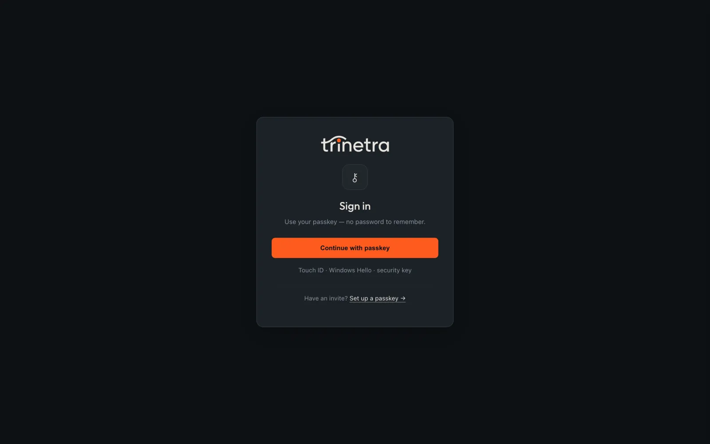
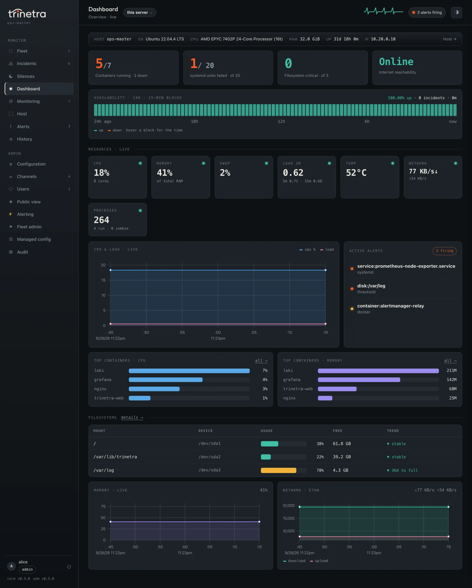
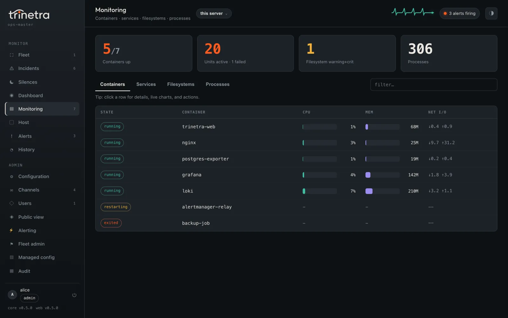
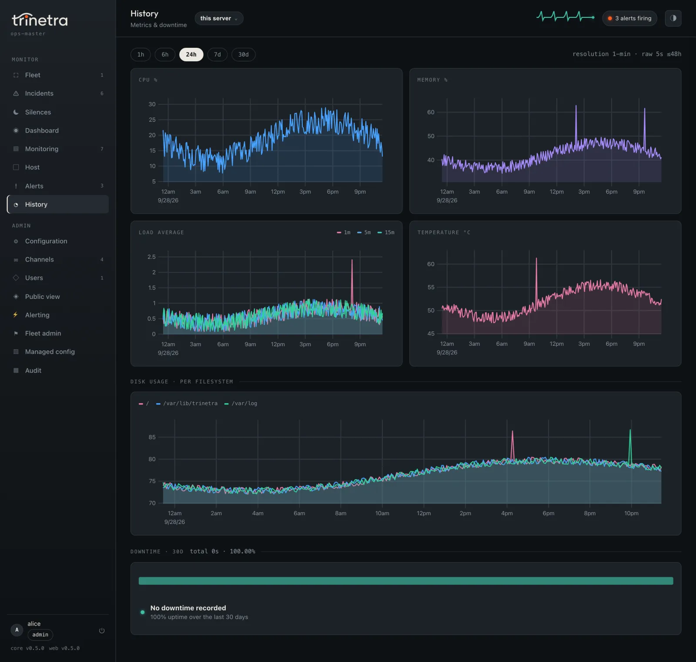
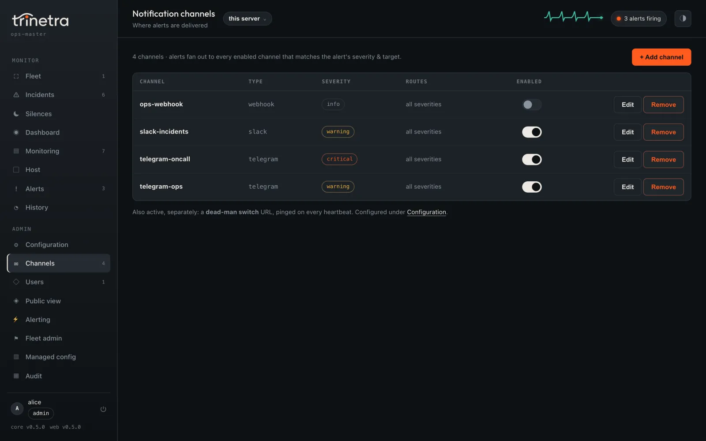
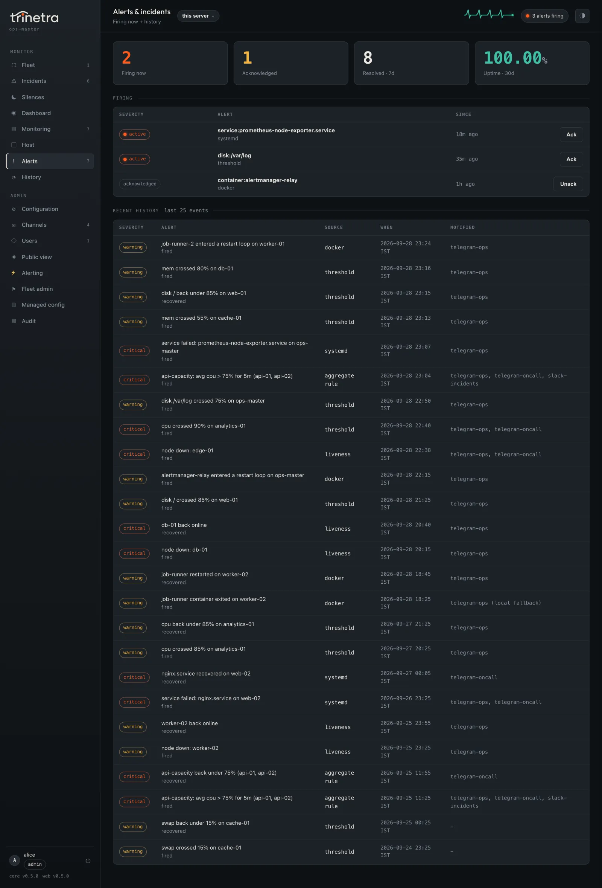
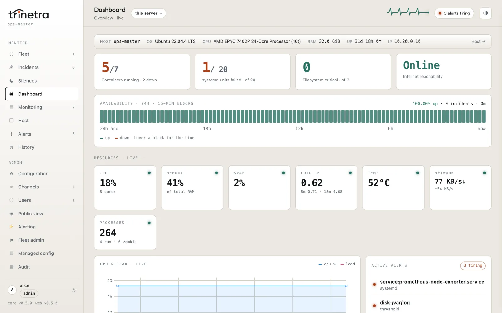
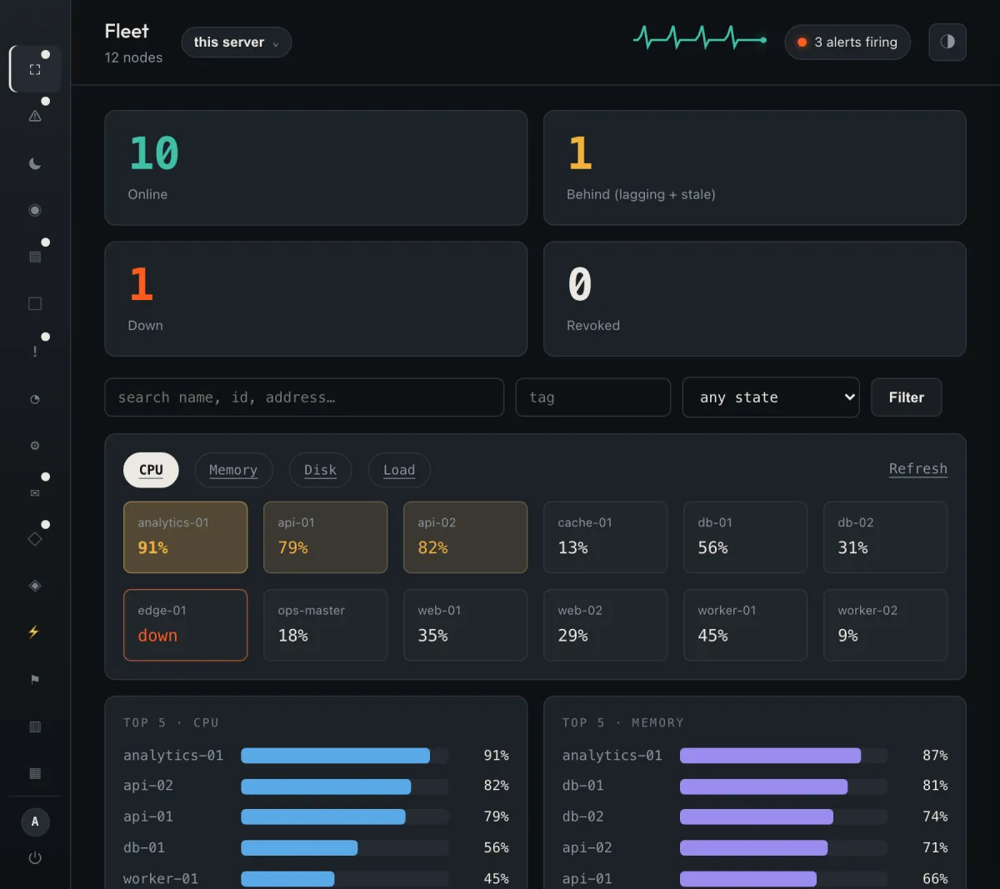
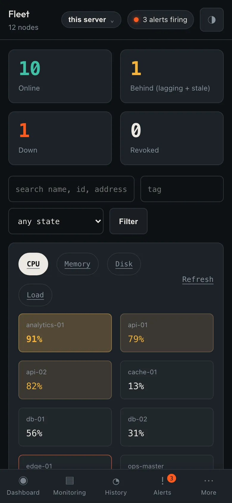

# The web UI

trinetra is a Telegram tool first, but it ships an optional browser
interface for people who would rather look at graphs than read chat messages.
The web UI is entirely opt-in and passkey only. It is an alternative to
Telegram, not a replacement for it: the same daemon can push alerts to a chat
and serve a dashboard at the same time, and neither depends on the other.

What the web UI gives you is a small, self-contained console for one server:

- A live dashboard that updates in place as new samples land, no page reload.
- History graphs that plot the time-series the daemon already keeps (see
  [Storage and the data model](09-storage-and-data-model.md)).
- A web-based editor for your configuration, notification channels, and user
  accounts, so you can change settings without touching the CLI.
- An alerts page listing recent alerts, with acknowledgement for admins.
- A curated public status page you can expose anonymously, showing only the
  panels you explicitly allow.

Everything the web UI shows comes from the same data the CLI and Telegram
already use: the live snapshot and the sampled time-series. The UI adds no new
collectors and writes no new on-disk series. It is a second reader of data the
daemon is already producing.

## How the web UI runs

There is one `trinetra-web` binary, and it is a plain, separate program
with no build tag:

```bash
go build -o /usr/local/bin/trinetra-web ./cmd/trinetra-web
```

`internal/web` is an ordinary, untagged package like any other in the
codebase. What keeps its dependencies (the WebAuthn stack and the rest) out of
the daemon is not a build tag; it is simply that the daemon package never
imports `internal/web`. `trinetra install` builds and ships all three
binaries (`trinetra`, `trinetra-ctl`, `trinetra-web`) and records
their checksums in the root-only install manifest (see [Installation and
first run](03-installation.md)).

`trinetra-web` does not embed the daemon and does not read its state
directly. Like `trinetra-ctl`, it dials the daemon's [control
socket](02-architecture.md#the-control-socket), borrows the socket client as
its data source, and serves the UI from its own process. It also opens a
second, dedicated connection to the same socket to subscribe to the daemon's
[live event stream](02-architecture.md#the-live-event-stream), so the
dashboard is pushed fresh data instead of only polling for it; see [Live
dashboard updates](#live-dashboard-updates) below for how that push reaches
the browser.

There are two ways `trinetra-web` gets started:

- **Supervised, via `web.enabled`.** This is the path for anything you run
  day to day. Once it is enabled, the daemon itself verifies and spawns
  `trinetra-web` as a child process, passing it the control socket path and
  a per-launch token. If the child exits, the daemon restarts it under a
  capped backoff; if the daemon shuts down, it stops the child too. You never
  run or babysit a second process by hand. See [Web
  supervisor](02-architecture.md#web-supervisor) for the full lifecycle and
  its diagram.

  The right way to turn it on is the `trinetra-ctl` web-setup wizard:
  `sudo trinetra cli`, then `s` from Home. It walks you through the serving
  mode, listen address, and the domain, RP ID, and origin that passkey login
  depends on, validates the combination, enables the web, and applies it over
  the control socket, so the first time you open the page passkey registration
  works.

  Do not just flip `web.enabled` on its own. Setting it starts the server, but
  with no serving mode and no `web.rp_id` / `web.origin` configured, WebAuthn
  has no relying-party identity to bind a passkey to, and registration and
  login fail. Run the wizard: it sets those together and leaves you with a
  working login. (The individual `web.*` keys, for automation or a headless
  box, are the reference under [Serving modes](#serving-modes) below.)

  Whichever way the keys get set, they take effect on the next restart: the
  supervisor decides once, at daemon startup, whether to spawn the child, and
  the `web.*` keys are not reloaded on SIGHUP. The wizard reminds you to
  restart after it applies; a scripted change needs `sudo systemctl restart
  trinetra`. There is no separate "web" unit.

- **Manual, via `trinetra web`.** This front-door subcommand runs the same
  trust checks the supervisor uses, then execs `trinetra-web` directly in
  the foreground. Reach for this when you want to run the web UI yourself,
  for example while testing on a box where `web.enabled` is off.

  ```bash
  sudo trinetra web
  ```

Either way, before `trinetra-web` can run at all, the core has to be able
to verify it: an absolute path next to the core binary's own directory, root
ownership with no group/world write bit, and a SHA-256 match against the
install manifest. If you build or hand-copy `trinetra-web` into place
yourself, (re-)run `trinetra install` afterward so its checksum is
recorded; until then, both the supervisor and the `trinetra web`
front-door refuse to run it and log why. See [The front-door safe-exec trust
model](02-architecture.md#the-front-door-safe-exec-trust-model) for the full
checks.

A subtle but useful detail: the `web.*` and `public.*` config keys exist in
`trinetra`'s config schema regardless of whether `trinetra-web` is
installed, so `trinetra config set web.enabled true` always succeeds even
before the plugin binary is present. It simply has nothing to supervise until
`trinetra-web` exists next to the core binary and passes verification.

## Authentication and roles

There is no password login anywhere in the web UI. Accounts authenticate with
WebAuthn passkeys only: a platform authenticator like Touch ID or Windows
Hello, or a hardware security key. Sessions are kept server-side, and state-
changing requests are protected with CSRF tokens.



Getting the first account is a one-time bootstrap. With `web.enabled true` and
no accounts yet, you visit `/enroll` with no token and register a passkey. The
very first passkey to register becomes the admin account. This decision is
atomic: if two people race to bootstrap at the same instant, exactly one wins
and becomes admin, and the other is told enrollment is closed. There is never a
window where the instance has two admins from the race or none at all.

Once any account exists, tokenless `/enroll` stops working. Every subsequent
user joins through a single-use enrollment token. An admin issues a token from
the `/users` page (choosing the new account's role and the token's lifetime),
shares the resulting `/enroll?token=...` link, and the invitee registers their
own passkey against it. The token is burned on first use whatever the outcome,
and it expires on its own even if it is never used. Admins can also change an
existing account's role, remove accounts, and revoke individual passkeys, with
a standing guard that refuses to demote or remove the last remaining admin, so
the instance can never lock itself out of administration.

There are three roles:

| Role | What it can do |
|------|----------------|
| `admin` | Everything a viewer can, plus `/config`, `/channels`, `/users`, `/settings/public`, and acknowledging alerts. |
| `viewer` | Read-only: the dashboard, history graphs, and the alerts page (view only, no ack). |
| anonymous | Only `/public`, and only when `public.enabled` is true. A curated, admin-picked subset of metrics, no login, no other route reachable. |

## The pages

Signed in, the UI is a handful of routes.

- **Live dashboard.** The landing page for any signed-in user. It shows the
  current state of the machine and updates in place over server-sent events
  (SSE) as fresh samples arrive, so you do not reload to see new numbers. It
  includes a 24 hour availability strip built from real per-request data. See
  [Live dashboard updates](#live-dashboard-updates) below for how the push
  from the daemon reaches this page.

  

  The **Monitoring** page drills into every container, systemd unit,
  filesystem and process:

  
- **History graphs.** Time-series charts of the metrics the daemon keeps,
  rendered client-side with uPlot. Same series the CLI and Telegram read; the
  page is just another view onto them.

  
- **`/config`.** An admin editor for the daemon's configuration. Writes go
  through the same validate-persist-apply path the CLI uses, so a change saved
  here is a change the daemon has validated.
- **`/channels`.** An admin editor for notification channels, with a test
  action to send through a channel and confirm it works.

  
- **`/users`.** The admin account console: issue enrollment tokens, set roles,
  remove accounts, and revoke passkeys.
- **`/settings/public`.** The admin control for the anonymous status page:
  toggle it on and pick which panels it exposes.
- **`/alerts`.** Recent alerts. Viewers can read it; admins can acknowledge
  from it.

  
- **`/public`.** The anonymous status page, described in its own section below.
  It is the only route an unauthenticated visitor can reach, and only when it
  is enabled.

## Layouts and themes

The UI follows the screen it is on. Above 1024 px the sidebar shows every
page with its label. Between 641 and 1024 px it collapses to an icon rail
(hover or focus an icon for its name). At 640 px and below it becomes a
bottom tab bar with the rest of the pages in a **More** sheet. On a short
window the sidebar's page list scrolls while your account and the version
stay pinned at the bottom. The theme button in the top bar switches between
dark and light; the choice is remembered per browser, and the first visit
follows the system setting.

| Light theme | Tablet | Phone |
|---|---|---|
|  |  |  |

## Live dashboard updates

`trinetra-web` subscribes to the daemon's [live event
stream](02-architecture.md#the-live-event-stream) at startup, over the same
control socket its other data comes from, and uses that subscription to
drive the `/events` SSE endpoint the live dashboard connects to. Two kinds
of event arrive on that subscription and each is handled differently:

- A snapshot tick (published on every sampler tick, once per fast interval)
  triggers a fresh call to `Snapshot()` and pushes the resulting
  `DashboardView` down the SSE connection as a `snapshot` frame. The tick
  itself carries no data; it only tells the web process a fresh view is
  worth fetching.
- An alert event (published the instant `dispatchAndLog` dispatches a fire,
  recover, or digest) is pushed straight down the SSE connection as its own
  `alert` frame, with no snapshot fetch involved, so the browser can react
  to it (toast it, refresh the alert list) immediately rather than waiting
  for the next tick.

A coarse fallback ticker (30 seconds) keeps running underneath the
subscription the whole time as a safety net: if the stream stalls or the
subscribe channel closes, the connection falls back to that ticker (still
calling `Snapshot()` on its own cadence) instead of going silent. And if the
subscription cannot be opened at all, for example a backend wired up
without a live daemon behind it, the SSE endpoint degrades to its original
behavior: polling `Snapshot()` on a plain ticker, with no push in the
picture at all.

The public status page's SSE endpoint follows the same pattern with one
deliberate restriction: it only ever refreshes on a snapshot tick, rebuilt
through the same admin-curated panel allowlist as its initial render. It
never receives an alert frame at all, push or otherwise, because alert
detail is never meant to reach an anonymous visitor. See [The public status
page](#the-public-status-page) below for the allowlist itself.

## Serving modes

`web.mode` decides how the `trinetra-web` server binds and how (or
whether) it terminates TLS. Pick the mode that matches how you already expose services on
the host. Whatever you choose, a web failure never takes down monitoring: the
web configuration is validated at startup, and an invalid or incomplete
combination makes the web listener refuse to start while the daemon keeps
running. Telegram and monitoring are unaffected; the daemon logs the failure,
skips the listener, and you fix the config and restart.

The guided way to set this up is `trinetra-ctl`'s web-setup wizard: run
`sudo trinetra cli` and press `s` from the Home screen. It walks you
through the mode, listen address, domain, RP ID, and origin, derives sensible
defaults, validates the whole combination up front, and enables and applies it
over the control socket in one step, so you cannot leave the web in a
half-configured state. See [Managing with
trinetra-ctl](plugins/trinetra-ctl.md#managing-with-trinetra-ctl).

The `config set web.*` commands shown under each mode below are the equivalent
manual form for automation or a headless box, and double as the reference for
exactly which keys each mode needs.

### `proxy` (default)

The server binds plain HTTP on `web.listen` (default `127.0.0.1:8088`) and
expects a local reverse proxy, Cloudflare Tunnel, nginx, or Caddy, to terminate
TLS and forward the original scheme and host. When the listener is loopback
bound, the server derives its WebAuthn relying-party ID and origin per request
from the trusted `X-Forwarded-*` headers, so you can leave `web.rp_id` and
`web.origin` empty. Those headers are only trusted on a loopback bind: a
public bind in this mode would let any client on the network spoof its own
origin, so keep `web.listen` on `127.0.0.1` when you front it with a proxy.

```bash
sudo trinetra config set web.mode proxy
sudo trinetra config set web.listen 127.0.0.1:8088
sudo systemctl restart trinetra
```

You can set `web.rp_id` and `web.origin` explicitly to the public hostname if
you prefer; they are validated the same way (the origin's host must equal
`web.rp_id`).

### `autocert`

The server terminates TLS itself and obtains and renews a Let's Encrypt
certificate automatically. This needs `web.listen` reachable for HTTPS, port 80
free and reachable for the ACME HTTP-01 challenge, `web.autocert_domains` set to
the public hostnames, and `web.rp_id` / `web.origin` set and matching (they are
required here, not derived).

```bash
sudo trinetra config set web.mode autocert
sudo trinetra config set web.listen :443
sudo trinetra config set web.autocert_domains monitor.example.com
sudo trinetra config set web.rp_id monitor.example.com
sudo trinetra config set web.origin https://monitor.example.com
sudo systemctl restart trinetra
```

### `manual`

You supply your own certificate and key, for an internal CA or a wildcard you
already manage. Both `web.tls_cert` and `web.tls_key` must point at readable PEM
files, and `web.rp_id` / `web.origin` are required and matching as in autocert.

```bash
sudo trinetra config set web.mode manual
sudo trinetra config set web.listen :443
sudo trinetra config set web.tls_cert /etc/trinetra/tls/fullchain.pem
sudo trinetra config set web.tls_key  /etc/trinetra/tls/privkey.pem
sudo trinetra config set web.rp_id monitor.example.com
sudo trinetra config set web.origin https://monitor.example.com
sudo systemctl restart trinetra
```

### The `web.*` keys

| Key | Default | Meaning |
|-----|---------|---------|
| `web.enabled` | `false` | Turns on daemon supervision of `trinetra-web`. Opt-in even when the binary is installed. |
| `web.listen` | `127.0.0.1:8088` | The `host:port` the server binds. Loopback by default; front it with a proxy for LAN or WAN access. |
| `web.mode` | `proxy` | One of `proxy`, `autocert`, or `manual`. |
| `web.rp_id` | `""` | WebAuthn relying-party ID: the public hostname passkeys are scoped to, no scheme or port. Required in autocert and manual; optional (derived) in proxy. |
| `web.origin` | `""` | Full public origin, `https://host[:port]`. Its host must equal `web.rp_id`. Required in autocert and manual. |
| `web.autocert_domains` | `""` | Comma-separated hostname allowlist for Let's Encrypt. Required in autocert mode. |
| `web.tls_cert` | `""` | PEM certificate path. Required in manual mode. |
| `web.tls_key` | `""` | PEM key path. Required in manual mode. |
| `web.session_ttl` | `24h` | How long a signed-in session stays valid (a `time.ParseDuration` string). |

`web.rp_id`, `web.origin`, `web.mode`, and `web.listen` are validated at
startup. An invalid or incomplete combination (manual mode with no cert, or an
`rp_id` that does not match the origin's host) makes the web server refuse to
start, without touching the rest of the daemon.

## The public status page

The public page is the only anonymous surface in the web UI, and it is off by
default. It is meant for a status page you can hand to anyone without giving
them a login, showing only the handful of metrics you decide are safe to share.

Two settings gate it, and nothing is exposed until both are set. `public.enabled`
turns on the `GET /public` route (while false, the route 404s and does not even
hint that a public page could exist). `public.panels` is an allowlist of exactly
which panels appear, enforced server-side, so a metric absent from the list can
never leak onto `/public` no matter what is visible elsewhere in the UI.

```bash
sudo trinetra config set public.enabled true
sudo trinetra config set public.panels availability,cpu,mem,disk:/,uptime
```

An admin can also curate the same allowlist from `/settings/public` once signed
in. The recognized panel ids are:

| Panel id | Shows |
|----------|-------|
| `availability` | A 24 hour up/down strip. |
| `cpu` | Live CPU percentage. |
| `mem` | Live memory percentage. |
| `swap` | Live swap percentage. |
| `load` | Load average (1m/5m/15m). |
| `temp` | Hottest temperature sensor. |
| `uptime` | Online/offline status. |
| `services` | Count of services up. |
| `containers` | Count of containers. |
| `net` | Network throughput. |
| `disk:<mount>` | Usage for a specific mount, e.g. `disk:/`. |

The `availability` panel is worth calling out on its own, because it is not a
scalar tile like the others: it renders a whole 24 hour up/down strip rather
than a single number, and it must be listed in `public.panels` by name for that
strip to appear. Older copies of the reference documentation omit it from the
allowlist; the panel is real and allowlistable, and the table above is the
authoritative list.

## Fleet

Everything above this section describes the web UI for one host. In [fleet
mode](02-architecture.md#fleet-mode), signed in on the **master**, the same
UI grows a fleet layer on top: every existing page is also reachable for any
other node, plus a set of fleet-only pages for the roster, incidents,
alerting, silences, managed config, and audit. None of this appears on a
solo installation or on a child's own local UI, beyond the badge described
at the end of this section.

This section is the reference for what each fleet page shows; for the
concepts behind them and a guided, task-oriented tour (setting up a fleet,
reading an incident, writing a route, troubleshooting a stuck node), see the
dedicated [Fleet mode](13-fleet.md) chapter.

### Node pages under `/n/{id}/`

Every existing per-server page -- the dashboard, history, monitoring, host
detail, alerts -- is mounted a second time under `/n/{node-id}/...`, resolved
through middleware into that node's replica. The bare, unprefixed routes
still mean "this host" exactly as before; nothing changes for a solo
install or for the master's own view of itself. A page under `/n/<id>/`
carries a **replica banner** at the top naming the node and its state:
"replica, catching up, N behind" while its backlog drains, or "is down
since HH:MM -- showing the last data received" once it has gone stale or
down. Live-only data that has no meaning without an active connection, such
as container logs, is served through the master-to-child stream's on-demand
RPC and greys out with the reason ("node is not connected") when the node
isn't currently linked.

### The switcher and Ctrl/Cmd-K

A dropdown in the top bar lists every fleet node (name, live state) and
jumps to the same page type on the node you pick -- switching from a node's
history page takes you to the next node's history page, not its dashboard.
Pressing **Ctrl-K** (or **Cmd-K** on macOS) opens a fuzzy palette over the
same roster, searching name and tag for any signed-in role, and additionally
by remote address for an admin. Two extras live only in the palette:

- **Recent nodes.** The last five nodes you visited are remembered
  client-side (`localStorage`, best-effort -- a private window or blocked
  site data just means no recent list, never a broken palette) and offered
  before you type anything.
- **Page-type jump.** Typing a node query followed by one of `dashboard`,
  `monitoring`, `host`, `alerts`, or `history` -- for example `web1
  history` -- jumps straight to that page type on the matched node, instead
  of that node's default dashboard.

A page with no per-node equivalent (the fleet pages themselves) always
targets the picked node's dashboard rather than a nonexistent node-scoped
copy of the current page.

### `/fleet`: the overview

The fleet landing page, reachable by any signed-in role:

- A **health strip** of four clickable counts -- Online, Behind (lagging +
  stale), Down, Revoked -- each a filter link into the table below.
- A **heatmap** of every matching node, tiled by a metric you pick (CPU,
  memory, disk, load), colour-banded, each tile linking to that node.
- **Top-N panels**: the five highest nodes by CPU, by memory, and by worst
  disk, plus a "Down now" panel listing every currently-down node with how
  long ago it was last seen.
- A **node table** (name, tags, state, CPU, memory, worst disk, load,
  version, last seen, and a link-health column showing skew/outbox
  warnings), sortable, filterable by tag/state/free-text search, all three
  living in the URL so a filtered/sorted view is a shareable link. The
  table body polls every 5 seconds and only ever shows the latest response
  even if an earlier poll is still in flight.
- A **compare view**: tick 2 or more node checkboxes in the table (or link
  in a tag) and open Compare to overlay one metric across up to 10 nodes at
  once, or view an aggregated avg/max/min series across a whole filtered
  set, on the same uPlot chart the rest of the UI uses. An invalid selection
  (an unknown node, more than 10 nodes) is shown as an inline message, never
  a blank chart or a 500.

### `/fleet/admin`

Admin-only. Three sections: **join tokens** (issue one with a TTL, use
count, and tags; the resulting join command is shown once, meant to be
copied straight into `trinetra fleet join`), **nodes** (rename, replace
tags, revoke, or remove -- destructive actions require a two-step confirm
with no JavaScript `confirm()` dialog; **Remove** only appears for a node
that is already revoked or down, since removing a live node would just have
it immediately re-report as unrecognized), and **link health** (per node:
state, last seen, clock skew, outbox depth and oldest un-acked age, replica
drop counts, and the node's remote address -- visible here because this page
is already admin-only).

### Incidents

`/fleet/incidents` lists incidents (state, title, severity, nodes involved,
opened, duration), filterable by state/node/tag via the URL and
self-polling every 10 seconds. `/fleet/incidents/{id}` shows one incident in
full: its members (with per-member silence/delivery state), and its full
timeline (fired, grouped, delivered, escalated, acked, resolved, each with
who and when). Any signed-in role can read both; an admin can acknowledge
the incident or silence it from the detail page.

### Alerting admin and the route tester

`/fleet/alerting` (readable by any role, editable by admins only) is three
things in one page:

- A structured **routes and policies** editor, mirroring `fleet alerting
  show`/`apply`'s shape one to one -- route matchers, policy steps,
  `repeat_every`, `send_resolved` -- plus a raw JSON editor for the whole
  `AlertingConfig` for anyone who would rather paste a document (see the
  worked example in [Fleet alerting](06-alerting-and-channels.md#routes-and-escalation-policies)).
  Saving carries the config's `version`, so a concurrent edit from another
  session or the CLI is caught as a conflict rather than silently
  overwritten.
- A read-only **aggregate rules** table showing each rule's expression,
  current value, and firing/no-data state live, next to the same rules the
  CLI's `fleet rules` prints.
- A **route tester**: fill in a hypothetical node/tags/rule/severity and see
  exactly which route and policy would fire and whether a silence would
  suppress it, without sending a real alert -- the web form of `fleet route
  test`.

### Silences and maintenance

`/fleet/silences` lists active, upcoming, and expired silences and recurring
maintenance windows, and lets an admin create either from a form (the same
matcher fields the CLI's `--match` takes: tag, node, rule, severity).
**Every time shown or entered on this page is the master's own local time
zone, labelled with its abbreviation** (e.g. "2030-06-01 12:00 IST"), never
bare UTC, so a time you type back matches what you meant. See [Fleet
alerting](06-alerting-and-channels.md#silences-and-maintenance-windows) for
the node matcher's exact glob-or-id semantics, which apply identically here.

### Managed config

`/fleet/managed` shows every managed-config fragment (tag, keys/values,
version, author), a per-node status table (applied vs. desired version,
whether it's applied, any drift, and any cross-fragment key conflicts), and,
for admins, a create/edit form restricted to the same closed 10-key
allowlist described in [Fleet alerting](06-alerting-and-channels.md#managed-config).
Unlike the CLI's `fleet managed set`, which merges by default, the web
form always edits and saves that fragment's **complete** set of key/value
rows -- there is no separate merge/replace choice here, because the form
already shows and submits every row at once. A viewer sees both tables but
not the create/edit form at all.

### Audit log

`/fleet/audit`, admin-only: every fleet mutation (node rename/tag/revoke/
remove, token issuance, silence/maintenance create, alerting config saves,
managed-config changes, incident acks) as a filterable (actor, action),
paginated table of time, actor, action, target, and detail.

### Remote-node actions and the stale banner

From a node-scoped page, acknowledging or unacknowledging an alert and
viewing container logs work exactly as they do locally **when that node is
currently connected** to the master's stream; when it isn't, the action is
disabled with a reason ("node is not connected") rather than silently doing
nothing or erroring. A remote node's live view (its SSE-driven dashboard
push) also has its own staleness detector, separate from the replica
banner's own state: after three consecutive failures polling that node, the
page shows a "live updates paused -- last update <time>" banner, cleared
automatically the moment a poll succeeds again.

### The child's link badge

Signed in on a **child**, the top bar shows a small status pill instead of
the switcher: **"Linked to master &middot; ack &lt;time&gt; ago"** while the
link is healthy, **"Connecting to master"** before the first ack, or
**"Master unreachable &lt;time&gt; &middot; alerting locally"** once the
lease has lapsed and the child has fallen back to delivering its own
alerts. Managed-config keys
are read-only on a child's own `/config` page while under management,
matching the CLI/control-socket refusal described in [Fleet
alerting](06-alerting-and-channels.md#managed-config).

---

[Previous: Downtime and liveness](07-downtime-and-liveness.md) | [Handbook index](README.md) | [Next: Storage and the data model](09-storage-and-data-model.md)
