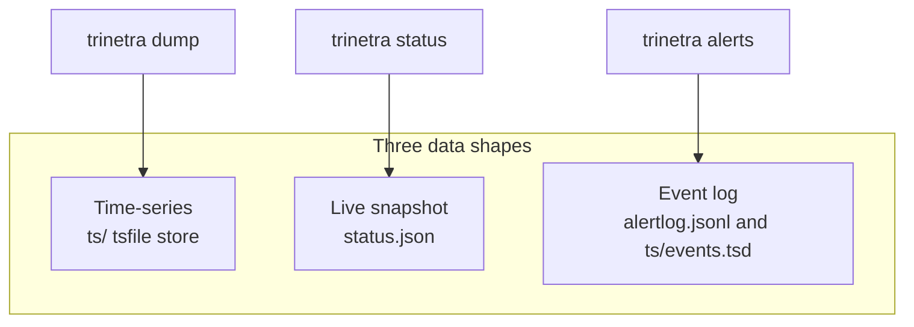

# Storage and the data model

Everything trinetra knows about your server ends up on disk in one of three
shapes. This chapter is about telling them apart, because the shape a datapoint
lives in is not an implementation detail you can ignore. It is the single most
useful thing to know when you go looking for an answer, and it decides three
different questions for you at once:

- Is this a value with **history** you can scan back through time?
- Is it a live read of **right now**, gone the moment it is overwritten?
- Or is it a discrete **thing that happened**, a record of an event?

Get the shape right and the tool to reach it follows immediately. Queryable
history comes out of `trinetra dump`. The live picture comes out of
`trinetra status`. Events come out of `trinetra alerts`. Guess the shape
wrong and you will hunt for CPU load in the event log, or expect a container's
network throughput to have a history it was never given.

The three shapes are:

1. **Time-series** under `/var/lib/trinetra/ts/`, the tsfile store: bounded,
   low-cardinality numeric metrics sampled on a fixed cadence.
2. **The live snapshot**, `status.json`, rewritten on every fast tick: the full
   in-memory view of "now", including fields that are refreshed constantly but
   never kept as history.
3. **The event log**: `alertlog.jsonl` for alert notifications, and
   `ts/events.tsd` for downtime events (see [Downtime and
   liveness](07-downtime-and-liveness.md)).

Each shape has one command that reads it:



The rest of this chapter takes them one at a time, then closes with the full
on-disk layout so you can see how the pieces sit together.

## 1. Time-series: the queryable history

Time-series is the shape for numbers that change continuously and that you want
to look back on. CPU usage over the last day, memory pressure overnight, how
full a disk was getting last week. These are values you sample on a regular
cadence and keep, so that later you can scan a range of time and see the shape
of it.

The design rule that keeps this store fast and small is deliberate and worth
stating up front: **only bounded, low-cardinality numeric metrics get a
series.** A handful of system-wide gauges, one series per real filesystem, one
per running container, one per network interface. What is explicitly kept out
is anything whose count can grow without limit, like a per-process series or a
per-container network series. Those live in the snapshot instead (shape #2).
Unbounded cardinality is exactly what a time-series store handles badly, so
trinetra simply refuses to create it.

### The complete list of series

There is a fixed, knowable set of series. Discovery adds one per disk, per
container, per interface, and per SMART device it finds, but the *kinds* are
these and only these:

| Series id | Tier | Notes |
| --- | --- | --- |
| `cpu`, `mem`, `swap` | fast | percent utilisation |
| `load1`, `load5`, `load15` | fast | load averages |
| `temp` | fast | temperature |
| `disk:<mount>` | slow | one per discovered filesystem |
| `docker:<name>:cpu`, `docker:<name>:mem` | slow | one pair per running container, opt-in via `collect.container_stats` (default on) |
| `net:<iface>:rx`, `net:<iface>:tx` | slow | bytes/sec per interface, opt-in via `collect.net_throughput` (default on) |
| `smart:<dev>:temp` | slow | one per SMART device that reports a temperature, opt-in via `collect.smart_attrs` (default on) |

The **fast tier** is sampled every `fast_interval`. The **slow tier** is
sampled on the slower cadence, which is why the more expensive collectors
(disks, containers, interfaces, SMART) live there. The opt-in series are all
opt-out in practice, since each of those `collect.*` toggles defaults to on;
turning one off simply stops the matching series from being written.

One wrinkle worth knowing: the `net:<iface>` series are empty until the second
slow tick. A rate needs a prior sample to diff against, so the very first tick
has nothing to compute a per-second figure from and writes nothing.

That is the whole list. Per-container network I/O, the systemd unit inventory,
and the process table are deliberately *not* here. They are refreshed live but
never given a series, precisely because their cardinality is unbounded. They
belong to shape #2.

### The metric id is the address

Every series is addressed by a stable string id: `cpu`, `mem`, `disk:/`,
`docker:web:cpu`, and so on. That id maps one-to-one to a file on disk, and it
is the same key the anomaly engine (see [Alerting and notification
channels](06-alerting-and-channels.md)) uses internally. This is why a newly
discovered disk or a newly started container gets its own series automatically
with no code change: a new metric is simply a new id, which is simply a new
file.

### On-disk format: the tsfile store

The default backend is called `tsfile`, and it is a columnar, per-series,
append-only binary store. One file per series, per resolution:

```
/var/lib/trinetra/ts/
  raw/cpu.tsd   raw/mem.tsd   raw/swap.tsd   raw/load1.tsd ...
  1m/cpu.tsd    1m/mem.tsd    ...
  events.tsd
```

Because a series is just a file, adding a new metric never changes the format
and never triggers a schema migration. That is the main win over a single
fixed-column table, where adding one column would rewrite the shape of every
record.

Each file starts with a fixed 16-byte, self-describing header, followed by
fixed-width records:

```
Header (16 bytes):
  magic       [4]byte    "SWTS"
  version     uint16     format version; readers switch on this
  recordLen   uint16     bytes per record; lets a reader skip records it can't size
  resolution  uint32     seconds per point (0 = raw / irregular)
  reserved    [4]byte
Records (append-only, sorted by timestamp):
  ts    int64     unix seconds
  min   float64
  avg   float64
  max   float64   (for raw points, min = avg = max = the sampled value)
```

The header being self-describing is what makes the format future-safe. A reader
checks the `magic` to confirm it is looking at a tsfile at all, switches on
`version` to know the layout, and uses `recordLen` to walk records even if a
newer writer added fields it does not understand. The magic doubles as a
corruption guard: a file that does not start with `SWTS` is rejected rather than
misread.

Three properties fall out of the fixed-width layout:

- **Range scans binary-search by time.** Because every record is exactly
  `recordLen` bytes and records are sorted by timestamp, finding the start of a
  time range is an O(log n) seek to a computed offset, not a full-file parse.
  You scan only the window you asked for.
- **Appends are O(1).** Writing a sample is a seek to the end of the file and a
  single record write. No rewrite, no compaction on the hot path.
- **Reads tolerate a torn final record.** If the daemon was killed mid-write,
  the last record may be shorter than `recordLen`. A read that finds fewer than
  `recordLen` trailing bytes ignores them rather than failing. The rest of the
  file is still perfectly good.

### Resolutions, downsampling, and retention

Raw samples are not kept forever, because at fast-tier cadence they would pile
up quickly. There are two resolutions in play:

- **`raw`** holds every sampled point, at full cadence.
- **`1m`** holds a one-minute rollup, storing the min, avg, and max over each
  minute. This is why every record carries all three numbers even though a raw
  point sets them equal.

On the slow tick a downsampler rolls recent raw points up into the `1m` series.
Retention is then applied per resolution, governed by two config keys (see
[Configuration](04-configuration.md)):

| Key | Default | Governs |
| --- | --- | --- |
| `storage.raw_retention` | `48h` | how long raw-resolution points are kept, fast- and slow-tier alike |
| `storage.rollup_retention` | `720h` (30 days) | how long 1-minute rollups (and downtime events) are kept |

Because retention is per-resolution, extending how far back your history goes is
a config change, not a redesign. And because a query picks the coarsest
resolution that satisfies the requested range, asking for a longer window does
not mean scanning more raw data than you need.

### Querying a series

You read history with `trinetra dump`:

```bash
trinetra dump --metric cpu
trinetra dump --metric disk:/ --since 24h
trinetra dump --metric mem --since 168h --res 1m --format csv
```

The flags are:

- `--metric <id>` the series to export, using the ids from the table above.
- `--since <dur>` how far back to scan, a Go duration (for example `24h`,
  `168h`); day and week units like `7d` are not accepted.
- `--res raw|1m` which resolution to read; omit it and the store chooses.
- `--format csv|json` the output shape, for piping into a spreadsheet or a
  graphing tool.

This export command is what keeps a binary store human-inspectable. You lose the
ability to `cat` a `.tsd` file directly, but you gain a clean CSV or JSON stream
of any series on demand.

### The store is behind an interface

All of the above is the *default* backend, not a hard-wired assumption. Every
caller in the daemon talks to a `SampleStore` interface, never to a file format
directly:

```go
type SampleStore interface {
    Append(ts int64, m MetricSet) error
    Query(metric string, from, to int64, res Resolution) ([]Point, error)
    AppendEvent(DownEvent) error
    Events(from, to int64) ([]DownEvent, error)
    Prune(now int64) error
    Close() error
}
```

The `tsfile` backend described here is the default and the only one meant for
production. A `memory` backend also exists, used mainly by tests, and is
non-persistent. Selecting it is a matter of `storage.backend`. The point of the
seam is that a future SQLite or remote-TSDB backend could drop in behind the
same interface without the daemon, the handlers, or the digests noticing.

## 2. The live snapshot: a read of "now"

The second shape is a single JSON document, `status.json`, rewritten in full on
every fast tick. It is the daemon's complete in-memory `Snapshot` serialised to
disk. Both `trinetra status` and a plain `cat /var/lib/trinetra/status.json`
read this one file.

The snapshot carries the current value of every series from shape #1, so you can
see the live numbers without querying history. But its real reason to exist is
everything it holds that is *not* a series: fields that are refreshed on each
tick and then thrown away, never accumulated into history. This is where all the
unbounded-cardinality state lives, exactly the state the time-series store
refuses to keep.

What the snapshot carries beyond the live series values:

- **Services.** The full systemd unit inventory (name, load, active, sub, and
  description for every unit), opt-in via `collect.services` (default on).
  Separately, `failed_units`, the alerting-only list of units currently in the
  `failed` state, is always collected regardless of that toggle.
- **Processes.** A process overview: total, running, sleeping, and zombie
  counts, plus a bounded top-N (by CPU, falling back to memory on the very
  first tick) of pid, name, state, cpu%, memory, and thread count. Opt-in via
  `collect.processes` (default on).
- **Container state and stats.** `containers` maps each container name to its
  state and is always collected once Docker is reachable. `container_stats`
  adds per-container cpu%, memory, *and* network rx/tx, opt-in via
  `collect.container_stats`. Note the asymmetry: the per-container **network**
  figures are snapshot-only. Unlike cpu and mem, they are never fed into a
  series. This is the concrete case of the cardinality rule in action.
- **Network rates.** `net_rates`, the same per-interface rx/tx bytes/sec that
  also feeds the `net:<iface>` series.
- **Disk detail.** Per-mount device path, filesystem type, inode-usage percent,
  free and total bytes, and, once enough `disk:<mount>` history exists, a linear
  fill-rate projection of how many days until the mount is full. Always
  collected, no toggle.
- **SMART health and attributes.** `smart_health` maps each device to PASSED,
  FAILED, or UNKNOWN and is always collected. `smart_attrs` adds per-device
  temperature, wear percent, and reallocated-sector counts, opt-in via
  `collect.smart_attrs`.

### A gotcha for anyone parsing status.json directly

The nested per-entity types in the snapshot (container stats, interface rates,
disk detail, SMART attributes, unit info, the process snapshot) do not carry
explicit `json` struct tags. As a result their keys in the raw file are the Go
field names *verbatim*, not the lower-snake-case names you might expect from the
top-level fields.

Concretely, a container's CPU percentage is at `container_stats.<name>.CPUPct`,
not `container_stats.<name>.cpu_pct`. If you are consuming `status.json`
programmatically rather than through the CLI or Telegram, keep this in mind and
read the field names off the Go types in `internal/trinetra/status.go` (and
the collectors in `docker.go`, `net.go`, `proc.go`, and `discover.go`) rather
than guessing. Reading it through `trinetra status` sidesteps the issue
entirely.

## 3. The event log: things that happened

The third shape is for discrete events, records of a thing occurring at a moment
in time, as opposed to a sampled value or a live reading. There are two event
streams.

**`alertlog.jsonl`** is an append-only JSON-lines file recording every alert
transition the daemon has raised: every fire and every recover, written the
instant the transition happens, by every anomaly check, the boot report, and
the daily and weekly digests. Delivery itself is asynchronous (see [Alert
history](06-alerting-and-channels.md#alert-history)), so an entry here is not
a delivery receipt, just a record that the alert happened; its outcome, if a
channel keeps failing after retries, only ever reaches the daemon's own
journal. It is pruned to roughly 30 days on each slow tick. Read it with
`trinetra alerts` rather than parsing the file, which prints the currently
active alerts followed by recent history.

**`ts/events.tsd`** holds downtime events, specifically `power_down` and
`net_down`. These are event-shaped, not sampled values, but they live *inside*
the tsfile store rather than in a separate JSONL file. The reason is pragmatic:
by living in the tsfile store they share its retention and downsampling
machinery, kept for the `rollup_retention` window (720h by default) exactly like
the 1-minute series. It is the one case where an event and a time-series share a
home.

## The on-disk layout

Putting it all together, here is what lives under `/var/lib/trinetra`:

```
/var/lib/trinetra/
  status.json           the live snapshot; check this first (shape #2)
  heartbeat             last-alive unix timestamp, rewritten every heartbeat_interval
  ts/                   the tsfile store (shapes #1 and part of #3)
    raw/<metric>.tsd    raw samples per series, binary (storage.raw_retention, 48h)
    1m/<metric>.tsd     1-minute min/avg/max rollups (storage.rollup_retention, 720h/30d)
    events.tsd          downtime events: power_down / net_down (rollup_retention window)
  baseline.json         rolling per-metric mean/stddev for the anomaly engine
  alerts.json           active-alert state (fire-once + recovery dedup)
  alertlog.jsonl        alert notification history (shape #3), pruned to ~30d
```

A note on the `<metric>` filenames: the metric id is used directly as the
filename, with any byte that is not filesystem-safe percent-encoded. So the
`disk:/` series lands at `ts/raw/disk%3A%2F.tsd`. You should not need to know
this in practice, because `trinetra dump --metric disk:/` reads it for you.
Reach for the CLI rather than the raw files, and the encoding stays invisible.

Read this layout back through the lens of the three shapes and it tells its own
story. `status.json` is the live now. Everything under `ts/` and the
`alertlog.jsonl` beside it is history and events, one queryable through `dump`,
the other through `alerts`. The small mutable state files (`baseline.json`,
`alerts.json`) stay as plain JSON on purpose: they are tiny, read and written
whole, and there is no reason to binary-encode something you want to be able to
inspect by eye.

---

[Previous: The web UI](08-web-ui.md) | [Handbook index](README.md) | [Next: Operations](10-operations.md)
