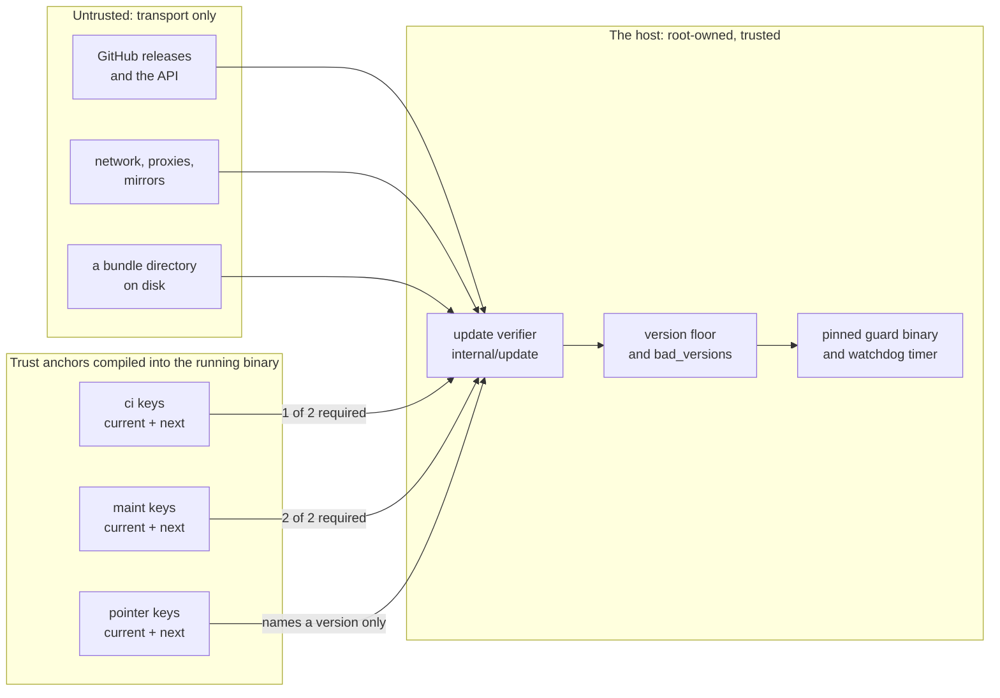
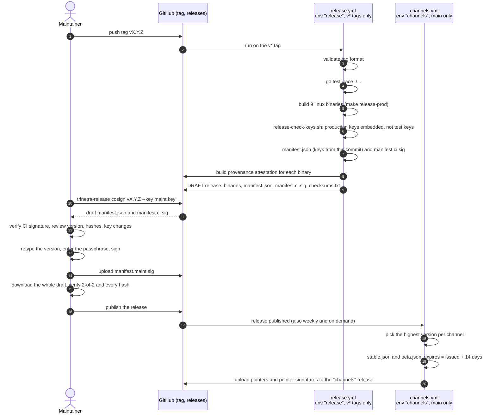
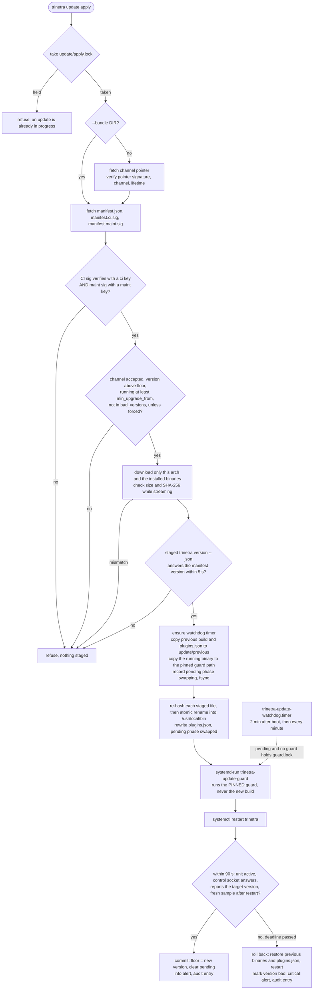
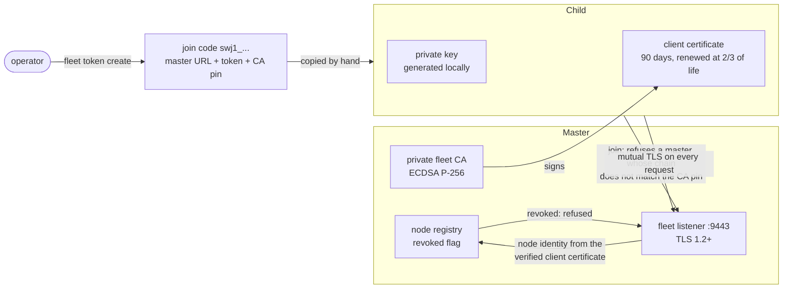

# Security

trinetra runs as root on the machines it watches, and it can replace its own
binary. That makes its security model worth reading in full, not just
trusting. This chapter sets it out in one place: what trinetra trusts, how a
release gets from a git tag onto your host without any single party being
able to forge one, what happens when an update goes wrong, and what each of
the other layers (web UI, fleet, plugins, control socket, secrets, audit)
protects against. It also says plainly what these defences do **not** cover.

If you only want to check a download by hand, jump to
[Verify a download yourself](#verify-a-download-yourself).

- [Trust boundaries](#trust-boundaries)
- [Signed releases](#signed-releases)
  - [Keys and roles](#keys-and-roles)
  - [The published release keys](#the-published-release-keys)
  - [How a release is made](#how-a-release-is-made)
  - [Channel pointers and freeze detection](#channel-pointers-and-freeze-detection)
- [How a host applies an update](#how-a-host-applies-an-update)
  - [Downgrade protection](#downgrade-protection)
  - [The guard, the watchdog and automatic rollback](#the-guard-the-watchdog-and-automatic-rollback)
- [If a key is compromised](#if-a-key-is-compromised)
- [Honest limits](#honest-limits)
- [Verify a download yourself](#verify-a-download-yourself)
- [Other security layers](#other-security-layers)
- [Reporting a vulnerability](#reporting-a-vulnerability)

## Trust boundaries

trinetra draws one hard line: **the only trust anchor for software it will
run is the set of public keys compiled into the binary that is running right
now.** Everything that arrives from outside, over any route, is checked
against those keys or refused.

What trinetra trusts:

- **Its own compiled-in release keys** (`internal/update/keys.go`): two
  public keys (current and next) for each of three roles, `ci`, `maint` and
  `pointer`. Nothing at runtime can add to them.
- **The local root-owned system**: the kernel, systemd, root-owned files
  under `/usr/local/bin`, `/usr/local/lib/trinetra`, `/etc/trinetra` and
  `/var/lib/trinetra`. An attacker who is already root on the host is out of
  scope; root can run anything.
- **For a fleet child**: the CA whose key hash it was given in the join code,
  and nothing else. **For a fleet master**: the client certificates its own
  CA issued, minus any node you revoked.
- **For the web UI**: a registered passkey, and the session the server made
  after a passkey sign-in.

What trinetra never trusts:

- **The network, GitHub, a proxy, a USB stick, or (later) the fleet master
  as a source of updates.** They are transport. Every byte they deliver is
  verified against the compiled-in keys before it is used.
- **The `keys` field inside a release manifest.** It echoes the key set the
  new build compiles in, so a key rotation is visible when the maintainer
  co-signs. Hosts never take trust from it.
- **`checksums.txt`.** It is published for convenience and never read by a
  host.
- **A channel pointer beyond naming a version.** The release it names is
  verified in full, like any other.
- **The new build to recover from its own failure.** The guard and watchdog
  that confirm or roll back an update run a pinned copy of the previous,
  known-good binary.
- **`$PATH`, or a plugin file it did not record at install time.**
- **Anything in a fleet request body about who sent it.** The master
  identifies a node only by its verified client certificate.



## Signed releases

Every release is signed **twice**, independently, and a host needs both.

- **The CI signature** is made by the GitHub Actions release workflow, which
  builds the binaries from the tagged commit.
- **The maintainer co-signature** is made afterwards, on the maintainer's own
  machine, with a key that never goes near CI.

Each signature is ed25519 (Go standard library) over the exact bytes of
`manifest.json`, prefixed with a fixed domain-separation line:

```
"trinetra-release-v1\n" || manifest.json bytes
```

The prefix means a signature made for one kind of object (a release
manifest) can never be replayed as a signature for another (a channel
pointer uses `"trinetra-channel-v1\n"`). A host accepts a release only when
the CI signature verifies against one of its compiled-in `ci` keys **and**
the maintainer signature verifies against one of its compiled-in `maint`
keys. Either one missing, malformed or signed by any other key refuses the
release before anything is downloaded beyond the manifest.

`manifest.json` is the whole contract for a release:

```json
{
  "schema": 1,
  "product": "trinetra",
  "version": "0.5.0",
  "channel": "stable",
  "published": "2026-10-01T10:00:00Z",
  "min_upgrade_from": "0.4.1",
  "keys": { "ci": ["..."], "maint": ["..."], "pointer": ["..."] },
  "files": [
    { "name": "trinetra-linux-amd64", "os": "linux", "arch": "amd64", "size": 11812345, "sha256": "..." }
  ]
}
```

It is decoded strictly: an unknown field, trailing data, a wrong `product`
or `schema`, a pre-release version on the `stable` channel, a file name with
a path separator, a platform other than `linux/{amd64,arm64,arm}`, or a
malformed hash is a refusal. It lists exactly nine files: `trinetra`,
`trinetra-ctl` and `trinetra-web` for each of the three architectures.

### Keys and roles

| Role | Signs | Where the private key lives |
| --- | --- | --- |
| `ci` | Release manifests (first signature) | GitHub Actions secret `TRINETRA_CI_SIGNING_KEY` in the `release` environment, which only `v*` tags can deploy to. |
| `maint` | Release manifests (co-signature) | The maintainer's machine only, encrypted with a passphrase (scrypt, then XChaCha20-Poly1305). Never in CI. |
| `pointer` | Channel pointers `stable.json` / `beta.json` | GitHub Actions secret `TRINETRA_POINTER_SIGNING_KEY` in the `channels` environment, which only the `main` branch can deploy to. It cannot sign releases. |

Each role has a **current** and a **next** key compiled into every build; a
signature from either is accepted. That is how keys rotate without any
out-of-band "trust this new key" message, which would itself be an attack
surface:

1. Generate a new key pair for the role.
2. Ship a normal release, signed with the keys hosts trust today, whose
   binary compiles in the new key set (for example: old next becomes current,
   new key becomes next). When the maintainer co-signs it, `trinetra-release
   cosign` shows a prominent **KEY ROTATION** block listing exactly which
   keys are added and removed.
3. Once hosts have updated onto that release, a later release can drop the
   retired key.

A release build must carry the production keys: the release workflow runs
`scripts/release-check-keys.sh`, which fails unless the built binary's key
fingerprints are non-empty, equal the ones `trinetra-release fingerprints`
reports, and are not the test keys. A build with no keys fails closed:
every update and every signed install is refused with "this build has no
release keys compiled in".

### The published release keys

These are the production public keys compiled into trinetra, copied from
`internal/update/keys.go`. They are public by design. Each is a raw 32-byte
ed25519 key, base64-encoded; the fingerprint is the SHA-256 of those 32 raw
bytes, exactly as `trinetra update status --json` (`fingerprints`) and
`trinetra-release fingerprints` print it.

| Role | Slot | Public key (base64) |
| --- | --- | --- |
| ci | current | `qYrzYRct8xy9iJR6Xm8ow+u33GMc8fAoqaX9GZh4+N4=` |
| ci | next | `UMoRKBR5eR908Tu+9wQ6les9m6Aa4pZBbITaJ3QSJuI=` |
| maint | current | `CCoIiySogUWY6OFBHGFfRTGFDOnUp+teJKY/Dxh1uaQ=` |
| maint | next | `/GzPC6QaaouUzZCnnQODcpU07ZStPHIjZ5I1A4fGiAE=` |
| pointer | current | `kwnelcUBEYplJz/eccyffudFShPlErYGP7S2WGWdCR8=` |
| pointer | next | `jHQ3krsljylnDlWIZhwPUwxiQzCK5Kg+q+WVE9Icv20=` |

Fingerprints, in the order the tools print them (current then next per
role):

```
ci:12fa1a1532ab468b3c552db2021b267515bd548bc3e08a0ad4dbc7def3611bb6
ci:2fe78c6f6d7e40ea751cc401952174ffd6da7889a60abcf2949616d9b785d2eb
maint:4becedfe2eea9d5689d6f073869f36b1a082d0ab16e10569660050997696f859
maint:1a77db1b45597594a02371f192c6b4eb115ae437a930b6ee1a11d967b69b4089
pointer:75c9c40cae8c66cee6d266ed276f19b11658a9c1906dcce9dda1fc1cd17750fa
pointer:6eda935c4f3885e91419c01fe751efbb581053f3b8e57a8d36f7cf32a48f0725
```

Check that an installed binary carries these keys with
`trinetra update status --json` (`keys_loaded` must be `true` and
`fingerprints` must match the list above). Recompute any fingerprint from its
key with OpenSSL 3:

```bash
printf '%s' 'qYrzYRct8xy9iJR6Xm8ow+u33GMc8fAoqaX9GZh4+N4=' | openssl base64 -d -A | openssl dgst -sha256 -r
```

### How a release is made



The workflow itself is hardened: third-party actions are pinned to commit
hashes, the checkout does not persist credentials, the tag reaches the shell
only through an environment variable after a strict `vX.Y.Z(-pre)` format
check, and the release is created as a **draft** so nothing is downloadable
until the maintainer has co-signed it. `cosign` also refuses when the
manifest's version does not match the tag, and refuses a maintainer key that
is not one of the compiled-in `maint` keys.

A tag with a pre-release suffix (`vX.Y.Z-beta.N`) is signed for the `beta`
channel; every other tag is signed for `stable`. The channel is inside the
signed manifest, so a beta build cannot be passed off as stable.

The maintainer procedure, with the GitHub environment setup, is in
[Operations: Release keys and releasing](10-operations.md#release-keys-and-releasing-maintainers-only).

### Channel pointers and freeze detection

A host learns "what is the newest release on my channel" from a small signed
file on a long-lived GitHub release named `channels`:

```json
{ "schema": 1, "product": "trinetra", "channel": "stable", "version": "0.5.0",
  "issued": "2026-10-05T03:17:00Z", "expires": "2026-10-19T03:17:00Z" }
```

It is signed with a `pointer` key over `"trinetra-channel-v1\n" || bytes`.
A host rejects a pointer that is expired, issued more than an hour in the
future, or claims a lifetime longer than 14 days (plus one hour of clock
slack), so even a stolen pointer key cannot mint a pointer that stays valid
for months. `channels.yml` re-signs both pointers every Monday and whenever a
release is published.

A pointer only names a version. That version's manifest must still pass the
full 2-of-2 check and every host policy below, so a forged pointer can at
worst name an older genuine release (refused by the floor) or a version that
does not exist.

The real threat a pointer defends against is a **freeze**: someone quietly
withholding updates so hosts stay on a vulnerable version. The daemon checks
the channel every `update.check_interval` (default 24h) and raises a warning
alert, once per episode, when:

- the pointer or its signature is missing, or it has expired; or
- the newest pointer this host has ever verified was issued more than 14
  days ago, whatever the reason (a blocked connection, a replayed old
  pointer).

A plain network outage does not warn until those 14 days have passed, and the
warning clears when a fresh pointer verifies.

**No freeze alert until a pointer has verified once.** A fresh host that has
never verified a pointer (for example `update.source=github` against the
private release repo with no `update.github_token`, which answers 404) does
not alert at all: freeze detection needs a good pointer to go stale first.
Such a host logs the cause once per distinct cause ("updates not
configured: ...") and shows it as `check error:` in `trinetra update
status`. The trade-off is deliberate: a host blocked from its very first
check is never freeze-alerted, so look at `update status` on a new host.

The daemon only **checks** and notifies. It never installs an update on its
own; applying one is always `trinetra update apply` (or the web UI's
admin-only Apply button).

## How a host applies an update

`trinetra update apply` (and `check`, and `install` when a manifest is
present) run the same verification. All of it happens on the host, against
the host's own compiled-in keys.



Details that matter:

- **Only what is needed is fetched.** A host downloads only its own
  architecture, and only the binaries it has installed (`trinetra` always,
  `trinetra-ctl`/`trinetra-web` if present). Signature files and the manifest
  are capped at 1 MiB; a binary stream is cut off one byte past its signed
  size.
- **No time-of-check/time-of-use gap.** Each staged file is re-hashed
  immediately before its atomic rename into place.
- **Staging is private.** `/var/lib/trinetra/update/` and everything under
  it is `0700` root; `state.json` is written with a temp file, fsync and
  rename, then a directory fsync, so a power cut never leaves a half-written
  floor.
- **Channel rule.** A `stable` host accepts only `stable` releases. A `beta`
  host accepts `beta` and `stable`, so it moves on to each final release. With
  `update.channel=off` only an explicit `--bundle DIR` apply is possible.
- **Locks.** `update/apply.lock` allows one apply, rollback or `install` at a
  time per host; `update/guard.lock` allows one guard at a time; every
  read-modify-write of `state.json` happens under `update/state.lock`. They
  are kernel `flock`s, so a killed process releases its lock. `install`
  refuses while an update is pending.

### Downgrade protection

- **The floor** is the highest version this host ever committed. A
  successful update raises it; a verified `install` raises it too (never
  lowers it). A release **lower** than the floor is refused always, and
  `--force` does not change that. The **same** version is "already
  installed" (a verified `install` may re-install it as a repair).
- **`update rollback`** restores the build kept in `update/previous/`, which
  passed verification when it was installed, through the same guarded
  restart. It does not lower the floor; the next apply moves forward again.
- **`min_upgrade_from`** in the signed manifest names the oldest running
  version allowed to upgrade straight to this release. An older host must
  step through an intermediate release first.
- **`bad_versions`**: a version that failed its health check on this host is
  never offered or retried automatically; `update apply --version X --force`
  retries it deliberately.

These rules protect the update path. They do not stop root from installing an
unsigned binary by hand with plain `trinetra install` (it warns; add
`--require-signed` to make it refuse).

### The guard, the watchdog and automatic rollback

Before the first binary is replaced, `apply` copies the binary that is doing
the apply to `/usr/local/lib/trinetra/guard/trinetra` (an exec-friendly root
path, since `/var/lib` is often `noexec`). That **pinned guard** is what
confirms or rolls back the update, launched as the transient unit
`trinetra-update-guard`. The code that wrote the pending update is the code
that resolves it, and it never depends on the new build starting.

`install` also installs `trinetra-update-watchdog.timer`: two minutes after
boot and then every minute, it runs the pinned guard with `update guard
--if-pending`. It does nothing when no update is pending or a guard already
holds `guard.lock`. Otherwise it finishes the job, so recovery survives a
killed guard, an apply that died half-way through the swap, a rollback whose
restore was interrupted, a reboot or a power cut inside the health window, and
a new build whose daemon crashes the moment it starts. `update apply`
re-creates the timer before swapping if it is missing.

Every apply/rollback start and every guard commit or rollback is written to
`/var/lib/trinetra/update/audit.jsonl` (on a fleet master, to the fleet audit
log) with the actor: `cli:<user>`, `socket` or `guard`. The full operator
walkthrough is in [Operations: Updating](10-operations.md#updating).

## If a key is compromised

| Compromised | What an attacker gains | What still stops them |
| --- | --- | --- |
| **`ci` key**, or the CI runner / GitHub org that holds it | Can produce CI signatures over any manifest, including one describing a backdoored build. | No host installs it without a maintainer signature. |
| **`maint` key** (and its passphrase) | Can co-sign any manifest. | No host installs it without a CI signature. |
| **`pointer` key** | Can sign pointers naming any existing version, each valid for at most 14 days. If they also control what hosts download, they can keep re-issuing fresh pointers to an **old** version, holding hosts back without tripping the freeze alert. | A pointer cannot install anything: every release it names is verified 2-of-2, a lower version is refused by the floor, and an operator can always `update apply --version X` a newer release directly. |
| **`ci` and `maint` together** | Full release forgery: hosts would install a signed malicious build. | Nothing on the host. This is why the two keys live in different places, with different people and protections. Recovery is a normal release with rotated keys, which is a race until hosts update. |
| **GitHub, the network, or a mirror** (no keys) | Can withhold, delay or corrupt downloads. | Corruption fails the signature or hash checks. Withholding raises the freeze alert once a pointer has verified. |
| **A fleet master** (future fleet-wide rollout) | Would be transport only, like GitHub. | Every child verifies every release itself against its own compiled-in keys. |

There is no remote kill switch and no out-of-band revocation list, by design:
either would be one more thing that could be forged. A compromised key is
retired by shipping a release, signed with keys hosts still trust, whose
binary compiles in a key set without it.

## Honest limits

- **The co-signature cannot detect a malicious CI build.** The maintainer
  confirms the version, channel, file hashes and key set they are shown; they
  do not rebuild the binaries. A compromised CI runner could build a
  backdoored binary from clean source, and the maintainer would co-sign its
  hash. A **reproducible-rebuild check** inside `trinetra-release cosign`
  (rebuild from the tag, compare hashes, refuse on mismatch) is planned before
  the first public release. GitHub build provenance
  ([below](#optional-github-build-provenance)) records which workflow run
  built each binary, but it is issued by the same CI.
- **No required reviewer on the `release` environment yet.** GitHub does not
  offer environment reviewers for this private repository, so the
  maintainer's offline co-signature is the approval gate today. The
  environment is still restricted to `v*` tags (and `channels` to `main`), so
  a branch cannot reach either signing key. A required reviewer is added
  when the repository goes public.
- **A host that never verified a pointer is never freeze-alerted** (see
  above). Its `update status` shows why.
- **A pointer-key compromise can hold hosts back** without an alert, as in the
  table above. It cannot push anything onto them.
- **Root is out of scope.** Anyone who is already root on a host can replace
  binaries, keys and state directly.
- **Fleet-wide automatic rollout is not built yet.** Today each host applies
  updates when an operator runs `update apply`; automatic rollout by channel
  through the fleet master is planned (see
  [Roadmap and status](12-roadmap-and-status.md)), with the same rule that
  the master is transport only.

## Verify a download yourself

You do not have to take trinetra's word that a release is genuine. With
standard tools you can check the same two things a host checks: that each
binary matches `manifest.json`, and that `manifest.json` carries a valid CI
signature **and** a valid maintainer signature from the
[published keys](#the-published-release-keys).

**You need** `sha256sum` (Linux; on macOS use `shasum -a 256`), and **OpenSSL
3.0 or newer** for the signatures. macOS ships LibreSSL as `/usr/bin/openssl`,
which cannot verify raw Ed25519 signatures (it fails with "unsupported
algorithm"); install OpenSSL 3 with `brew install openssl@3` and call it as
`"$(brew --prefix openssl@3)/bin/openssl"`. `openssl version` must print
`OpenSSL 3.x`. `jq` is optional.

### Download a release into one directory

Keep the release's own file names (with the `-linux-<arch>` suffix) while you
verify. Download the binaries you want plus the manifest and both signatures:

```bash
mkdir trinetra-release && cd trinetra-release
arch=linux-amd64     # or linux-arm64, linux-arm
base=https://github.com/InfoDiveLabs/trinetra/releases/latest/download
for f in trinetra-$arch trinetra-ctl-$arch trinetra-web-$arch \
         manifest.json manifest.ci.sig manifest.maint.sig; do
  curl -fsSL -o "$f" "$base/$f"
done
```

### Step 1: check the binaries against the manifest

With `jq`:

```bash
jq -r '.files[] | "\(.sha256)  \(.name)"' manifest.json | sha256sum -c --ignore-missing
```

Without `jq` (the manifest has one field per line, `name` before `sha256`):

```bash
awk -F'"' '/"name":/ {n=$4} /"sha256":/ {print $4 "  " n}' manifest.json | sha256sum -c --ignore-missing
```

On macOS, replace `sha256sum` with `shasum -a 256` in either line. Every file
you downloaded must print `OK` and the command must exit 0. `--ignore-missing`
skips the architectures you did not download; with no matching file at all it
fails ("no file was verified").

This step alone only proves the files match *a* manifest. Step 2 proves the
manifest is genuine. Do both.

### Step 2: verify both signatures with OpenSSL 3

Build the exact message both signatures cover: the line
`trinetra-release-v1` plus one newline, then `manifest.json` byte for byte.
Use `printf` (not `echo`) so there is exactly one newline, and `cat` so the
manifest is not altered:

```bash
{ printf 'trinetra-release-v1\n'; cat manifest.json; } > signed-message.bin
```

Decode the two signature files (one line of base64 each) into raw 64-byte
signatures:

```bash
openssl base64 -d -A -in manifest.ci.sig    -out ci.sig.bin
openssl base64 -d -A -in manifest.maint.sig -out maint.sig.bin
```

Turn the published keys into PEM public keys. An Ed25519 public key in PEM
form is the fixed 12-byte DER header `302a300506032b6570032100` followed by
the 32 raw key bytes, base64-encoded. Because the header is a multiple of
three bytes long, its base64 (`MCowBQYDK2VwAyEA`) simply goes in front of the
key's own base64, so no binary tools are needed:

```bash
pem() { printf '%s\n' '-----BEGIN PUBLIC KEY-----' "MCowBQYDK2VwAyEA$1" '-----END PUBLIC KEY-----'; }
pem 'qYrzYRct8xy9iJR6Xm8ow+u33GMc8fAoqaX9GZh4+N4=' > ci-current.pem
pem 'UMoRKBR5eR908Tu+9wQ6les9m6Aa4pZBbITaJ3QSJuI=' > ci-next.pem
pem 'CCoIiySogUWY6OFBHGFfRTGFDOnUp+teJKY/Dxh1uaQ=' > maint-current.pem
pem '/GzPC6QaaouUzZCnnQODcpU07ZStPHIjZ5I1A4fGiAE=' > maint-next.pem
```

Verify the CI signature with the CI key and the maintainer signature with the
maintainer key:

```bash
openssl pkeyutl -verify -pubin -inkey ci-current.pem    -rawin -in signed-message.bin -sigfile ci.sig.bin
openssl pkeyutl -verify -pubin -inkey maint-current.pem -rawin -in signed-message.bin -sigfile maint.sig.bin
```

Each must print `Signature Verified Successfully` and exit 0. A release made
after a key rotation may be signed with a role's **next** key instead: if a
`current` check prints `Signature Verification Failure`, repeat it with
`ci-next.pem` or `maint-next.pem`. The release is genuine only when **both**
roles pass, each with one of its own two keys. A CI signature checked against
a maintainer key, or either signature checked against a modified manifest,
fails.

If both steps pass, the binaries are exactly what CI built and the maintainer
approved. Drop the architecture suffix and install as usual; keep the
manifest and signatures next to the binaries so `install` checks them again:

```bash
for b in trinetra trinetra-ctl trinetra-web; do mv "$b-$arch" "$b"; done
chmod +x trinetra trinetra-ctl trinetra-web
sudo ./trinetra install --require-signed
```

### Optional: GitHub build provenance

The release workflow also records a GitHub build-provenance attestation for
each binary. With the GitHub CLI and access to the repository you can check
which workflow run produced a file:

```bash
gh attestation verify trinetra-linux-amd64 --repo InfoDiveLabs/trinetra
```

This is a useful extra, not a substitute for step 2: it is issued by the same
CI that makes the first signature, and it says nothing about the maintainer's
approval.

### The easy path

Everything above is what trinetra does for you on every install and update:

- `sudo ./trinetra install --require-signed`, run from a directory holding
  `manifest.json`, both `.sig` files and the binaries, verifies both
  signatures and every binary's hash, and refuses before copying anything
  on any mismatch (without the flag, a missing manifest is only a warning;
  a present one is always verified).
- `sudo trinetra update apply --bundle DIR` does the same for an upgrade from
  a directory laid out like the one above (release file names kept), then
  runs the guarded, rolled-back-on-failure swap.
- `sudo trinetra update apply` does it against GitHub, via the signed
  channel pointer.

## Other security layers

### Web UI

- **Passkeys only.** Accounts sign in with WebAuthn passkeys (platform
  authenticators or security keys); there are no passwords to steal or reuse.
  The first passkey on a fresh instance becomes admin, atomically; after
  that, new accounts need a single-use, expiring invite from an admin.
- **Roles.** `admin` and `viewer`, plus anonymous access to `/public` only
  when an admin enables it. Every mutation (config, channels, users, alert
  acknowledgement, updates) is admin-only, and the last admin cannot be
  demoted or removed.
- **Sessions and CSRF.** Sessions are server-side, in an `HttpOnly`,
  `SameSite=Lax` cookie that is `Secure` whenever the request arrived over
  HTTPS, with a 24-hour default lifetime (`web.session_ttl`). Every
  state-changing request must carry the session's CSRF token, compared in
  constant time.
- **Headers.** A strict Content-Security-Policy (scripts only from the
  server itself plus a per-request nonce, `frame-ancestors 'none'`),
  `X-Content-Type-Options: nosniff`, `Referrer-Policy: same-origin`, and HSTS
  when this process terminates TLS itself.
- **Rate limits** on the unauthenticated passkey ceremonies.
- **Updates page.** `/updates` (admin only, CSRF-protected) offers Check,
  Apply and Roll back through the control socket; it runs the exact
  verification described above.

Details: [The web UI: Authentication and roles](08-web-ui.md#authentication-and-roles).

### Fleet



- **Pinned CA, no trust on first use.** The join code carries a SHA-256 pin
  of the master CA's public key. The child generates its private key locally
  and refuses to talk to a master whose certificate chain does not match the
  pin. Join tokens are short-lived, single- or limited-use, and joins are
  rate-limited per source IP.
- **Mutual TLS.** After joining, every request is mutual TLS with a
  certificate signed by the fleet CA, and the master identifies the node from
  that certificate, never from the request body. Do not put a TLS-terminating
  proxy in front of the fleet port.
- **Revoke.** `trinetra fleet node revoke` refuses a node's certificate from
  then on; `fleet node remove` also drops it from the registry and liveness
  tracking.
- **Updates stay local.** A child never takes an update from the master on
  trust; see the table above.

Details: [Fleet mode](13-fleet.md) and
[Architecture: Enrollment](02-architecture.md#enrollment).

### Plugins

`trinetra cli` and `trinetra web` exec the plugin binaries as root, so the
core first proves they are the ones it installed: the path is next to the
core binary (never `$PATH`), the file and its directory are owned by root (or
the core binary's owner) and not group- or world-writable, and the file's
SHA-256 matches `/var/lib/trinetra/plugins.json` (`0600`), which `install`
and every update rewrite. Any failure is a refusal. See
[Architecture: The front-door safe-exec trust model](02-architecture.md#the-front-door-safe-exec-trust-model).

### Control socket

Plugins reach the daemon through `/run/trinetra/control.sock`: the directory
is `0700` root and the socket `0600`, and every connection's opening hello
must carry a per-launch random token (compared in constant time) read from
the root-only `/run/trinetra/token`,
regenerated at every daemon start. If the token cannot be generated or
written, the daemon logs it and serves the socket on file permissions alone
rather than crash-looping. See
[Architecture: The control socket](02-architecture.md#the-control-socket).

### Secrets

- `/etc/trinetra/config.json` is written `0600`, root-owned, with an atomic
  replace.
- Secret keys (`telegram.token`, `update.github_token`) are never shown in
  the clear: `config get` prints `(set)` / `(not set)` and the full-config
  display does the same. The web config page never renders
  `update.github_token` back, and its audit entries record only `(set)` /
  `(not set)`.
- `update.github_token`, needed only while the release repository is
  private, should be a read-only token. The GitHub client sends it only to
  the GitHub API and drops it on the redirect to GitHub's download storage.
- Release signing keys never appear in output: `trinetra-release keygen`
  prints only the public key and fingerprint.

### Audit logs

- **Web UI changes** (config, channels, users, alert acks):
  `/var/lib/trinetra/audit.jsonl`, with the acting account.
- **Fleet changes** (nodes, tokens, silences, routing, managed config,
  incident acks): the fleet audit log, shown at `/fleet/audit`.
- **Updates** (apply and rollback starts, guard commits and rollbacks):
  `/var/lib/trinetra/update/audit.jsonl`, or the fleet audit log on a master.

### A small, stdlib-only core

The `trinetra` daemon, including every line of update verification, is
built from the Go standard library only; a test
(`TestDefaultBuildIsStdlibOnly`) fails the build if a third-party package ever
creeps into it. The plugins (`trinetra-web`, `trinetra-ctl`) and the
maintainer-only `trinetra-release` tool carry their own dependencies, outside
the core.

## Reporting a vulnerability

Please do not open a public issue for a security problem. Contact the
maintainers privately with a description, the affected version
(`trinetra version`), and steps to reproduce if you have them. You will get an
acknowledgement, and a fix will ship as a normal signed release; the advisory
follows once hosts can update.

---

[Previous: Fleet mode](13-fleet.md) | [Handbook index](README.md)
