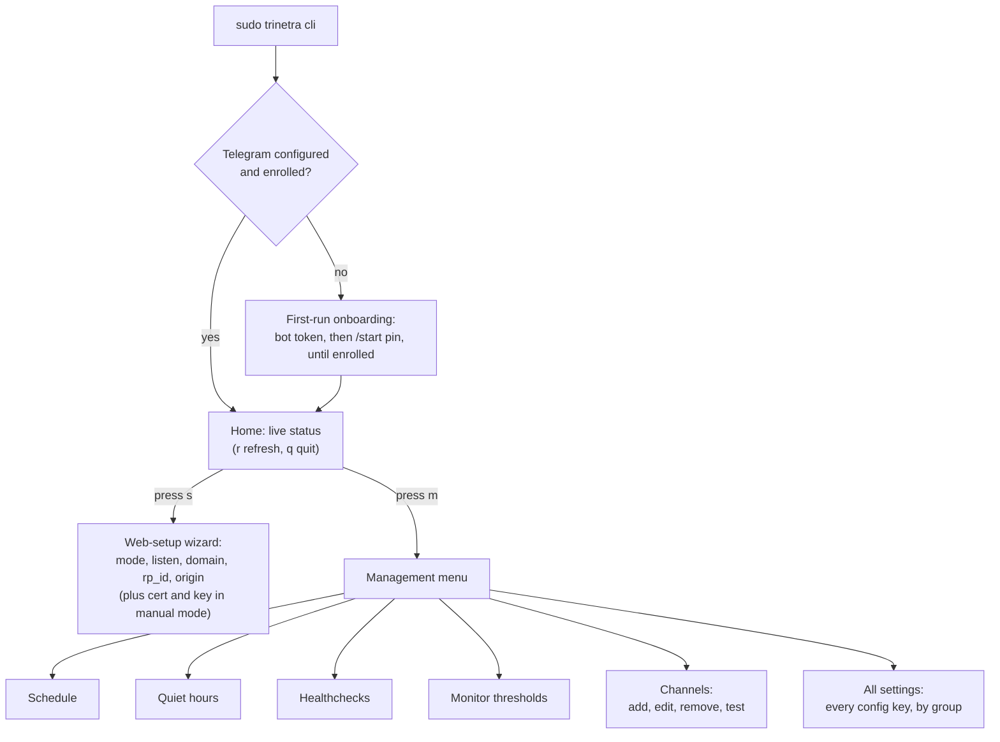

# trinetra-ctl

`trinetra-ctl` is a separate client binary that dials the daemon's control
socket. It is the primary, recommended way to manage a running trinetra day
to day: it wraps the schedule, quiet hours, healthchecks, monitor thresholds,
and notification channels in guided, validated screens, plus a first-run
onboarding flow for Telegram, and its generic **all settings** screen reaches
every remaining flat config key on top of those, so there is no config key
you have to drop to `trinetra config set` for. It is a complete, supported
management tool: every config key is reachable through its screens. Nothing
supervises its process (unlike [trinetra-web](trinetra-web.md), which the
daemon supervises), by design -- it is an interactive client you run by hand
when you want it, not a background service.

In normal use you do not invoke the binary directly; run `trinetra cli`
instead (see [the front-door in the Plugins overview](README.md)), which
safely locates and execs it. The direct invocations below still apply once
launched, and remain useful when scripting or working from a non-standard
install location.

## At a glance

Where each feature lives in the TUI: launch with `sudo trinetra cli`, and
from the Home screen `m` opens the management menu and `s` opens the web-setup
wizard. If Telegram is not configured or enrolled yet, launching drops you
straight into first-run onboarding instead.



## Installing

`trinetra-ctl` installs alongside the daemon. The recommended path is to
download the `trinetra-ctl-<arch>` asset from the [releases
page](https://github.com/InfoDiveLabs/trinetra/releases) into the same
directory as the `trinetra` binary (renamed to `trinetra-ctl`, dropping
the arch suffix), then run `sudo trinetra install`: it copies the plugin
into `/usr/local/bin` next to the daemon and records its checksum in the
root-only install manifest, so the `trinetra cli` front-door can verify and
run it. If you already installed the daemon, just download the plugin next to
`trinetra` and re-run `trinetra install`. Building from source
(`go build -o trinetra-ctl ./cmd/trinetra-ctl`) is the secondary option.
See [Installation and first run](../03-installation.md) for the full flow and
[Plugins](README.md) for the shared install and safe-exec model.

## Running trinetra-ctl

Run it with a subcommand for a one-shot, non-interactive read or change that
mirrors the daemon-side output. Run it with no subcommand to launch the
interactive Bubble Tea TUI, which is now the primary way to manage a running
trinetra. The subcommands are the scriptable counterpart to the TUI: the
read verbs (`status`, `doctor`, `alerts`) mirror the Home dashboard, and
`config get`/`config set`/`channels test` drive the same validated setters and
actions the management screens use, for a headless box or an automation script
that cannot sit in front of a terminal.

```
trinetra-ctl [--socket PATH] [--token PATH] [--json] <command>
```

| Command | Purpose |
| --- | --- |
| `status` | Print the current dashboard snapshot. |
| `doctor` | Print the daemon's diagnostic report. |
| `version` | Print the ctl and core daemon versions (flags a mismatch). |
| `host` | Print the host hardware/OS inventory (add `--json` for raw). |
| `logs <container> [--tail N]` | Print a docker container's recent logs. |
| `alerts` | Print the currently active alerts. |
| `config get <key>` | Print one flat config key's current value. |
| `config set <key> <value>` | Set one config key, validated and applied live. |
| `channels test <name>` | Send a live test notification through a channel. |

Every subcommand exits `0` on success, `2` on a usage error (an unknown or
malformed command, a bad argument count, or an unknown config key), and `1`
when the underlying control-socket call fails, consistent throughout `run.go`.

- **`--json`** makes the three read verbs (`status`, `doctor`, `alerts`) emit
  JSON instead of the text layout. It may appear before or after the verb, so
  `trinetra-ctl status --json` and `trinetra-ctl --json alerts` are
  equivalent, and it is inert (silently ignored) for the mutating verbs.
  `alerts --json` always emits a JSON array, `[]` when nothing is firing, so a
  consumer never has to special-case the empty state.
- **`config get <key>`** prints one flat config key's current value, read
  through the same `config.Get` the TUI's **all settings** screen uses. An
  unknown key is a usage error (exit `2`), pointing you at the all-settings
  catalog for the valid key names.
- **`config set <key> <value>`** sets one key through the exact same validated
  `config.Set` setter the TUI uses (so a value the CLI rejects is one the TUI
  would reject too), then commits it live with `ApplyConfig`. The same
  restart-required caveats the TUI shows apply here: keys like `web.enabled`
  and the `storage.*` backend/retention settings only take full effect after a
  daemon restart, even though the value is saved and the rest of the config
  hot-reloads immediately.
- **`channels test <name>`** sends a live test notification through the named
  channel, the same `TestChannel` action the Channels screen's `t` key runs.

Socket and token resolution, highest priority first:

| Source | Socket | Token |
| --- | --- | --- |
| Flag | `--socket PATH` | `--token PATH` |
| Environment | `TRINETRA_CONTROL_SOCKET`, else `SERVERWATCH_CONTROL_SOCKET` (compat, one release) | `TRINETRA_CONTROL_TOKEN`, else `SERVERWATCH_CONTROL_TOKEN` (compat, one release) |
| Default | `$RUNTIME_DIRECTORY/control.sock`, else `/run/trinetra/control.sock` | the sibling `token` file next to the resolved socket |

A missing token file is treated as no-auth (the daemon serves without a token
when it could not generate one). Any other token read error is fatal.

## Managing with trinetra-ctl

Every screen the interactive TUI offers follows the same shape: fetch the
current `Config` over the control socket, mutate it with a validated
`config.Set` setter, and commit it in one atomic `ApplyConfig` call. Nothing
is written straight to disk by `trinetra-ctl` itself, and a screen can
never leave the daemon with a half-applied change. Where a screen needs to
know what the host actually looks like, it asks the daemon rather than
probing locally: the Monitor thresholds screen lists targets from the
daemon's own `MonitorTargets`, and an enabled channel is checked with
`ValidateChannel` before it is ever saved.

**The Home screen.** Launching `trinetra-ctl` with no subcommand opens
Home, a live dashboard that re-fetches itself every couple of seconds (and on
`r`) so it stays current without you touching it. It renders, top to bottom:

- A **status header**: `trinetra  ● online   updated Ns ago`, where the dot
  is green for online and red for offline, and the "Ns ago" is how stale the
  last snapshot is.
- A boxed **SYSTEM** panel: colour-coded CPU/MEM/SWAP meter bars with their
  percentages (green under 70%, amber to 90%, red at or above), a live CPU
  sparkline built from a rolling in-session history of the last snapshots, the
  three load averages, temperature (only when a sensor is present), and network
  throughput (rx down / tx up).
- A boxed **ALERTS** panel: an `N firing` count and the top active alerts, each
  a severity dot plus a truncated key (with `(acked)` on acknowledged ones and
  a `+N more` tail when the list overflows), or a `✓ no active alerts` empty
  state.
- A boxed **DISKS** panel: the top mounts by usage, each with a coloured usage
  bar. Absent when disk collection found no mounts.
- A **24h availability strip**: green (up) and red (down) blocks across the last
  day, with the uptime %, total downtime, and incident count. Absent when the
  snapshot carries no availability data.
- An **inventory line**: containers up/total, failed/total units, disk mounts
  (with a critical count when any are critical), and process count.

Colours mirror the web UI's palette so the terminal and the browser read as the
same product, and lipgloss emits no ANSI when stdout is not a TTY, so the plain
labels survive piping and redirection. From Home:

| Key | Action |
| --- | --- |
| `m` | Open the management menu (below). |
| `s` | Launch the guided web setup wizard, applying `web.*` over the socket. |
| `r` | Force an immediate status refresh. |
| `?` | Toggle the help overlay (below). |
| `q` / `esc` | Quit. |

Pressing `?` from Home opens a **help overlay** listing the whole keymap (the
Home keys, the shared menu navigation, and the global `ctrl-c`); any key
dismisses it. The sub-screens carry a breadcrumb heading (`trinetra ▸ Web
setup`, `trinetra ▸ Manage`, and so on) so you always see where you sit
relative to Home.

If Telegram is not yet configured, or is configured but not yet enrolled,
Home opens straight into first-run onboarding instead (below), rather than
showing a dashboard with nothing to alert you.

**The web setup wizard (`s`).** Walks mode -> listen -> domain -> rp_id ->
origin -> confirm, and is a complete, functional flow for all three serving
modes: `proxy` and `autocert` need nothing further after origin, and
`manual` continues on to two more steps collecting the TLS certificate and
private key file paths (`web.tls_cert`/`web.tls_key`), since
`internal/web`'s manual mode cannot start without both. Those two steps
reject a blank path in place with an inline message rather than letting you
reach confirm with an incomplete manual-mode config; the confirm screen's
review always shows the cert/key paths for manual mode. Applying goes
through the same fetch/`config.Set`/`ApplyConfig` path every other screen
uses, so every field gets its real validation.

**The management menu.** Pressing `m` from Home opens a menu of config-backed
flows: **schedule**, **quiet hours**, **healthchecks**, **monitor
thresholds**, **channels**, and **all settings**. Move with the up/down
arrows or `j`/`k`, open the highlighted row with `enter`, and back out with
`esc`. The menu rows carry an icon each and the selected row is highlighted;
the channels and monitor-thresholds tables show a coloured state badge per row
(`● on`, `○ off`, or `○ unavailable`), all matching the same web-UI palette
Home uses.

- **Schedule.** Choose `off`, `daily`, or `weekly`. `daily` prompts for an
  `HH:MM` time; `weekly` prompts for `dow@HH:MM`, for example `mon@09:00`.
  The screen pre-fills whatever is currently set, so accepting the current
  mode re-applies the existing value rather than an empty one.
- **Quiet hours.** A single `HH-HH` window, or `off` to clear it.
- **Healthchecks.** A single healthchecks.io ping URL, or `off` to clear it.
- **Monitor thresholds.** A live list of every target the daemon has
  discovered (fetched from the daemon, not probed locally). `enter`/`space`
  toggles the target under the cursor on or off, `t` opens a threshold-edit
  input for it, and each change applies immediately, one `ApplyConfig` per
  toggle or edit.
- **Channels.** A list of every configured notification channel. `a` adds a
  new one, walking through its type (telegram, email, webhook, slack,
  discord, ntfy, or gotify) and that type's fields; `e` edits the channel
  under the cursor; `d`/`x` removes it; `t` sends it a live test notification.
  Before an **enabled** channel is saved, the screen validates it over the
  socket and refuses to persist it if validation fails, so a channel that
  would silently fail to deliver can never be saved while turned on. A
  disabled channel skips that gate, since there is nothing it can misdeliver
  while off, which is how you stage a channel's settings before switching it
  on.
- **All settings.** A generic browse/edit screen over every flat config key,
  grouped (Intervals, Baseline, Thresholds, Alerting, Notifications,
  Schedule, Storage, Collection, Web, Public), so nothing is reachable only
  through `trinetra config set`. Pick a group, then a key: each row shows
  its CURRENT value and a one-line description. `enter` opens a value input
  that applies through the exact same validated `config.Set` every other
  screen uses; a rejected value is shown on the result screen and never
  persisted. Keys that only take effect after a daemon restart (the
  `storage.*` backend/retention settings, and `web.enabled`/`web.listen`)
  carry a "restart required" note on both the edit screen and the result
  screen, the same caveat the guided web-setup wizard shows for its own
  restart-required keys. This is the catch-all screen: even a key added to a
  future release without its own dedicated screen is reachable here the
  moment it is added to the config catalog.

> To manage trinetra without `trinetra-ctl`, for scripting, automation,
> or a headless box, see [Daemon-only config
> management](../11-command-reference.md#3-daemon-only-config-management).

**First-run onboarding.** The first time `trinetra-ctl` runs against a
daemon whose Telegram bot has no token, or has a token but is not yet
enrolled, Home opens into a guided flow instead of the dashboard:

1. **Bot token.** Paste the token from @BotFather. `enter` saves it; `esc`
   skips onboarding for now, since the token can always be set later from the
   Channels screen or `trinetra telegram set-token`.
2. **Enrollment PIN.** Once the token is saved, the screen fetches the
   daemon's current enrollment PIN over the socket and shows it with the
   `/start <pin>` instruction, the exact PIN `trinetra telegram set-token`
   itself now prints (see #90 in [Daemon-only config
   management](../11-command-reference.md#3-daemon-only-config-management)). It
   then polls every two seconds until the daemon reports the chat enrolled.

See [Installation and first run](../03-installation.md#5-connect-telegram-and-enroll-as-owner)
for the enrollment flow diagram, which covers both this screen and
`telegram set-token`.

---

[Plugins overview](README.md) | [Handbook index](../README.md)
